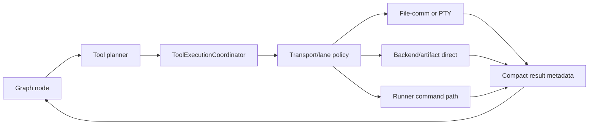

# Agent Architecture

Code-verified overview of the agent runtime packages used by LangGraph turns,
tool planning, tool execution, provider-neutral LLM calls, and runtime
transports.

## Purpose

The agent layer supplies the execution machinery behind task chat turns. It
contains graph state, graph nodes, prompt-facing context, tool catalog
discovery, tool planning, transport selection, result normalization, and LLM
provider adapters.

The backend owns SaaS identity, tenant context, durable credentials, task
lifecycle, and runtime placement. The agent layer receives already-normalized
runtime metadata and executes within that boundary.

## Responsibility Boundary

Owned by the agent layer:

- LangGraph state models, graph builders, graph nodes, and routing helpers.
- Prompt-authoritative conversation context bundle construction and projections.
- Tool catalog discovery and LLM-visible tool filtering.
- Tool planning, parameter validation, approval/dispatch flow, and result
  projection.
- Tool transport policy across local file-comm, PTY, direct backend/artifact
  execution, and runner-supported container tools.
- Provider-neutral LLM client interfaces, profiles, capabilities, and concrete
  provider adapters.
- Workspace-safe command preparation and task-local runtime file preparation.

Not owned by the agent layer:

- HTTP or WebSocket authentication.
- Tenant membership and permission resolution.
- Storage/decryption of provider credentials.
- Task admission, runner assignment, or runtime provider selection.
- Cross-task workspace access.

## Wired Entrypoints

- `backend/routers/chat/submit.py`
  - Reserves chat rows and starts background LangGraph generation.
- `backend/services/langgraph_chat/execution/turn_service.py`
  - `run_langgraph_generation`, resume generation, and checkpoint retry
    compatibility entrypoints.
- `backend/services/langgraph_chat/facade.py`
  - Builds runtime config, runs intent classification, selects the graph branch,
    and delegates to handlers.
- `backend/services/langgraph_chat/handlers/*`
  - Compile and execute normal-chat, simple-tool, and deep-reasoning graphs.
- `agent/graph/*`
  - Graph state, builders, nodes, context, memory, streaming, and tool execution
    subgraphs.
- `agent/tool_runtime/*`
  - Runtime tool coordination, transport routing, timeout policy, batch
    execution, and lane policy.
- `agent/tools/*`
  - Tool implementations, schemas, registry, catalog visibility, and
    tool-specific command construction.
- `agent/providers/llm/*`
  - Provider-neutral LLM contracts, model profiles, factory, and adapters.

## Package Responsibilities

- `agent/graph`
  - Owns LangGraph runtime structure: state models, builders, nodes, context
    bundle projections, memory updates, streaming event helpers, and shared
    tool execution subgraph.
- `agent/tool_runtime`
  - Owns tool execution policy after a tool plan exists: lane classification,
    timeout planning, transport routing, batch execution, PTY/file-comm/direct
    dispatch, and compact result metadata.
- `agent/tools`
  - Owns concrete tool schemas and tool-specific command preparation. The tool
    registry discovers executable `BaseTool` subclasses and excludes helper
    modules from the callable catalog.
  - LLM-facing category routing uses visible tool IDs plus enhanced metadata
    categories. Service credential proof and single-file FTP transfer tools are
    exposed under the `service_access` category as normal cataloged tools.
- `agent/communication`
  - Owns file-based command/result transport for local container execution.
- `agent/providers/llm`
  - Owns provider-neutral LLM client contracts and provider-specific adapters.
    Graph nodes should request neutral clients rather than constructing native
    provider payloads.
- `core/prompts`
  - Owns versioned prompt templates and prompt builders consumed by graph nodes
    and planning code.

## Tool Execution Flow

Tool execution boundaries:

- Container-scoped tools use file-comm or PTY for local placement.
- Runner placement supports only tools allowed by runner runtime policy.
- Backend-scoped tools execute directly only when lane policy allows it.
- Artifact-scoped tools require active task context and remain task-bound.
- Unknown tools default to container-scoped handling and do not silently become
  backend-direct tools.

## Tool Catalog And Visibility

- `agent/tools/tool_registry.py` scans Python modules and registers concrete
  `BaseTool` subclasses by class-declared `tool_id`.
- Helper modules, policies, parsers, schemas, and private modules are excluded
  from the executable catalog.
- `agent/tools/catalog_visibility.py` controls which registered tools are
  visible to the model-facing catalog.
- Hidden tools may still be callable by internal runtime paths when policy
  allows them.
- Catalog metadata can be warmed and cached for graph execution.

## LLM Provider Boundary

- `agent/providers/llm/factory/client_factory.py` creates provider-neutral
  `LLMClient` instances from explicit provider/model identity.
- Model profiles and capabilities live under `agent/providers/llm/profiles` and
  `agent/providers/llm/core`.
- OpenAI and Anthropic adapters translate neutral tool, structured-output,
  usage, and request settings into native provider payloads.
- Backend runtime services resolve credential refs and attach live runtime
  services at invocation time. Graph state carries serializable deployment
  references plus compatibility provider/model snapshots, not decrypted
  credentials or SDK clients.

## Context And Memory

- `agent/graph/context/builder.py` is the single builder authority for the
  prompt-authoritative `ConversationContextBundle`.
- `backend/services/langgraph_chat/context_builder.py` assembles runtime config
  once per turn and places the bundle in metadata.
- Graph nodes consume role-specific projections instead of rebuilding transcript
  text locally.
- Working memory is stored under graph metadata and rendered into prompt/context
  projections by graph memory helpers.
- Context compression policy is coordinated by backend LangGraph services, while
  agent token counters and projections support fit checks and prompt shaping.

## Security And Isolation Notes

- Agent runtime code must treat tenant/task/runtime identity from backend
  metadata as authority; model-provided task ids or host paths are not authority.
- Workspace file operations should stay task-local and use existing safe
  workspace helpers.
- Tool lane policy is fail-closed: direct execution is explicit, not a fallback
  for unknown tools.
- Runtime metadata sanitization removes raw LLM secret keys from tool execution
  request metadata.
- Provider adapters receive plaintext credentials only through backend-owned
  runtime services immediately before provider calls.

## Operational Notes

- The current wired path is LangGraph-driven through the backend facade and
  handlers.
- `agent/executor.py` remains a compatibility facade for action/tool execution
  entrypoints and delegates transport internals to `agent/tool_runtime`.
- File-comm uses `commands.jsonl`, `results.jsonl`, and lock files in the active
  workspace.
- PTY use is policy- and capability-gated; parallel PTY calls use named internal
  sessions when enabled.
