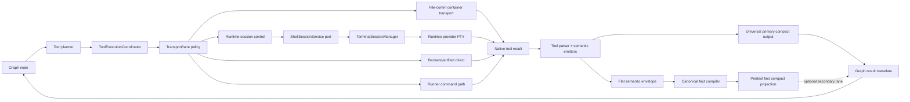

# Agent Architecture

Code-verified overview of the agent runtime packages used by LangGraph turns,
tool planning, tool execution, producer-owned semantic parsing, compact result
projection, provider-neutral LLM calls, and runtime transports.

## Purpose

The agent layer supplies the execution machinery behind task chat turns. It
contains graph state, graph nodes, prompt-facing context, tool catalog
discovery, tool planning, transport selection, native result parsing, semantic
envelope assembly, result normalization, and LLM provider adapters.

The backend owns SaaS identity, tenant context, durable credentials, task
lifecycle, and runtime placement. The agent layer receives already-normalized
runtime metadata and executes within that boundary.

## Responsibility Boundary

Owned by the agent layer:

- LangGraph state models, graph builders, graph nodes, and routing helpers.
- Prompt-authoritative conversation context bundle construction and projections.
- Tool catalog discovery and LLM-visible tool filtering.
- Tool planning, parameter validation, approval/dispatch flow, and result
  projection.
- Tool-specific native result parsing and semantic observation/evidence
  emission.
- Runtime semantic envelope assembly and extraction before independent
  Knowledge and compact-output consumption.
- Tool transport policy across local file-comm, provider-backed runtime
  sessions, direct backend/artifact execution, and runner-supported container
  tools.
- Provider-neutral LLM client interfaces, profiles, capabilities, and concrete
  provider adapters.
- Workspace-safe command preparation and task-local runtime file preparation.

Not owned by the agent layer:

- HTTP or WebSocket authentication.
- Tenant membership and permission resolution.
- Storage/decryption of provider credentials.
- Task admission, runner assignment, or runtime provider selection.
- Knowledge lineage, observation persistence, read-model projection, or replay.
- Canonical fact/evidence admission policy, which lives in the backend-free
  `runtime_shared.semantic.pentest_facts` boundary.
- Cross-task workspace access.

## Wired Entrypoints

- `backend/routers/chat/submit.py`
  - Reserves chat rows and starts background LangGraph generation.
- `backend/services/langgraph_chat/execution/turn_service.py`
  - `run_langgraph_generation`, resume generation, and checkpoint retry
    compatibility entrypoints.
- `backend/services/langgraph_chat/facade.py`
  - Builds runtime config, runs intent classification, selects the graph branch,
    and delegates to handlers.
- `backend/services/langgraph_chat/handlers/*`
  - Compile and execute normal-chat, simple-tool, and deep-reasoning graphs.
- `agent/graph/*`
  - Graph state, builders, nodes, context, memory, streaming, and tool execution
    subgraphs.
- `agent/subagents/*`
  - Declarative subagent definitions, definition-backed registries, and the
    generic child runtime graph used by process-local subagent runs.
- `agent/tool_runtime/*`
  - Runtime tool coordination, transport routing, timeout policy, batch
    execution, lane policy, and result enrichment.
- `agent/semantic/*`
  - Flat runtime semantic envelope assembly/extraction and prompt formatting;
    canonical evidence and fact policy remain under `runtime_shared/semantic`.
- `agent/tools/*`
  - Tool implementations, schemas, registry, catalog visibility, and
    tool-specific command construction, parsing, and semantic emitters.
- `runtime_shared/semantic/pentest_facts/*`
  - Backend-free semantic envelope contracts, evidence validation, canonical
    fact admission, compilation, masking, diagnostics, ordering, and dedupe.
- `agent/providers/llm/*`
  - Provider-neutral LLM contracts, model profiles, factory, and adapters.

## Package Responsibilities

- `agent/graph`
  - Owns LangGraph runtime structure: state models, builders, nodes, context
    bundle projections, memory updates, streaming event helpers, and shared
    tool execution subgraph. The parent handoff continuation graph reuses the
    existing post-action reasoning node, decision router, direct-tool path,
    thinking/reflection nodes, and finalizer; it does not introduce a separate
    handoff reasoner.
- `agent/subagents`
  - Owns static TOML definition loading, registry projections, generic
    assignment/result contracts, and the definition-configured child graph.
    The child graph runs one bounded model/tool session using the versioned
    `subagent_runtime` prompt family, shared approval/dispatch/synthesis nodes,
    canonical child working/phase memory, and a bounded `AgentResultProjection`
    parent handoff. It does not carry Pathfinder/Scout-specific Python
    orchestration, child PTR/router reasoning, or an extra child-only LLM
    completion stage.
- `agent/tool_runtime`
  - Owns tool execution policy after a tool plan exists: lane classification,
    timeout planning, transport routing, batch execution,
    runtime-session/file-comm/direct dispatch, result enrichment, and compact
    result metadata.
- `agent/tools`
  - Owns concrete tool schemas, tool-specific command preparation, native
    result parsing, and final semantic observation/evidence emission. The tool
    registry discovers executable `BaseTool` subclasses and excludes helper
    modules from the callable catalog.
  - LLM-facing category routing uses visible tool IDs plus enhanced metadata
    categories. Service credential proof and single-file FTP transfer tools are
    exposed under the `service_access` category as normal cataloged tools.
- `agent/semantic`
  - Owns backend-free assembly and extraction of the four flat runtime semantic
    fields: schema version, capability family, observations, and evidence. It
    delegates evidence vocabulary/schema validation to
    `runtime_shared.semantic.pentest_facts` and does not parse tool output.
- `agent/graph/compression`
  - Owns universal primary compact output and the optional secondary compact
    lane. Pentest tools compile their runtime semantic envelope and project
    fact families through `agent/graph/compression/pentest_facts`; remaining
    `deterministic/` modules are shared metadata/envelope helpers, not per-tool
    interpretation adapters.
- `agent/communication`
  - Owns file-based command/result transport for local container execution.
- `agent/providers/llm`
  - Owns provider-neutral LLM client contracts and provider-specific adapters.
    Graph nodes should request neutral clients rather than constructing native
    provider payloads.
- `core/prompts`
  - Owns versioned prompt templates and prompt builders consumed by graph nodes
    and planning code.

## Tool Execution Flow

```mermaid
flowchart LR
    Graph[Graph node]
    Planner[Tool planner]
    Coordinator[ToolExecutionCoordinator]
    Policy[Transport/lane policy]
    Local[File-comm container transport]
    RuntimeSession[Runtime-session control]
    ShellService["ShellSessionService port"]
    TerminalManager["TerminalSessionManager"]
    Provider["Runtime provider PTY"]
    Direct[Backend/artifact direct]
    Runner[Runner command path]
    Native["Native tool result"]
    Enrichment["Tool parser + semantic emitters"]
    Envelope["Flat semantic envelope"]
    Primary["Universal primary compact output"]
    Compiler["Canonical fact compiler"]
    FactProjection["Pentest fact compact projection"]
    Result["Graph result metadata"]

    Graph --> Planner
    Planner --> Coordinator
    Coordinator --> Policy
    Policy --> Local
    Policy --> RuntimeSession
    Policy --> Direct
    Policy --> Runner
    Local --> Native
    RuntimeSession --> ShellService
    ShellService --> TerminalManager
    TerminalManager --> Provider
    Provider --> Native
    Direct --> Native
    Runner --> Native
    Native --> Enrichment
    Enrichment --> Envelope
    Enrichment --> Primary
    Envelope --> Compiler
    Compiler --> FactProjection
    Primary --> Result
    FactProjection -. "optional secondary lane" .-> Result
    Result --> Graph
```

Tool execution boundaries:

- Container-scoped tools use file-comm or PTY for local placement.
- `shell.utility`, `shell.assessment`, and `shell.write_stdin` are universal
  runtime-session-scoped tools. The two start aliases share the hidden
  `shell.exec` implementation schema and command policy while retaining distinct
  capabilities: utility output is transient, while assessment output is
  eligible for durable evidence. Their adapters fail closed for direct
  execution; the graph dispatcher routes them through
  `runtime_session_control`.
- Runtime-session shell tools use `ShellSessionService` through the
  runtime-shared service port, then `TerminalSessionManager`, then the selected
  runtime provider. Each start creates one dedicated Kali exec whose local
  provider or managed runner owns output, structured process exit, and exit
  code. Managed output reuses the task-scoped `terminal.frame` stream. The
  model-facing shell aliases and `shell.write_stdin` do not fall back to
  file-comm, host subprocess execution, or runner command transport.
- `shell.utility` or `shell.assessment` may return a public `shs_` continuation
  handle while its dedicated process is still running.
  `shell.write_stdin` uses that handle only for exact non-empty input or
  interruption on an explicitly interactive start. Non-interactive progress
  automatically returns to runtime-owned waiting below the model-visible tool
  boundary and does not invoke the shell interaction-decision model.
- Shell-session result projection keeps only bounded public continuation fields
  needed by the next model turn: `process_status`, public `session_id`,
  nullable `exit_code`, `stdin_available`, bounded `stdout`/`stderr`,
  `truncated`, `summary`, stable `error_code`, and provider-confirmed artifact
  references on terminal assessment updates.
- Assessment transcripts are written by a Kali-side `tee` under
  `/workspace/artifacts`, atomically finalized after capture, and exposed only
  after runtime-provider confirmation. The backend never creates a duplicate
  shell-output file. Utility sessions use the unwrapped dedicated exec path and
  create no artifact.
- `shell.script` remains on its existing compatibility execution path and is
  not migrated by the shell-session foundation.
- Runner placement supports only tools allowed by runner runtime policy.
- Backend-scoped tools execute directly only when lane policy allows it.
- Artifact-scoped tools require active task context and remain task-bound.
- Unknown tools default to container-scoped handling and do not silently become
  backend-direct tools.

The semantic envelope is also preserved with execution results for downstream
Knowledge ingestion. Knowledge builds and compiles its own envelope, attaches
backend-owned lineage and archive-scoped evidence in its bridge, and persists
observations independently. The agent compact consumer never passes its
`CompiledFactSet` or compact DTOs into backend Knowledge.

## Tool Catalog And Visibility

- `agent/tools/tool_registry.py` scans Python modules and registers concrete
  `BaseTool` subclasses by class-declared `tool_id`.
- Helper modules, policies, parsers, schemas, and private modules are excluded
  from the executable catalog.
- `agent/tools/catalog_visibility.py` controls which registered tools are
  visible to the model-facing catalog.
- `agent/tools/universal_agent_tools.py` defines universal utilities appended
  to main-agent and subagent catalogs when the registered tool metadata is
  visible. The current universal set is `shell.utility`, `shell.assessment`, and
  `shell.write_stdin`; the shared `shell.exec` implementation remains hidden
  from model-facing catalogs.
- Hidden tools may still be callable by internal runtime paths when policy
  allows them.
- Catalog metadata can be warmed and cached for graph execution.

## LLM Provider Boundary

- `agent/providers/llm/factory/client_factory.py` creates provider-neutral
  `LLMClient` instances from explicit provider/model identity.
- Model profiles and capabilities live under `agent/providers/llm/profiles` and
  `agent/providers/llm/core`.
- OpenAI and Anthropic adapters translate neutral tool, structured-output,
  usage, and request settings into native provider payloads.
- Backend runtime services resolve credential refs and attach live runtime
  services at invocation time. Graph state carries serializable deployment
  references plus compatibility provider/model snapshots, not decrypted
  credentials or SDK clients.

## Context And Memory

- `agent/graph/context/builder.py` is the single builder authority for the
  prompt-authoritative `ConversationContextBundle`.
- `backend/services/langgraph_chat/context_builder.py` assembles runtime config
  once per turn and places the bundle in metadata.
- Graph nodes consume role-specific projections instead of rebuilding transcript
  text locally.
- Working memory is stored under graph metadata and rendered into prompt/context
  projections by graph memory helpers.
- Context compression policy is coordinated by backend LangGraph services, while
  agent token counters and projections support fit checks and prompt shaping.

## Parent Handoff And PAR Boundary

Terminal subagent results do not finalize the parent turn directly. The backend
handler launches bounded child runs, and
`backend/services/agent_runs/parent_handoff_coordinator.py` observes ready
terminal results from the process-local registry for the same tenant, task, and
conversation while lifecycle and deterministic progress events continue to
stream. It does not invoke the parent graph until all scoped child runs are
terminal. The coordinator then claims the aggregated unconsumed results,
projects them into parent context, and
`agent/graph/builders/parent_handoff_builder.py` runs the parent continuation
graph.

That graph marks the initial input as
`post_action_outcome_source="subagent_handoff_batch"` and routes through the
existing `post_tool_reasoning` node under its expanded post-action reasoning
role. PAR may route to the existing direct-tool path, think, reflect,
synthesize/finalize, or return the backend-owned `delegate_subagent` and
`wait_for_subagents` coordination outcomes. Follow-up delegation still uses the
classifier-compatible handoff entry and the shared backend ownership policy and
assignment builder.

The child graph remains a bounded local loop: model, approval, dispatch,
synthesis, observation, and terminal `AgentResult` projection. It does not run
parent PAR, mutate global todos, decide final user responses, or own the
parent's wait/delegate/finalize policy.

## Security And Isolation Notes

- Agent runtime code must treat tenant/task/runtime identity from backend
  metadata as authority; model-provided task ids or host paths are not authority.
- Workspace file operations should stay task-local and use existing safe
  workspace helpers.
- Tool lane policy is fail-closed: direct execution is explicit, not a fallback
  for unknown tools.
- Runtime-session shell calls require backend-projected tenant, task, execution
  owner, workspace, and runtime placement identity. Model-provided ids and
  host paths are not authority for session continuation or cleanup.
- Runtime metadata sanitization removes raw LLM secret keys from tool execution
  request metadata.
- Provider adapters receive plaintext credentials only through backend-owned
  runtime services immediately before provider calls.
- Parent handoff coordination preserves tenant, task, conversation, parent-turn,
  and run identity through registry claims and graph metadata. Graph state stays
  serializable and carries projected result/run summaries, not backend service
  objects or decrypted credentials.

## Operational Notes

- The current wired path is LangGraph-driven through the backend facade and
  handlers.
- `agent/executor.py` remains a compatibility facade for action/tool execution
  entrypoints and delegates transport internals to `agent/tool_runtime`.
- File-comm uses `commands.jsonl`, `results.jsonl`, and lock files in the active
  workspace.
- `shell.utility`, `shell.assessment`, and `shell.write_stdin` use
  provider-backed dedicated exec sessions through the runtime provider
  boundary. The process-local shell-session registry owns public handles,
  capacity, claims, and idle/deadline selection. The shell-session service
  coordinates PTY I/O,
  owner cleanup for terminal main and subagent runs, task retirement cleanup,
  and managed-runner disconnect handle expiry.
- Legacy PTY use outside the shell-session tools remains policy- and
  capability-gated; parallel compatibility PTY calls use named internal
  sessions when enabled.
