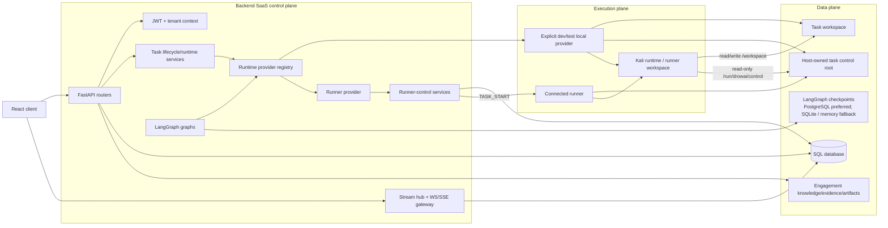
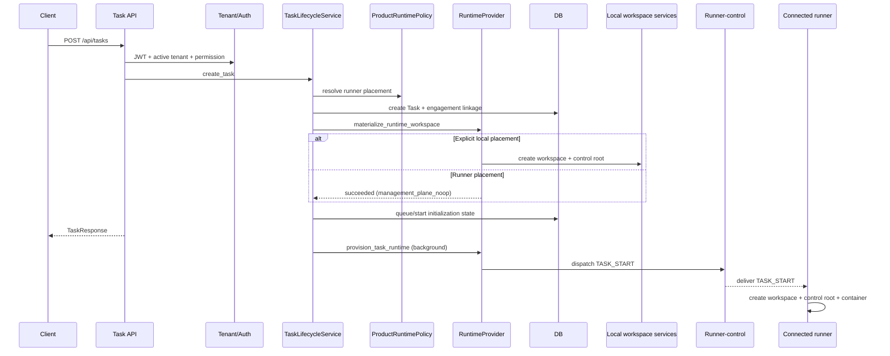
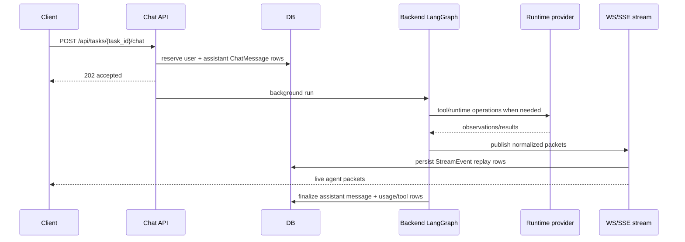
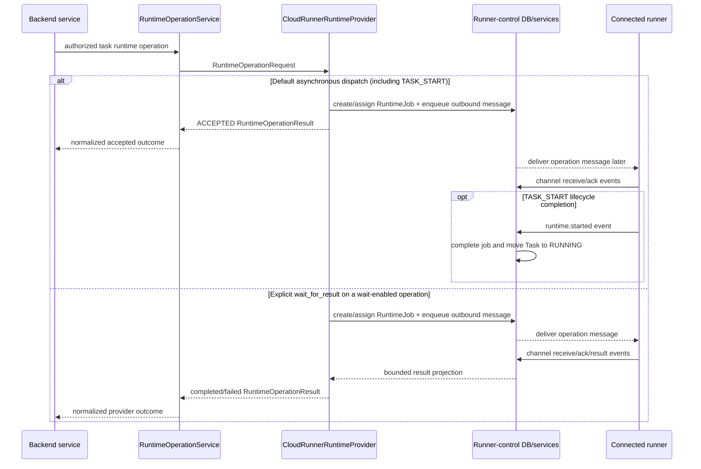

# Application Plane Architecture

Code-verified structural overview of the SaaS-style DrowAI application planes:
management plane, data plane, and execution plane. This document describes how
the application is shaped and how control/data/runtime responsibilities move
between layers; it is not a feature-by-feature application catalog.

## Purpose

DrowAI is now structured around a tenant-aware control plane that owns identity,
authorization, task lifecycle, runner assignment, persisted records, and realtime
fanout, while isolated runtimes perform task execution through provider
contracts.

The important architectural split is:

- **Management plane:** authenticated API and WebSocket gateway, tenant context,
  setup, settings, task lifecycle, runner-control, scheduling, retention, and
  operational policy, including backend-hosted chat/LangGraph orchestration.
- **Data plane:** tenant/user/task/engagement-owned relational records,
  persisted stream packets, chat transcript, reports, knowledge/evidence,
  artifacts, usage, and task workspace files.
- **Execution plane:** provider-dispatched task runtime and tool side effects
  through Runner placement, plus explicit dev/test/diagnostic local-provider
  paths.

## Plane Detail Docs

- [Management Plane](management-plane.md)
- [Data Plane](data-plane.md)
- [Execution Plane](execution-plane.md)
- [Agent Architecture](agent-architecture.md)
- [LangGraph Graph Architecture](langgraph-graph-architecture.md)
- [Memory Architecture](memory.md)
- [Knowledge Workspace Architecture](knowledge.md)
- [Tool Architecture](tools.md)
- [Model Architecture](models.md)
- [Runtime Provider Architecture](runtime-provider.md)
- [Workspace And Artifact Architecture](workspace-artifacts.md)
- [Artifact Provenance Architecture](artifact-provenance.md)

## Wired Entrypoints

- **Backend app:** `backend/main.py`
  - Mounts setup, auth, tasks, chat, health, settings, LLM, reporting,
    engagement, knowledge, usage, retention, runner-control, and tenant routers.
  - Owns the canonical `/ws` multiplexer for `agent-multi`, `terminal`,
    `docker`, `metrics`, and `vpn_status` channels.
  - Starts database/bootstrap checks and background services through the FastAPI
    lifespan.
- **Frontend shell:** `client/src/App.tsx`
  - Wraps routes in auth, tenant context, setup gate, query client, and runtime
    stream bootstrap.
  - Protected pages are product surfaces over the same tenant-aware backend API.
- **Runtime placement authority:** `backend/services/runtime_provider/product_policy.py`
  and `backend/services/runtime_provider/registry.py`
  - Product paths resolve to Runner placement before provider dispatch; the
    registry maps already-authorized task metadata to a concrete provider.
- **Runtime provider contract:** `backend/services/runtime_provider/contracts.py`
  - Carries `tenant_id`, `task_id`, actor identity, placement, workspace id,
    runner id, and execution site id on each runtime operation.
- **Explicit local execution provider:** `backend/services/runtime_provider/local_docker_provider.py`
  - Delegates dev/test/diagnostic local runtime operations to the
    Docker/workspace stack.
- **Runner provider:** `backend/services/runtime_provider/cloud_runner_provider.py`
  - Dispatches runtime operations through runner-control jobs/messages.
- **LangGraph facade:** `backend/services/langgraph_chat/facade.py`
  - Builds runtime config, classifies intent, selects a graph branch, and
    delegates execution handlers.

## Management Plane

The management plane is the authenticated SaaS control surface. It decides who
can do what, which tenant owns the operation, where a task should run, and which
durable records should be created or updated.

Primary responsibilities:

- **Identity and auth:** `backend/auth.py` and `backend/routers/auth.py` issue and
  validate JWT-backed sessions.
- **Tenant context:** `backend/services/tenant/context.py` resolves active tenant
  membership, requires explicit tenant selection for ambiguous multi-tenant
  users, and supplies effective permissions.
- **HTTP routing:** `backend/main.py` mounts product routers and keeps routers as
  thin request/response boundaries.
- **User-facing WebSocket gateway:** `backend/services/websocket/gateway.py`
  centralizes JWT extraction, tenant hint resolution, user identity, and task
  ownership checks for the client channels multiplexed through `/ws`.
- **Task lifecycle:** `backend/services/task/lifecycle_service.py` creates tasks,
  resolves engagement ownership, admits capacity, requests placement-specific
  create-time workspace materialization, and starts background initialization.
  Local placement materializes immediately; Runner placement acknowledges a
  management-plane no-op and materializes later on the connected runner after
  background `TASK_START` dispatch.
- **Task runtime control:** `backend/services/task/runtime_service.py` validates
  task state transitions and invokes runtime provider operations for start,
  pause, resume, and stop.
- **Runner-control:** `backend/routers/runner_control.py` and
  `backend/services/runner_control/*` manage execution sites, runner
  registration, runner credentials, runtime jobs, runner connections, and
  durable control messages. The separately mounted
  `/api/runner-control/channel` WebSocket authenticates tenant-bound runner
  identity from runner headers through `RunnerChannelAuthService`; runner
  channel services own its connection lifecycle and message policy.
- **Operational services:** setup, retention, CVE indexing, reporting jobs,
  tenant data-management settings, usage, and LLM provider settings are mounted
  as backend-managed control surfaces.

Backend chat/LangGraph orchestration:

- `POST /api/tasks/{task_id}/chat` reserves chat rows and schedules background
  generation in the backend application process.
- `LangGraphChatFacade` builds runtime config, runs intent classification,
  selects normal chat, direct-executor/simple-tool, or deep-reasoning handlers,
  and streams via the backend streaming adapter.
- Runtime services and provider metadata are attached at execution time rather
  than serialized as secrets or concrete SDK clients into graph checkpoints.
- Only provider-dispatched runtime and tool side effects cross from this backend
  orchestration into the local or managed-runner execution plane.

Management-plane data is tenant-bound. User-facing task operations filter by
tenant and user, while runner-control and maintenance paths carry explicit
tenant/runtime identity rather than relying on implicit global state.

## Data Plane

The data plane is the system of record and replay surface for product state. It
stores what happened, what users can inspect, and what the application can use
for continuity.

Important relational ownership roots:

- **Tenant and membership:** `Tenant`, `TenantMembership`
- **User-owned work:** `Task`, `Engagement`, `Report`
- **Chat continuity:** `ChatMessage`, `ToolCall`, `ChatTurnEvent`
- **Graph continuity:** LangGraph execution and interrupt/resume flows prefer
  shared PostgreSQL checkpoint tables, then degrade to a per-task SQLite file
  and finally process-local in-memory state when the preferred stores cannot be
  acquired
- **Streaming replay:** `StreamEvent`, `SystemLog`
- **Runtime control:** `ExecutionSite`, `Runner`, `RunnerCredential`,
  `RunnerInstallToken`, `RuntimeJob`, `RunnerConnection`,
  `RunnerControlMessage`
- **Artifacts/provenance:** `ToolExecution`, `ArtifactManifest`,
  `ExecutionArtifact`
- **Knowledge/evidence:** engagement-scoped knowledge tables under
  `backend/models/knowledge.py`
- **Reporting:** `TaskClosureMemo`, `EngagementReport`, `EngagementReportJob`
- **LLM/runtime settings:** provider credentials, selections, usage records, and
  memory dependency selections under `backend/models/llm.py`

Task workspace and runtime control data remain separate from relational app data
and from each other:

- Local task workspaces live under `agent/workspaces/task-<id>/...` on the host
  and mount read/write as `/workspace` in local containers. Their host-owned
  control roots live under `agent/runtime-control/task-<id>/...` and mount
  read-only as `/run/drowai/control`.
- Managed runners likewise keep `tasks/<workspace-id>` data roots separate from
  `control/<workspace-id>` roots and use the same read/write workspace plus
  read-only control-mount contract.
- VPN configuration and runtime-input files are control material; they are not
  workspace-visible artifacts.
- Workspace file access is task-local and should go through the existing
  runtime/workspace services rather than arbitrary host path reads.
- Engagement knowledge/evidence/artifact projections are app-owned durable data,
  not a direct view of another task workspace.

Streaming data crosses planes deliberately:

- Live LangGraph/tool events publish through `InMemoryStreamHub`.
- The hub persists normalized, masked stream packets into `StreamEvent` for
  replay/recovery.
- The frontend runtime stream client tracks per-task sequence cursors and
  resubscribes over the multiplex WebSocket when needed.

## Execution Plane

The execution plane performs provider-dispatched runtime and tool side effects
for a task, but it does not own SaaS authorization, tenant membership decisions,
or LangGraph orchestration. Those responsibilities remain in the backend
management plane before runtime provider calls are issued.

Product runtime placement is task metadata resolved through product policy and
then dispatched through the provider boundary:

- New product tasks use `Task.runtime_placement_mode=runner`.
- `Task.runner_id`, `Task.execution_site_id`, and `Task.workspace_id` carry
  placement identity for runner-backed work.
- `RuntimeProviderRegistry` fails closed for unsupported placement modes.

Explicit local runtime path:

- `LocalDockerRuntimeProvider` delegates to the Docker facade and workspace
  manager.
- It is reserved for dev/test/diagnostic callers and is not a standalone or
  distributed product fallback.
- `backend/services/docker/__init__.py` is the implementation facade over the
  decomposed Docker package.
- `backend/services/unified_docker_service.py` is now a compatibility shim, not
  the only implementation source.
- The local runtime uses task workspaces and the Kali executor daemon/file-comm
  path over `/workspace/commands.jsonl` and `/workspace/results.jsonl`.

Product Runner path:

- `CloudRunnerRuntimeProvider` delegates lifecycle, terminal, artifact,
  environment metadata, and tool-command work to cloud-runner collaborators.
- Runner-control tables persist runtime jobs, runner connections, and durable
  inbound/outbound control messages.
- `build_runner_runtime_provider()` requires
  `ENABLE_CLOUD_RUNNER_CONTROL=true`; runner placement is intentionally gated.

## Cross-Plane Runtime Flow

Task creation:

Task chat/run:

Runner-backed runtime operation:

## Security And Isolation Notes

- Tenant context is resolved before user-facing task, stream, runner, reporting,
  and knowledge operations.
- Tenant membership alone does not grant access to another user's personal task
  workspace or runtime stream; task-scoped endpoints still enforce ownership.
- User-facing client channels multiplexed through `/ws` use the shared
  JWT/tenant gateway; their channel handlers do not implement independent auth
  policy. `/api/runner-control/channel` is a separate machine-authenticated
  ingress using tenant ID, runner ID, and runner credential-secret headers;
  runner-control channel services revalidate its tenant-bound credential and
  own its lifecycle and message policy.
- Runtime provider requests carry task, tenant, actor, runner, execution-site,
  and workspace identity as explicit envelope fields.
- Decrypted provider credentials are resolved in backend services immediately
  before provider adapter use and should not be written to graph metadata,
  checkpoints, stream events, runner-control payloads, or logs.
- Local and runner containers receive two task-bound filesystem capabilities:
  writable task data at `/workspace` and host-owned control material mounted
  read-only at `/run/drowai/control`. VPN and runtime-input files remain in the
  control root rather than the artifact-visible workspace.
- Runner-control raw command material has an intentionally limited durability
  boundary; durable control rows are masked and cross-process raw-secret command
  replay is not supported by design.

## Operational Notes

- `backend/main.py` startup validates deployment profile state, runner-control
  schema readiness, tenant baseline schema readiness, reporting lifecycle schema
  readiness, and default tenant bootstrap before starting background services.
  Its lifespan also awaits `initialize_checkpointer_schema()`; that bootstrap
  module is the sole PostgreSQL LangGraph checkpointer DDL owner and serializes
  setup across replicas with an advisory lock, while non-PostgreSQL
  configurations skip that bootstrap. Request paths use the shared
  `CheckpointerService` and do not run DDL: acquisition prefers PostgreSQL,
  falls back to a per-task SQLite file that is not shared across backend
  replicas, and finally uses process-local memory whose state is lost on
  restart.
- Product deployment profiles can require runner placement for new task
  creation; `TaskLifecycleService._resolve_task_create_runtime_placement_mode`
  fails closed when profile/runtime placement are incompatible.
- Standalone deployment is defined by `deploy/compose/standalone.yml` and still
  uses Runner placement. Distributed Management is defined by
  `deploy/cloud/control-plane.yml`; Runner hosts use
  `deploy/cloud/execution-site-package/compose.yml`.
- Background services include platform maintenance such as retention and
  reporting/CVE schedulers through the backend service lifecycle.
- Deployment startup resolves generated config/secrets before database checks
  and auth setup. Process env and dev `.env` values remain higher-precedence
  overrides; product Docker/local launcher paths should not require users to
  author `.env` files.
- Frontend auth uses JWTs from local storage for HTTP `Authorization` headers.
  WebSocket auth uses `Bearer.<token>` subprotocols and tenant hints when
  available.
- React Query caches tenant-scoped API data and clears tenant-scoped caches on
  tenant switch.

## Current Boundaries

- `backend/services/unified_docker_service.py` is a compatibility shim over
  `backend/services/docker/*`; new Docker runtime details should be verified in
  the decomposed Docker package.
- Some compatibility routes and fields remain mounted or present, such as
  basic user stats/scans/vulnerabilities placeholders and `Task.mode`.
- Runtime provider contracts are the structural authority for provider
  dispatch. Product policy owns whether product callers may use a placement;
  Runner-control tables and services own runner registration, assignment,
  messages, and runtime job state.
- SSE reasoning routes remain as compatibility/fallback delivery surfaces. The
  primary live frontend runtime stream path is the multiplex `/ws` `agent-multi`
  channel.
- Runtime placement default is configuration-dependent for dev/test utilities.
  Product deployment profiles resolve product task placement to Runner. Verify
  `TASK_RUNTIME_PLACEMENT_MODE_DEFAULT`, `DROWAI_DEPLOYMENT_PROFILE`, and
  `ENABLE_CLOUD_RUNNER_CONTROL` before making deployment-specific claims.
