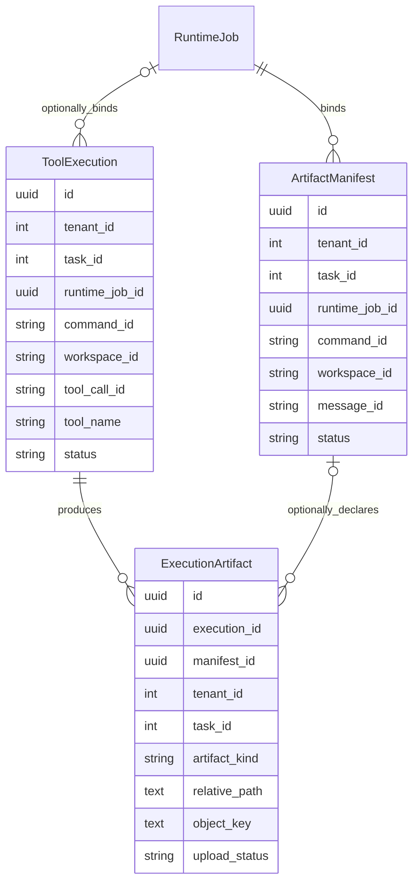
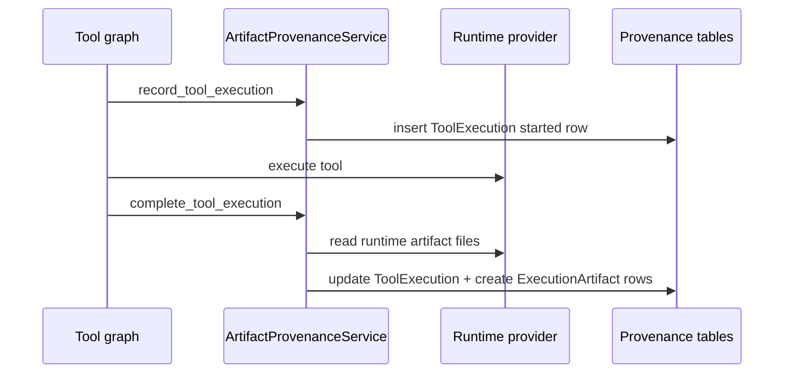
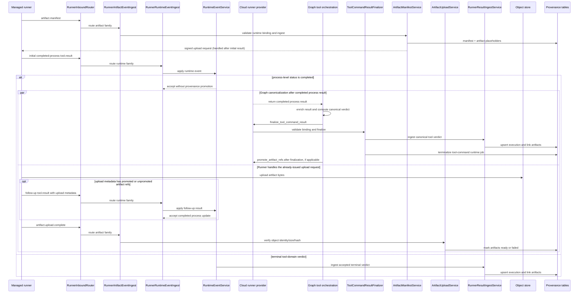

# Artifact Provenance Architecture

Code-verified overview of durable tool execution provenance, execution artifact
records, runner artifact manifests, upload completion, and task-scoped
provenance read APIs.

## Purpose

Artifact provenance records what tool ran, how it was invoked, how it ended,
and which artifacts it produced. It gives the app a durable, task-scoped record
for raw output, artifact catalog search, timeline views, knowledge ingestion,
and reporting.

The system supports both local graph execution and managed runner execution.
Local execution writes provenance at tool finalization. Runner execution
reconciles runner-control runtime jobs, tool results, artifact manifests, and
object-store upload completion.

## Responsibility Boundary

Owned by artifact provenance:

- `ToolExecution` rows.
- `ExecutionArtifact` rows.
- Runner `ArtifactManifest` rows.
- Start, completion, and task-scoped chat-cancellation updates for tool
  executions.
- Command/stdout/stderr artifact rows.
- Runtime file artifact rows.
- Runner manifest placeholders and signed upload instructions.
- Upload-complete readiness transitions.
- Task-scoped provenance read/query APIs.
- Sanitized artifact references for graph memory and prompts.

Not owned by artifact provenance:

- Tool planning or approval.
- Runtime command execution and provider-specific cancellation.
- Workspace file browser behavior.
- Long-term knowledge archive policy.
- Raw object-store implementation.
- Frontend presentation state.

## Wired Entrypoints

Durable models and repositories:

- `backend/models/provenance.py`
  - `ToolExecution`, `ArtifactManifest`, and `ExecutionArtifact`.
- `backend/repositories/tool_execution_repository.py`
  - Tool execution persistence and query helpers.
- `backend/repositories/execution_artifact_repository.py`
  - Execution artifact persistence and query helpers.

Writers and ingestors:

- `backend/services/artifact/provenance_service.py`
  - Local execution provenance start/completion persistence.
- `backend/services/artifact/runner_result_ingest_service.py`
  - Runner `tool.result` ingestion and output artifact reconciliation.
- `backend/services/runner_control/channel/inbound.py`
  - Routes authenticated runner artifact and runtime message families to their
    focused channel ingestors.
- `backend/services/runner_control/channel/artifact_ingest.py`
  - Delegates accepted manifest and upload-complete messages to the data-plane
    artifact services.
- `backend/services/runner_control/channel/runtime_ingest.py`
  - Delegates accepted runtime messages, including `tool.result`, to
    `RuntimeEventService`.
- `backend/services/runner_control/runtime_event_service.py`
  - Applies runtime-event side effects and promotes non-`completed` terminal
    tool-domain verdicts through `RunnerResultIngestService`; process-level
    `completed` results remain unpromoted for graph/provider finalization.
- `agent/graph/subgraphs/tool_execution_runtime/runner_command_orchestration.py`
  - Enriches completed managed-runner process results, computes the canonical
    tool verdict, and dispatches `finalize_tool_command_result` through the
    cloud runtime provider.
- `backend/services/runtime_provider/cloud_runner/tool_commands/finalizer.py`
  - Validates the bound tool-command job, ingests the canonical verdict through
    `RunnerResultIngestService`, and terminalizes the runtime job.
- `backend/services/data_plane/artifact_manifest_service.py`
  - Runner `artifact.manifest` ingest and upload instruction creation.
- `backend/services/data_plane/artifact_upload_service.py`
  - Runner `artifact.upload.complete` verification and readiness updates.
- `agent/graph/subgraphs/tool_execution_runtime/artifact_and_provenance.py`
  - Graph-side provenance finalization and artifact-ref enrichment.
- `backend/routers/chat/cancel.py` and
  `backend/services/langgraph_chat/runtime/tool_cancel_service.py`
  - Project an accepted task-scoped chat cancellation onto active
    `ToolExecution` rows, then request best-effort runtime cancellation through
    `RuntimeOperationService`.

Readers:

- `backend/routers/artifact_provenance.py`
  - Read-only task-scoped provenance API.
- `backend/services/artifact/provenance_query_service.py`
  - Execution/artifact query and payload shaping.
- `backend/services/artifact/memory_service.py`
  - Artifact catalog search and bounded artifact reads for app/agent callers.
- `backend/services/data_plane/artifact_read_service.py`
  - Object-backed bounded text reads.
- `backend/services/data_plane/artifact_file_browser_service.py`
  - Virtual file browser over execution artifact rows.

## Data Model

Important identity fields:

- tenant and task
- runtime job
- runner and execution site
- command id
- workspace id
- tool call id
- conversation/turn ids

These fields let the system join runtime execution, UI tool cards, artifact
catalog rows, and runner upload workflows without relying on global tool-call
ids alone.

## Local Provenance Flow

Local completion can persist:

- command text
- stdout
- stderr
- referenced runtime files
- status, exit code, duration, and masked execution metadata

Small text artifacts are stored inline. Runtime files are read through the
runtime-provider boundary before artifact rows are created.

## Runner Provenance Flow

Runner artifact manifest ingest validates:

- tenant
- runner
- task
- tool-command runtime job
- task runtime job
- command id
- workspace id
- task runtime job id

The manifest service creates placeholders and signed upload instructions but
does not persist signed URLs or secret upload headers. Upload completion verifies
accepted artifact identity, object key, size, hash, and client artifact id before
transitioning artifacts to `ready` or `upload_failed`.

## Tool Cancellation Flow

After a task-scoped chat cancellation is accepted,
`ChatToolCancelProjectionService` asks `ToolExecutionRepository` to mark active
rows for the turn as `cancel_requested` and records cancellation metadata. The
service separately dispatches a best-effort `cancel_tool_command` operation
through `RuntimeOperationService`; the selected runtime provider owns the
runtime-side cancellation behavior, while artifact provenance owns only the
durable row projection and resulting runtime-cancellation metadata.

## Read Flow

The read API is task-scoped and read-only.

Main API surfaces:

- execution by id
- execution by task-scoped `tool_call_id`
- execution timeline
- conversation/turn execution list
- artifact metadata lookup
- artifact search
- artifact catalog
- bounded artifact read
- raw-output batch lookup

Content read order is:

1. inline database text when available
2. object-store text read for ready object-backed artifacts
3. runtime workspace file fallback through provider boundary when allowed
4. not available / omitted by policy

Reads return availability state instead of leaking internal object keys or host
paths.

## Artifact References In Graph State

Graph/runtime projection keeps compact artifact references for memory and prompt
context. These references may include durable artifact ids and labels, but must
not include signed URLs, object keys, or secret-bearing metadata.

At provenance finalization, linked `ExecutionArtifact` rows are projected into
durable artifact references. Projection assembles refs from compact refs,
artifact paths, or those persisted refs, enriches them with provenance fields,
and sanitizes them before adding them to graph memory and prompt context.
`promoted_artifact_ids` remains runtime event and artifact-scope metadata; the
wired graph path does not convert those ids into reference objects.

## Security / Isolation Notes

- Provenance reads enforce tenant action policy and owned task scope.
- Tool execution writes resolve tenant ownership from task context.
- Runner ingest assumes channel identity has already been authenticated, then
  validates runtime-job/workspace/command binding.
- Secrets are masked before durable execution metadata and artifact text writes.
- Signed upload instructions are sent to the runner but not persisted.
- Object keys and backend-local paths are not exposed by public read payloads.
- Artifact reads are bounded by service-level byte/character limits.

## Operational Notes

- Artifact provenance persistence is currently always enabled; the feature-flag
  helper returns `True` unconditionally and provides no configurable off state.
- Small text artifacts may be inline; large text artifacts may be object-backed.
- Runner manifest artifacts can exist before the final `tool.result` arrives.
- Upload completion can trigger knowledge ingestion reconciliation for ready
  execution artifacts.
- Timeline and catalog queries rely on tenant/task indexes in provenance tables.

## Known Gaps Or Drift Risks

- Local and runner provenance paths are intentionally different and converge in
  the same SQL tables.
- Some runner artifacts may be pending while a tool result has already arrived.
- Runtime file fallback depends on provider availability and can be unavailable
  after runtime cleanup.
- Artifact references in graph memory are compact summaries, not the complete
  provenance record.
