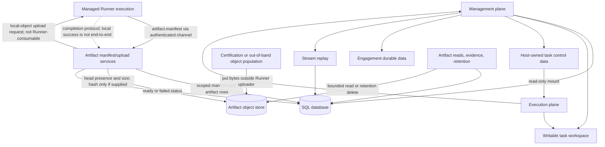

# Data Plane Architecture

Code-verified overview of the durable state, replay records, and workspace data
that the application uses to render product state and preserve continuity.

## Purpose

The data plane is the system of record. It stores tenant-owned product state,
task history, chat continuity, stream replay packets, runtime-control records,
knowledge/evidence, artifacts, reporting output, usage, and task-local
workspace files. LangGraph continuation state can degrade from durable shared
storage to a task-keyed local file or process memory, as described below.

It does not decide whether a user may access data; management-plane services
resolve tenant/user/action context before reads and writes.

## Responsibility Boundary

Owned by the data plane:

- SQLAlchemy ORM tables under `backend/models/*`.
- SQLAlchemy engine/session lifecycle and ORM/Alembic schema-readiness checks
  through `backend/database.py`.
- LangGraph continuation checkpoints selected by the chat checkpointer service:
  PostgreSQL is preferred, a task-keyed SQLite file outside the canonical task
  workspace is the persistent fallback, and process-local `MemorySaver` is the
  non-durable last resort. PostgreSQL checkpoint DDL has a separate startup
  owner.
- Task, engagement, chat, stream, artifact, knowledge, runner-control, reporting,
  usage, and LLM selection records. Product task runtime records use Runner
  placement metadata; local placement metadata is explicit dev/test/diagnostic
  state, not product fallback state.
- Task-local writable workspaces and separate host/runner-owned task control
  roots for VPN and runtime-input material.
- Object-key-backed artifact payload records for the managed Runner artifact
  protocol, with scoped manifest/artifact rows in SQL and bytes behind the
  data-plane object-store port. The current local backend's upload limitation
  is documented below; durable bytes that have been populated are separate from
  live workspace files and can remain readable after runtime cleanup.
- Replayable stream packets and persisted chat transcript.
- Retention classes and deletion/finalization targets implemented by owning
  services.

Not owned by the data plane:

- HTTP/WebSocket auth policy.
- Runtime placement selection.
- Tool execution inside containers or managed runners.
- Frontend cache invalidation policy, except through API response contracts.

## Wired Entrypoints

- `backend/database.py`
  - Engine/session factory, test/dev-only metadata initialization, and
    production ORM/Alembic schema-readiness helpers.
- `backend/services/langgraph_chat/checkpoint/schema_bootstrap.py`
  - Sole owner of PostgreSQL LangGraph checkpointer DDL, invoked from the
    backend lifespan before traffic is served.
- `backend/services/langgraph_chat/checkpoint/checkpointer_service.py`
  - Selects and manages the per-task PostgreSQL, SQLite, or in-memory
    checkpointer used by every wired chat branch.
- `backend/models/__init__.py`
  - Aggregate ORM import surface used by metadata registration.
- `backend/models/core.py`
  - `User`, `Task`, `Engagement`, task history, reports, and core ownership.
- `backend/models/tenant.py`
  - `Tenant` and `TenantMembership`.
- `backend/models/runner_control.py`
  - Runner registry, credentials, runtime jobs, connections, and messages.
- `backend/models/streaming.py`
  - Stream and system-log replay records.
- `backend/models/knowledge.py`
  - Engagement-scoped knowledge, evidence, assets, services, findings, and
    relationships.
- `backend/config/workspace_config.py`
  - Local task workspace and host-owned task control-root layout authority.
- `backend/services/streaming/event_store.py`
  - Stream packet persistence/replay store.
- `backend/config/data_plane.py`
  - Object-store backend, local root, signed-target TTL, and artifact size
    limits.
- `backend/services/data_plane/artifact_manifest_service.py`
  - Validates Runner manifests, creates tenant/task-bound manifest and artifact
    rows, and returns just-in-time upload instructions.
- `backend/services/data_plane/artifact_upload_service.py`
  - Validates upload-completion identity and available object metadata before
    artifact readiness. The local store supplies object presence and size, but
    not an independently computed stored-object hash.
- `backend/services/data_plane/object_store.py` and
  `backend/services/data_plane/registry.py`
  - Object-key storage port and configured implementation selection.
- `backend/services/data_plane/artifact_read_service.py` and
  `backend/services/data_plane/retention_service.py`
  - Scoped durable artifact reads and evidence-aware object deletion.
- `backend/services/runner_control/channel_manager.py`
  - Wires artifact manifest and upload-complete ingest into the authenticated
    Runner channel.
- `backend/services/workspace/runtime_file_explorer_service.py`
  - Owns live runtime workspace browsing, separately from durable artifacts.
- `backend/routers/agent_reasoning.py`
  - `/tasks/{task_id}/reasoning/history` returns the filtered reasoning-panel
    view; `/tasks/{task_id}/reasoning/replay` returns authorized, cursor-paged,
    unfiltered persisted stream packets for replay and order verification.

## Detail Docs

- [Workspace And Artifact Architecture](workspace-artifacts.md)
- [Artifact Provenance Architecture](artifact-provenance.md)

## Main Data Families

- **Identity and tenancy:** persisted users, tenants, and memberships. Active
  tenant context is request-derived rather than a data-plane record; the client
  holds the validated selected tenant id in browser local storage.
- **Task ownership:** tasks, task status history, turn counters, Runner
  placement metadata for product work, and explicit local placement metadata
  only for dev/test/diagnostic paths.
- **Engagement ownership:** engagements and engagement-scoped knowledge/evidence.
- **Chat continuity:** user/assistant messages, tool calls, turn events.
- **Graph continuation checkpoints:** PostgreSQL-backed state when available,
  persistent task-keyed SQLite state at
  `WORKSPACE_ROOT/<task_id>/checkpoints.db` (default
  `workspace/<task_id>/checkpoints.db`) when PostgreSQL cannot be acquired, and
  process-local in-memory state only as the final fallback.
- **Streaming replay:** normalized stream packets and reasoning/system logs.
- **Runtime control:** execution sites, runners, enrollment/install tokens,
  credentials, runtime jobs, runner connections, control messages.
- **Artifacts/provenance:** tool executions, manifests, execution-artifact rows,
  and object-key-backed payloads. Runner manifests create scoped placeholder
  rows and just-in-time upload requests. Readiness follows accepted completion
  identity plus the object metadata available from the configured store; the
  current local-backend limitation is described below.
- **Reporting:** task closure memos, generated engagement report artifacts,
  report jobs. Generated reports keep tenant/user ownership and source
  engagement snapshot metadata so ready report content can remain readable after
  the source engagement row is removed, subject to tenant retention policy;
  report jobs durably checkpoint validated sections, generation metadata, retry
  eligibility, and finalization phase so Management restarts resume unfinished
  work without regenerating completed sections. Report generation jobs and task
  closure memos remain tied to live engagement/task lifecycle.
  Focused persistence repositories live under `backend/repositories/reporting/`,
  and services import their concrete modules directly. `EngagementReportJobRepository`
  owns tenant/user/requester-scoped job persistence, while
  `ReportJobWorkerRepository` owns worker-only durable-ID queue, progress,
  failure, and recovery operations.
  Durable report execution is split into focused worker modules: the public
  worker claims jobs and constructs dependencies, attempt execution prepares
  and finalizes reports, section execution checkpoints validated sections, and
  failure persistence records retries or terminal outcomes. This decomposition
  does not change the durable claim, checkpoint, commit, rollback, retry, or
  ready-promotion workflow. Worker-path services receive explicit memo, report,
  requester-job, and worker-job repository roles instead of one ambiguous
  composite repository. A linked report/job terminal-failure transition is
  atomic: failure to persist the report state rolls back before the job is
  failed. The unresolved report attempt remains generating until normal stale
  worker recovery requeues its job.
- **Provider/runtime settings:** LLM provider credentials, selections, memory
  dependency selections, usage records.

Runner-control registry rows are operational state rather than durable task
ownership. Guarded Runner Site deletion removes runtime jobs before registry
rows; task history, tool records, artifacts, findings, and reports remain.
Database constraints clear only FK-backed provenance references that use
`ON DELETE SET NULL`. The task placement strings `Task.runner_id` and
`Task.execution_site_id` remain as historical metadata unless explicitly
reconciled.

## Cross-Plane Flow

Common write paths:

- Task create writes `Task`, engagement linkage, workspace id, and task-local
  workspace bootstrap files.
- Chat submit reserves user and assistant `ChatMessage` rows before background
  execution starts.
- Each wired LangGraph chat branch acquires its task checkpointer through the
  shared checkpointer service, which tries PostgreSQL, then SQLite, then
  non-durable process memory.
- LangGraph/tool execution emits stream packets that are persisted as
  `StreamEvent` rows for replay.
- Runner operations persist `RuntimeJob` and `RunnerControlMessage` rows before
  connected runners act.
- On Runner placement, `artifact.manifest` creates tenant/task/runtime-bound
  manifest and artifact placeholders and returns an `artifact.upload.request`.
  With the only registered local backend, that request contains a
  `local-object://` target that the Runner's `urllib` uploader cannot consume,
  so direct Runner upload is not currently wired end to end. Certification
  populates the local object out of band with `put_bytes` before sending
  `artifact.upload.complete`. Given an already populated object, completion
  validates the accepted identity, object key, declared size/hash, object
  presence, and stored size. The local head metadata has no content hash, so
  readiness does not independently hash the stored bytes.
- Knowledge/reporting services promote selected runtime outputs into
  engagement-owned durable records.

## Workspace Boundary

- Local task workspaces live under `agent/workspaces/task-<id>/...`.
- Local task control data lives separately under
  `agent/runtime-control/task-<id>/...`; managed runners preserve the same
  per-task `tasks/` and `control/` split beneath the runner root.
- Containers see the writable task workspace at `/workspace` and the matched
  control root as a separate read-only mount at `/run/drowai/control`.
- Workspace/control cleanup is coupled by task identity so both matched roots
  are removed without touching sibling tasks.
- This cleanup does not cover the SQLite checkpoint fallback. Its current
  `WORKSPACE_ROOT/<task_id>/checkpoints.db` path is outside the canonical
  `agent/workspaces/task-<id>` root, and irreversible task cleanup closes the
  cached checkpointer and deletes checkpoint rows visible through SQLAlchemy but
  does not remove that fallback file.
- Workspace files are task-local runtime data, not tenant-wide shared storage.
- Live file browsing stays on the runtime workspace path. Durable artifact
  browsing resolves scoped artifact rows and object keys through data-plane
  services, so it does not depend on the live workspace surviving cleanup.
- Detailed workspace and control-root layout belongs in
  [Workspace And Artifact Architecture](workspace-artifacts.md).
- Engagement durable knowledge/evidence is app-owned data derived from bounded
  service workflows, not unrestricted workspace traversal.

## Security And Isolation Notes

- Data reads should include active tenant and user/task ownership filters unless
  they are explicit maintenance, runner-control, or trusted server-owned
  worker/queue paths. A worker path that starts from an internally claimed
  durable record must derive tenant/user scope from that record before
  downstream scoped data access; the production report worker follows this
  boundary.
- Stream replay packets are normalized and masked before durable persistence.
- Provider credentials are stored in credential rows and surfaced through masked
  status responses, not plaintext read models.
- Task control roots are backend/runner-owned rather than runtime-writable;
  their directories use restrictive permissions, runtime input uses mode
  `0600`, and containers receive the control mount read-only.
- Runner artifact messages are checked against authenticated tenant, Runner,
  task, and runtime-job bindings. Upload completion must match the accepted
  artifact identity, object key, declared size, and declared hash. Object-head
  presence and size are also checked; a stored-object hash is compared only
  when the store supplies one, which the current local store does not.
- Signed upload targets and secret headers are generated just in time and are
  not persisted in manifest or artifact metadata; durable access is keyed by
  server-generated, tenant/task-scoped object keys.
- Retention routes return counts, classes, ids, and reason/error codes rather
  than raw sensitive content.

## Operational Notes

- `DATABASE_URL` is required for normal backend startup.
- Startup validates Alembic/ORM readiness for tenant baseline, runner-control,
  and reporting lifecycle, then the dedicated checkpointer bootstrap serializes
  PostgreSQL LangGraph DDL with an advisory lock. Non-PostgreSQL development
  configurations skip that PostgreSQL bootstrap, while chat execution still
  uses the runtime fallback chain. PostgreSQL is shared and durable, SQLite is
  a persistent task-keyed file, and `MemorySaver` loses state on process
  restart. The SQLite resolver currently imports a nonexistent canonical
  workspace-config module and therefore uses
  `WORKSPACE_ROOT/<task_id>/checkpoints.db` (default
  `workspace/<task_id>/checkpoints.db`); the task deletion path does not remove
  this file, so checkpoint contents can survive irreversible task deletion.
- Retention is orchestrated by backend services but candidate selection belongs
  to owning data families.
- The object-store registry currently supports only the local filesystem-backed
  implementation; selecting another backend fails as unsupported. Its
  `local-object://` upload target is not handled by the Runner URL uploader, so
  the managed Runner upload path is incomplete. Certification covers the
  surrounding promotion/read flow by writing bytes directly through
  `LocalObjectStore.put_bytes`, not by exercising the Runner uploader.
- Stream replay depends on sequence persistence; live WebSocket clients recover
  by resubscribing with last-seen sequence.
