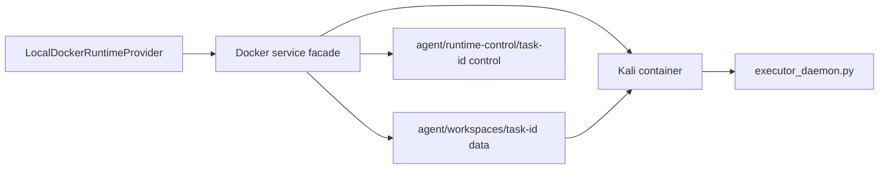
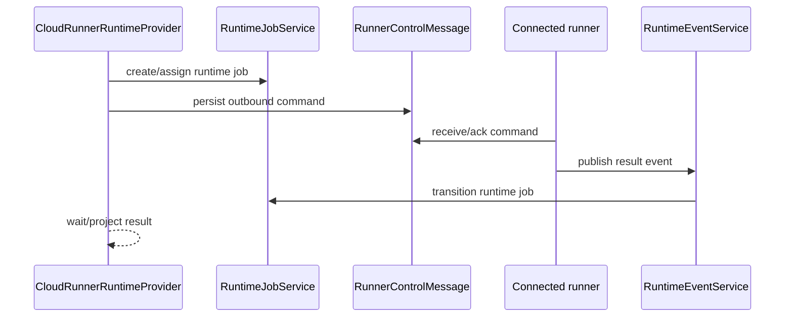

# Execution Plane Architecture

Code-verified overview of task runtime execution, runtime provider selection,
LangGraph orchestration, product Runner dispatch, and explicit dev/test local
Docker provider behavior.

## Detail Docs

- [Agent Architecture](agent-architecture.md)
- [LangGraph Graph Architecture](langgraph-graph-architecture.md)
- [Tool Architecture](tools.md)
- [Model Architecture](models.md)
- [Runtime Provider Architecture](runtime-provider.md)
- [Workspace And Artifact Architecture](workspace-artifacts.md)
- [Artifact Provenance Architecture](artifact-provenance.md)

## Purpose

The execution plane performs task work. It runs LangGraph turns, executes tools,
opens terminals, reads/writes runtime artifacts, and reports runtime results
back to the management and data planes.

It does not own tenant membership, user permissions, or cross-task data access.
Those decisions are resolved before runtime operations are dispatched.

## Responsibility Boundary

Owned by the execution plane:

- LangGraph branch execution for chat, direct executor, and deep reasoning.
- Runtime provider operations for product Runner placement and explicit
  dev/test/diagnostic local placement.
- Tool command dispatch and result collection.
- Runner-owned Kali container lifecycle and `/workspace` execution model.
- Runner lifecycle, terminal, artifact, metadata, and tool-command operations.
- Runtime observations, artifacts, logs, metrics, terminal output, and VPN state.

### Managed task networking

New and recreated task runtimes receive one non-internal user-defined Docker
bridge named from the existing container identity with a `-net` suffix. The
local Docker and Runner providers share the same backend-free contract for
ownership labels and deterministic collision-safe `/29` allocation. The
default pool is `198.18.0.0/15`; operators may override it with
`DROWAI_RUNTIME_NETWORK_POOL`, which must be a non-global IPv4 CIDR capable of
providing a `/29`. Invalid or exhausted pools fail runtime provisioning rather
than falling back to Docker's legacy bridge.

The bridge enables masquerading for internet/VPN control connectivity and
disables inter-container communication. Local runtimes retain backend access
through Docker's `host-gateway` mapping for `host.docker.internal`; Runner
runtimes do not gain a runner-host mapping. Permanent runtime retirement removes
only an empty network carrying the expected DrowAI ownership labels. Stop and
pause operations leave it intact, and existing containers are not reattached.

OpenVPN may install more-specific routes through `tun0`, so VPN targets and
network scanners continue to use the tunnel while ordinary traffic uses the
task bridge. Operators should select a non-overlapping override pool if a VPN
also routes the default managed range.

Not owned by the execution plane:

- HTTP route authorization.
- Tenant membership selection.
- Durable report/knowledge policy decisions.
- Secret storage.
- Frontend cache or routing behavior.

## Wired Entrypoints

- `backend/services/langgraph_chat/facade.py`
  - Chat turn orchestration and branch selection.
- `backend/services/langgraph_chat/execution/graph_executor.py`
  - LangGraph execution and stream adaptation.
- `backend/services/runtime_provider/registry.py`
  - Placement-to-provider resolution.
- `backend/services/runtime_provider/product_policy.py`
  - Product placement policy that rejects Management-owned local Docker for
    product task paths.
- `backend/services/runtime_provider/contracts.py`
  - Runtime operation request/result envelope.
- `backend/services/runtime_provider/local_docker_provider.py`
  - Explicit dev/test/diagnostic Local Docker-backed provider.
- `backend/services/runtime_provider/cloud_runner_provider.py`
  - Managed runner-backed provider.
- `backend/services/docker/*`
  - Docker client, config, lifecycle, logs, metrics, exec, and operations.
- `kali_executor/executor_daemon.py`
  - In-container file-comm executor daemon.
- `agent/communication/file_comm.py` and
  `kali_executor/communication/file_comm.py`
  - Host/container JSONL command/result transport.

## Runtime Placement

Product task runtime placement is resolved before provider dispatch:

- Product tasks use `runner` -> `CloudRunnerRuntimeProvider`.
- Explicit dev/test/diagnostic callers may use `local` ->
  `LocalDockerRuntimeProvider`.

Provider requests include:

- `tenant_id`
- `task_id`
- `actor_type` and `actor_id`
- `user_id`
- `runtime_placement_mode`
- `workspace_id`
- `runner_id`
- `execution_site_id`
- operation name, payload, and metadata

Unsupported placement modes fail closed in the registry.

## Explicit Local Docker Runtime

Local runtime work is delegated through `LocalDockerRuntimeProvider` to the
Docker service facade and workspace manager. This is not a product execution
path for standalone or distributed deployments and must not be used as a
Management-host fallback when no Runner is connected.

Key boundaries:

- Host task workspace is mounted as `/workspace`.
- Host control material is mounted read-only as `/run/drowai/control`; VPN and
  runtime input are not workspace-visible artifacts.
- Command transport uses `commands.jsonl` and `results.jsonl`.
- The executor daemon runs prepared command envelopes under `/workspace`.
- Docker implementation details live under `backend/services/docker/*`.
- Runtime images must report workspace layout `2.0`; mismatches stop startup.
- `backend/services/unified_docker_service.py` preserves compatibility imports.

## Product Runner Runtime

Managed runner work is delegated through `CloudRunnerRuntimeProvider` to
runner-control jobs and messages.

Key boundaries:

- Runner placement requires managed runner control to be enabled.
- Durable rows store runtime job and message state.
- Runner connections and leases are tenant-bound.
- Raw reusable-secret command durability is intentionally limited; durable
  control rows are masked.
- Standalone Compose starts Management and Runner together from
  `deploy/compose/standalone.yml`; distributed Management uses
  `deploy/cloud/control-plane.yml`; Runner hosts use
  `deploy/cloud/execution-site-package/compose.yml`.
- Runner Site removal only removes idle execution capacity. Live execution blocks
  removal, and the final connected authorized Runner cannot be removed through
  the normal operation. Runner removal never owns or changes parent task state.

## LangGraph Runtime

LangGraph execution is backend-orchestrated but runtime-facing.

Flow:

1. Chat route validates provider/model and reserves chat messages.
2. Background generation calls `run_langgraph_generation`.
3. `LangGraphChatFacade` builds runtime config and selects the graph branch.
4. Graph nodes call runtime/tool services through configured runtime context.
5. Stream events publish live packets and persist replay rows.
6. Completion callbacks finalize chat messages, tool rows, usage, and state.

Branches:

- Normal chat: response-only graph.
- Direct executor: bounded progressive tool execution.
- Deep reasoning: plan-oriented graph path.

## Security And Isolation Notes

- Runtime operations must be task-bound and tenant-bound through provider
  envelopes.
- Runtime file access should remain inside the task workspace.
- Runtime providers should return normalized operation results rather than
  leaking provider-specific internals to routers.
- Decrypted LLM credentials should not be serialized into graph state,
  checkpoints, stream packets, runner messages, or logs.
- Tool execution in task runtimes should not bypass scope validation and
  workspace-safe path helpers.

## Operational Notes

- Product containers are created by Runner using the configured runtime image
  contract and `/workspace` mount policy.
- Runner placement is required for product standalone and distributed
  deployments.
- Terminal channels use runtime provider operations for runner placement and
  Docker exec PTY behavior only for explicit local placement.
- VPN state is task-specific. Local placement materializes and connects after
  provisioning succeeds; Runner placement waits for the accepted
  `runtime.started` event before dispatching VPN config and reconnect operations.
- Configure/upload requests made before the task reaches `running` persist the
  VPN as `configured` without entering the runtime. Status reads return that
  persisted state and Retry returns a conflict until runtime execution is safe.
  Successful provisioning commits `running` before the serialized VPN
  materialize/reconnect sequence, preventing configuration updates from racing
  the startup handoff.
- VPN connection failure does not fail the task runtime. The provider persists
  VPN state separately, and the existing runtime-log stream merges bounded,
  sanitized `/vpn/connection.log` entries into Docker Terminal rows tagged with
  `service: vpn`. VPN tail probing is best-effort, so an exited container or a
  rejected Docker exec does not suppress already available container logs.
