# Knowledge Workspace Architecture

Code-verified overview of the Knowledge tab and its backing knowledge
subsystem. This page covers the visible workspace subpages, the global and
engagement-scoped APIs they use, and the execution-to-read-model lifecycle that
keeps the workspace current.

## Purpose

The Knowledge workspace is the user-facing security intelligence surface for
durable findings, assets, evidence, and relationship context. It is mounted as
`/knowledge` in the React app and is backed by tenant/user-scoped FastAPI
routers over durable knowledge read models.

The workspace currently has five visible subpages:

- **Briefing:** global knowledge summary cards and a short overview.
- **Findings:** global finding inventory with filters, detail panel, linked
  asset navigation, and evidence preview.
- **Assets:** global asset inventory with risk rollups, detail panel, linked
  services, linked findings, and evidence preview.
- **Evidence:** global evidence catalog and bounded preview drawer.
- **Territory:** engagement-selected relationship map using the
  engagement-scoped graph endpoint.

## Responsibility Boundary

The Knowledge workspace owns:

- Global user/tenant knowledge reads through `GET /api/knowledge/*`.
- Engagement-lensed reads through `GET /api/engagements/{engagement_id}/*`.
- Durable evidence preview reads through bounded read APIs.
- React Query cache keys and invalidation for global and engagement knowledge.
- Reuse of engagement knowledge components for global views.
- Display and filtering of summary, findings, assets, evidence, and map data.

The Knowledge workspace does not own:

- Runtime execution, terminal transport, Docker or runner operations.
- Raw artifact upload transport.
- Report generation, although reporting can reference knowledge records.
- Arbitrary host filesystem access for evidence previews.
- Task lifecycle, except that task execution can produce knowledge deltas.

## Wired Entrypoints

- **Frontend route:** `client/src/App.tsx`
  - Mounts `KnowledgeWorkspacePage` at protected route `/knowledge`.
  - Redirects legacy `/engagements` routes to `/knowledge`.
- **Workspace page:** `client/src/pages/knowledge-workspace-page.tsx`
  - Owns active tab state from the `tab` query string.
  - Calls global knowledge hooks for summary, findings, assets, and evidence.
  - Calls engagement hooks for engagement selection and the Territory graph.
- **Tab metadata:** `client/src/pages/knowledge-workspace-navigation.ts`
  - Defines tab ids: `summary`, `findings`, `assets`, `evidence`, `map`.
  - Publishes search destinations for the app navigation registry.
- **Global knowledge hooks:** `client/src/hooks/use-knowledge.ts`
  - Wrap `/api/knowledge/summary`, findings, assets, services, evidence, and
    global graph endpoints.
- **Engagement knowledge hooks:** `client/src/hooks/use-engagement-knowledge.ts`
  - Wrap `/api/engagements` and engagement-scoped summary, findings, assets,
    services, evidence, web surface, and graph endpoints.
- **Global API router:** `backend/routers/knowledge.py`
  - Exposes tenant/user-scoped global knowledge endpoints under
    `/api/knowledge`.
- **Engagement API router:** `backend/routers/engagement_knowledge.py`
  - Exposes engagement-scoped knowledge endpoints under `/api/engagements`.
- **Query facade:** `backend/services/knowledge/query_service.py`
  - Delegates read behavior to `KnowledgeQueryEngine`.
- **Query engine:** `backend/services/knowledge/query/engine.py`
  - Composes selectors, filters, sorting, payload shaping, and graph snapshots.
- **SQL selectors:** `backend/services/knowledge/query/selectors.py`
  - Own database retrieval for tenant/user and engagement-scoped reads.
- **Payload mappers:** `backend/services/knowledge/query/mappers.py`
  - Shape ORM rows into API payload dictionaries.

## Workspace Subpages

### Briefing

The Briefing tab is `summary` in route state and renders the reusable
`EngagementSummaryCards` component against global `KnowledgeSummary` data. The
frontend fetches `GET /api/knowledge/summary` through `useKnowledgeSummary`.

The backend summary counts open non-candidate findings, buckets open findings
by severity, counts total/vulnerable/exploited assets, and includes service,
evidence, relationship, and latest-observed timestamps. Open statuses are
returned as a stable contract for the UI.

### Findings

The Findings tab uses `useKnowledgeFindings` and `useKnowledgeFinding` over:

- `GET /api/knowledge/findings`
- `GET /api/knowledge/findings/{finding_id}`

Supported global filters include severity, status, exploited state, asset
search, source tool, text query, candidate inclusion, sort, limit, and offset.
The backend excludes candidate findings by default, attaches missing source tool
data from linked evidence when possible, and returns linked asset/service
summaries plus canonical evidence references for details.

The UI reuses engagement finding components by mapping global finding rows into
the engagement-shaped component contract with a synthetic `engagement_id` value.
Selecting a finding opens the detail panel; selecting evidence references opens
the global evidence preview drawer.

### Assets

The Assets tab uses `useKnowledgeAssets` and `useKnowledgeAsset` over:

- `GET /api/knowledge/assets`
- `GET /api/knowledge/assets/{asset_id}`

Supported global filters include asset type, vulnerable state, exploited state,
text query, sort, limit, and offset. The backend derives vulnerable and
exploited rollups from non-candidate linked findings and includes service and
finding counts in list rows. Asset details include linked service summaries and
linked finding summaries.

Like Findings, the UI reuses engagement asset components by adapting global
asset rows into the engagement-shaped component contract.

### Evidence

The Evidence tab uses `useKnowledgeEvidence` over:

- `GET /api/knowledge/evidence`
- `POST /api/knowledge/evidence/{evidence_id}/read`

Supported global filters include source tool, evidence type, text query, sort,
limit, and offset. The query engine groups durable archive rows by source
execution and selects one canonical evidence row per execution for catalog
display.

Evidence previews use `EngagementEvidenceDrawer` with `useKnowledgeApi=true`.
The drawer calls the global read endpoint, requests bounded content, and does
not render the engagement evidence catalog inside the drawer for this page.
Backend response sanitization redacts internal path fields from payloads before
they reach the client.

### Territory

The Territory tab is `map` in route state. It first requires the user to select
an engagement from `useEngagements`. After an engagement is selected, the page
uses `useEngagementGraph(engagement_id)` and renders `EngagementMapView`.

The visible Territory tab therefore uses:

- `GET /api/engagements`
- `GET /api/engagements/{engagement_id}/relationships/graph`

There is also a global hook and backend endpoint for
`GET /api/knowledge/relationships/graph`, but the current Knowledge workspace
page does not wire that global graph into the visible Territory tab.

### Services

Services are part of the knowledge model and API surface, but there is no
top-level Services subpage in the current Knowledge workspace navigation.

Available endpoints and hooks include:

- `GET /api/knowledge/services`
- `GET /api/engagements/{engagement_id}/services`
- `useKnowledgeServices`
- `useEngagementServices`

Services currently surface through asset details, summary counts, web-surface
views, and relationship maps rather than as a separate tab.

## Backend API Shape

The global router under `/api/knowledge` exposes:

- `GET /summary`
- `GET /findings`
- `GET /findings/{finding_id}`
- `GET /assets`
- `GET /assets/{asset_id}`
- `GET /services`
- `GET /evidence`
- `POST /evidence/{evidence_id}/read`
- `GET /relationships/graph`

The engagement router under `/api/engagements` exposes:

- `GET /`
- `GET /{engagement_id}`
- `GET /{engagement_id}/summary`
- `GET /{engagement_id}/findings`
- `GET /{engagement_id}/findings/{finding_id}`
- `GET /{engagement_id}/assets`
- `GET /{engagement_id}/assets/{asset_id}`
- `GET /{engagement_id}/services`
- `GET /{engagement_id}/web-surface`
- `GET /{engagement_id}/web-surface/paths`
- `GET /{engagement_id}/evidence`
- `POST /{engagement_id}/evidence/{evidence_id}/read`
- `GET /{engagement_id}/relationships/graph`

Both routers delegate to the same `KnowledgeQueryService`. Global endpoints
pass tenant/user scope without an engagement id; engagement endpoints pass the
selected engagement id to produce an engagement-lensed view.

## Data Model

Knowledge persistence lives in `backend/models/knowledge.py`.

Append-only and archive tables:

- `KnowledgeIngestionRun`: one ingestion lifecycle row per execution,
  extractor family, and extractor version.
- `KnowledgeObservation`: append-only normalized observations tied to an
  ingestion run.
- `KnowledgeEvidenceArchive`: durable evidence archive rows that survive task
  deletion when required.

Canonical read models:

- `KnowledgeAsset`: tenant/user-owned asset records.
- `KnowledgeService`: tenant/user-owned service records.
- `KnowledgeFinding`: tenant/user-owned finding records.
- `KnowledgeRelationship`: tenant/user-owned relationship records.
- `KnowledgeWebPath`: tenant/user-owned canonical web path records.

Engagement lens tables:

- `EngagementAssetLink`
- `EngagementServiceLink`
- `EngagementFindingLink`
- `EngagementWebPathLink`

Provenance:

- `KnowledgeEntityProvenance`: entity-to-execution/evidence provenance records.

Global read models are keyed by tenant, user, and canonical identity keys.
Engagement link tables provide the engagement lens without requiring every
canonical entity to be unique only inside one engagement.

## Execution-To-Knowledge Lifecycle

```mermaid
flowchart LR
    Runtime["Task runtime execution"]
    Artifacts["Execution artifacts + provenance"]
    Archive["KnowledgeArchiveService"]
    Ingestion["KnowledgeIngestionService"]
    Adapters["KnowledgeAdapterRegistryService"]
    Observations["KnowledgeObservation rows"]
    Projection["KnowledgeProjectionService"]
    ReadModels["Assets, services, findings, relationships, web paths"]
    API["/api/knowledge and /api/engagements"]
    Client["Knowledge workspace tabs"]
    LocalTrigger["Local async ingestion trigger"]
    Notify["knowledge_delta notification"]

    Runtime --> Artifacts
    Artifacts --> Archive
    Archive --> Ingestion
    Ingestion --> Adapters
    Adapters --> Observations
    Observations --> Projection
    Projection --> ReadModels
    ReadModels --> API
    API --> Client
    Ingestion --> LocalTrigger
    LocalTrigger --> Notify
    Notify --> Client
```

1. Task execution produces execution records and artifacts through the runtime
   and artifact provenance systems.
2. `KnowledgeIngestionService` resolves task ownership, loads execution
   provenance, creates or reuses a `KnowledgeIngestionRun`, and archives
   delete-critical evidence through `KnowledgeArchiveService`.
3. `KnowledgeAdapterRegistryService` dispatches deterministic adapters for
   supported tool families such as nmap, masscan, fping, ffuf, nuclei, sqlmap,
   gobuster, hydra, msfconsole, and tshark.
4. Extracted and optional candidate observations are normalized and inserted as
   append-only `KnowledgeObservation` rows with run-local deduplication.
5. `KnowledgeProjectionService` resolves canonical identities and upserts
   assets, services, findings, relationships, web paths, and engagement link
   rows through focused projectors.
6. The query service reads the projected models and shapes tab payloads for the
   frontend.
7. Local queued ingestion calls
   `schedule_projection_notification_from_result` after the ingestion commit;
   when the result inserted assets or findings, it publishes a task-scoped
   notification with category `knowledge_delta`. Runner promotion ingestion and
   upload-complete reconciliation also ingest and project records, but they do
   not currently publish `knowledge_delta`.
8. Received `knowledge_delta` notifications invalidate global knowledge caches
   and the relevant engagement cache in the client.

## Frontend Runtime Flow

The Knowledge page resolves the active tab from `/knowledge?tab=<id>`, defaults
to `summary`, and writes tab changes back to the URL using
`buildKnowledgeTabPath`.

On page render, the global summary, findings, assets, and evidence list queries
are active. Finding and asset detail queries are disabled until a row is
selected. The Territory graph query is disabled until the user selects an
engagement.

`useRuntimeNotifications` listens for browser `task-notification` events. When
the event category is `knowledge_delta`, it invalidates the global `["knowledge"]`
query namespace and the relevant engagement query namespaces when an engagement
id is present.

Tenant changes clear knowledge-related query data through the tenant cache
reset path, which prevents stale cross-tenant workspace state from staying in
the client cache.

## Security And Isolation Notes

- Global knowledge endpoints require the current authenticated user and active
  tenant context.
- The global router enforces `ACTION_KNOWLEDGE_READ` before serving each
  user-facing read.
- The query selectors filter by `tenant_id` and `user_id`; engagement reads also
  validate the selected engagement scope.
- Evidence read endpoints verify engagement, tenant, user, and archive row
  ownership before reading durable content.
- Evidence previews are bounded by read mode and character limits.
- Internal storage/path fields are redacted from API payloads and read
  responses.
- Durable evidence content is read through archive/object-store services, not
  by exposing arbitrary host paths to the client.

## Operational Notes

- `KnowledgeReadModelRebuildService` can rebuild projected read models for an
  engagement or source execution from stored observations.
- `KnowledgeReplayService` and replay source resolution support replaying
  historical or durable archive inputs into the knowledge pipeline.
- `KnowledgeRetentionService` and retention executors apply operational and
  evidence-retention policies over knowledge-related records.
- Candidate extraction is optional and controlled through knowledge candidate
  extraction policy and feature-flagged confidence thresholds.
- Unsupported tools can still produce archive rows and a successful ingestion
  with zero deterministic observations.

## Known Gaps Or Drift

- The UI has no dedicated Services tab even though service endpoints and hooks
  exist.
- The visible Territory tab uses engagement-scoped graph data. The global
  `/api/knowledge/relationships/graph` endpoint and `useKnowledgeGraph` hook
  exist but are not currently wired into that tab.
- The global page reuses engagement components by adapting records with
  synthetic `engagement_id` values, so component names may still say
  "engagement" while rendering global knowledge.
- The Briefing tab is a compact summary, not a full narrative intelligence
  report.
