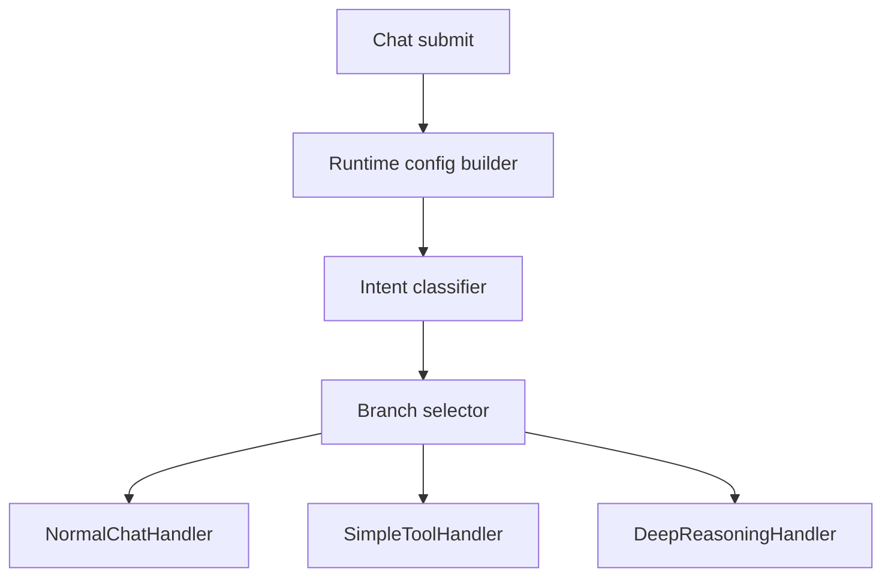
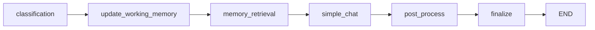
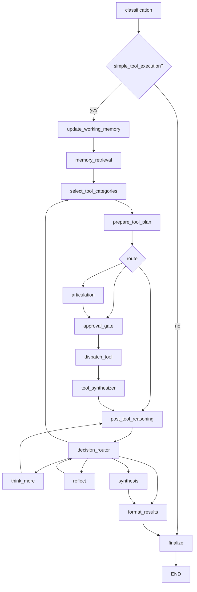
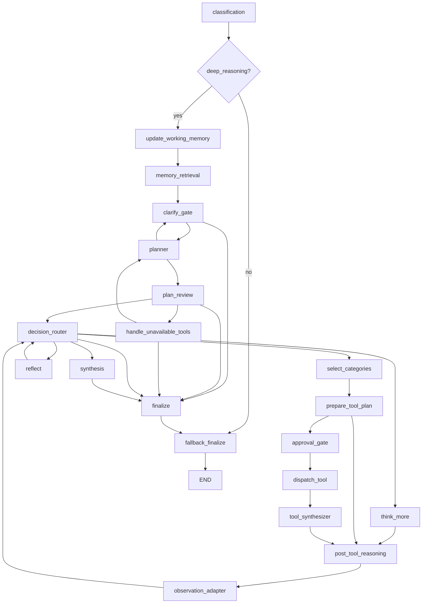

# LangGraph Graph Architecture

Code-verified overview of the active LangGraph branch selection, graph builders,
node topology, checkpoint/stream execution, and graph boundaries.

## Purpose

LangGraph is the per-turn workflow runtime for task chat. It routes each turn
into one of three graph branches:

- normal chat
- simple tool execution
- deep reasoning

The backend facade owns branch selection. Graph builders own node topology.
Graph nodes own local state transitions and emitted stream events.

## Checkpointer Schema Lifecycle

PostgreSQL checkpointer schema DDL is startup-owned. The FastAPI lifespan runs
LangGraph's idempotent checkpointer setup before background services start and
before the application accepts traffic. A PostgreSQL session advisory lock
serializes this bootstrap across concurrent backend replicas.

Request paths only acquire an already-initialized checkpointer. Chat history
prewarm and graph handlers do not run schema setup or index creation. Chat
history, prewarm, and readiness endpoints release their short ORM transactions
before awaiting runtime warmup, preventing PostgreSQL concurrent-index setup or
other external work from retaining request connections.

## Responsibility Boundary

Owned by LangGraph graph architecture:

- Graph state shape and node topology.
- Capability gates at graph entry.
- Prompt-context consumption through runtime metadata.
- Tool planning and execution subgraph wiring.
- HITL interrupt points and checkpoint-compatible resume shape.
- Stream event emission through LangGraph custom events.

Not owned by graph builders:

- HTTP request validation.
- Credential storage/decryption.
- Task ownership/tenant authorization.
- Runtime provider selection.
- Chat row reservation and final persistence.
- Frontend rendering decisions.

## Wired Entrypoints

- `backend/services/langgraph_chat/facade.py`
  - `LangGraphChatFacade.handle_turn` builds runtime config, enriches intent,
    resolves branch, and delegates to the selected handler.
- `backend/services/langgraph_chat/routing/selectors.py`
  - Maps `ExecutionMode` to normal chat, simple tool, or deep reasoning.
- `backend/services/langgraph_chat/handlers/normal_chat_handler.py`
  - Compiles `build_simple_chat_graph`.
- `backend/services/langgraph_chat/handlers/simple_tool_handler.py`
  - Compiles `build_simple_tool_graph`.
- `backend/services/langgraph_chat/handlers/deep_reasoning_handler.py`
  - Compiles `compile_deep_reasoning_graph`.
- `backend/services/langgraph_chat/execution/graph_executor.py`
  - Runs compiled graphs with `astream(..., stream_mode=["custom", "values"])`.
- `agent/graph/graph_builder.py`
  - Simple chat and minimal/bootstrap graph builders.
- `agent/graph/builders/simple_tool_builder.py`
  - Simple-tool graph builder.
- `agent/graph/builders/deep_reasoning_builder.py`
  - Deep-reasoning graph builder.

## Branch Selection



Selection inputs:

- normalized `agent_mode`
- `plan_mode`
- provider/model/runtime metadata
- intent classifier enrichment
- feature flags for simple-tool and deep-reasoning availability
- deterministic test mode overrides

Route policy:

- Chat mode forces normal chat.
- Plan overlay forces deep reasoning while preserving the underlying autonomy
  mode for approval behavior.
- Agent/full-access without plan mode can route through classifier-derived
  execution mode.

### Pre-classifier context compaction

For non-deterministic turns, `LangGraphChatFacade` resolves the classifier's
task-selected provider/model, prepares the exact classifier request, and counts
that request's system prompt, user prompt, structured-output schema, and output
reservation before classification. The soft trigger is
`floor((context_limit - reserved_output_tokens) * 0.80)`; the optional
`LANGGRAPH_CONTEXT_COMPACTION_TRIGGER_TOKENS_OVERRIDE` changes only that trigger
when it is positive and below the usable prompt budget. It does not change the
model's hard context limit. Deterministic mode bypasses both classification and
this compaction decision.

When compaction triggers, every compressor pass uses the same task-selected
provider/model through the existing runtime client resolver. For each retained-
tail candidate, the facade rebuilds and recounts the exact candidate classifier
request through `IntentClassifier.prepare_request`; only a candidate that fits
the hard limit is persisted and installed, and that already-counted request is
the object sent to the classifier. Provider failures are not compatibility-
resubmitted for compatibility. Each compressor provider request receives at
most one short jittered retry for provider-neutral timeout, rate-limit, or
temporary upstream failures; invalid output, refusal, authorization,
configuration, request-fit, and persistence failures are not retried. This
provider retry is distinct from the compressor's conditional second corrective
pass and the bounded five/four/three whole-turn candidate sequence. If
compaction fails after the soft trigger while the original prepared classifier
request still fits the model's hard limit, the failed lifecycle and warning
metadata are emitted and the unchanged prepared request continues. The turn
fails before classification only when that original request cannot fit.

The single conversation-bundle builder always installs a required
`classifier_transcript_window` from the full canonical history loaded for the
turn. Immediately before non-deterministic classification, the facade replaces
only that field when a compacted candidate is validated and persisted. The
intent-classifier projection never falls back to the shared bounded window and
invokes the exact full-or-compacted request that was accounted. Planner,
category-selection, and articulation continue to read the unchanged shared
bounded `transcript_window`.
Candidate validation reduces only by complete turns from five through three;
if the three-turn candidate still exceeds the selected model's hard limit, the
facade exits before classifier invocation with `context_uncompactable`.
Validated snapshots keep their epoch, source-token count, and exact positive
`through_message_id` cutoff together in the existing
`citations["context_compression"]` payload; no additional storage table is
introduced. Snapshot rows are reserved with no raw-message parent, so writing a
summary does not alter any raw row's parent or latest-child relationship. On
reload, the reader verifies the snapshot and cutoff are in the requested
task/conversation, locates that cutoff in its canonical raw traversal, and
reconstructs the prompt as the summary plus every raw message after the cutoff;
the snapshot row's physical position does not define the retained window. This
projection does not select an active branch: sibling subtrees keep the reader's
existing depth-first, created-time order, and new raw turns continue to parent
from the canonical raw-history tail. If the newest summary has missing or
malformed metadata, a foreign cutoff, or a cutoff absent from that traversal,
the reader ignores summary rows and projects the complete raw canonical history;
it never uses physical summary position or an older snapshot to drop raw rows.
The active user turn remains separate from this history: interactive submission
loads history before reserving the new rows, queued dispatch excludes both
reserved current-turn IDs, and compressor requests keep
`projected_user_message=None` while the classifier bundle retains the active
text only in `current_user_turn`.
Snapshot insertion is the final idempotency authority. The epoch includes a
deterministic digest of the exact backend source-ID sidecar, so different
histories with the same estimated token count do not collide. Persistence
locks the task row, resolves existing summary metadata inside the same
transaction, and returns an exact epoch/cutoff match without writing another
row. Every validated candidate reaches this locked authority; there is no
token-count-only precheck. A repeated epoch with a different cutoff is rejected
before reservation, and any partial reservation/update failure rolls back.
The initial, interrupt-resume, and checkpoint-retry success finalizers do not
recompress or persist context. The validated pre-classifier operation is the
only compressor and summary-write authority for a user turn.
Because the persisted cutoff is the final source ID in the exact expired
prefix used to build the validated classifier candidate, a fresh reader session
reconstructs the same summary and retained complete-turn tail, with the same
backend source-ID alignment, after refresh or process restart.
The existing status stream also exposes an awaited `status/context_window`
lifecycle emitter for compaction. It accepts only `compacting`, `completed`,
`failed`, or `cancelled`, carries task/conversation/turn/epoch identity, and
delegates to the shared awaited hub publisher so callers can order subsequent
work after stream sequence assignment. The facade passes its existing turn
identity into the pre-classifier compression service; that service awaits the
matching `compacting` packet before its first compressor call and spans all
whole-turn candidate attempts plus snapshot persistence before awaiting exactly
one matching terminal packet. Success emits `completed`, provider/validation/
persistence failures emit `failed`, and task cancellation emits `cancelled`.
While that scope is active, its owning asyncio task is registered under the
same task/turn identity. An accepted `RunLifecycleService.request_cancel`
cancels only that registered owner, so in-flight provider work receives
`CancelledError`, the matching cancelled lifecycle is awaited, and snapshot
persistence cannot run afterward.
The multi-task stream manager writes these lifecycle packets into the existing
task/conversation-keyed context-window store before broadcasting its legacy
compatibility event. The store applies the turn/epoch/sequence gate reducer,
the context-window hook exposes the resulting state, and only the matching task
composer disables submission and shows the inline compaction status. The
composer draft remains controlled state and is not cleared when the gate opens
or closes. If the multiplex stream disconnects, including its direct
`open`-to-reconnecting transition, the manager releases active gates only for
its desired task IDs while retaining lifecycle identity and the last sequence;
stale replay therefore cannot re-gate the composer after recovery.

## Shared Graph State

The main graph state is `InteractiveState` from `agent/graph/state.py`.

Core partitions:

- `facts`
  - user message, conversation id, capability, metadata, plan/todos, selected
    tool state, decision history, budget counters.
- `trace`
  - reasoning, observations, executed tools, history, final text, usage records.

State is passed through LangGraph as dictionaries, with wrappers in
`agent/graph/builders/common_edges.py` converting to typed state where needed
and injecting runtime context/config/writer only for nodes that accept them.

## Normal Chat Graph

Builder: `agent/graph/graph_builder.py::build_simple_chat_graph`



Purpose:

- respond without tool execution
- use shared context bundle and working-memory update path
- stream/finalize an assistant message through the normal completion callback

## Simple Tool Graph

Builder: `agent/graph/builders/simple_tool_builder.py::build_simple_tool_graph`



Important boundaries:

- Capability gate exits to `finalize` when simple-tool execution is unavailable.
- `prepare_tool_plan` can bypass execution and send unavailable-capability state
  to post-tool reasoning.
- `articulation` runs only for the first attempt; retries go directly to the
  approval gate.
- `approval_gate` interrupts when approval is required.
- `dispatch_tool` executes only after approval.
- `post_tool_reasoning` emits candidate decisions; `decision_router` is the
  deterministic route authority.

## Deep Reasoning Graph

Builder: `agent/graph/builders/deep_reasoning_builder.py::build_deep_reasoning_graph`



Important boundaries:

- Deep reasoning adds `clarify_gate`, `planner`, `plan_review`, and
  `handle_unavailable_tools`.
- Plan review can interrupt for human approval when HITL interrupts are enabled.
- Tool approval still keys off autonomy mode, not plan routing alone.
- Tool execution uses the same shared approval/dispatch/synthesizer/PTR path as
  simple-tool.
- `observation_adapter` converts post-tool findings into compact observations
  before returning to `decision_router`.
- Terminal path is `finalize -> fallback_finalize -> END`.

## Shared Tool Execution Subgraph

The shared tool execution path lives in `agent/graph/subgraphs/tool_execution.py`
and delegates runtime details under
`agent/graph/subgraphs/tool_execution_runtime/*`.

Shared sequence:

```text
select categories -> prepare_tool_plan -> approval_gate -> dispatch_tool
  -> tool_synthesizer -> post_tool_reasoning
```

Runtime responsibilities under the subgraph:

- build request context from graph metadata
- prepare workspace files/directories
- validate and execute tool batches
- apply approval and idempotency behavior
- dispatch local, direct, or runner-backed commands
- project compact result metadata back into graph state
- record artifact/provenance metadata

## Streaming And Checkpointing

`LangGraphExecutor.stream_graph` runs compiled graphs using both stream modes:

- `custom`
  - node-authored stream events for reasoning, tool, answer, pause, and status
    updates
- `values`
  - full graph state snapshots for checkpointing, final-state capture, and
    interrupt detection

The executor forwards processed custom events to the in-memory stream hub. The
hub persists replayable stream packets separately from graph checkpoints.
At each `values` checkpoint the executor may still evaluate the context window
and emit the existing ceiling status/handoff metadata. This observation is
read-only: it does not call the context compressor, call `aupdate_state`, or
replace legacy `facts.metadata["conversation_history"]`. The validated
pre-classifier path described above remains the only compaction authority.

Interrupt handling:

- interrupt payloads are observed from `values` events
- stream execution continues long enough for checkpoint state to persist
- handlers return interrupted results without final assistant text
- resume paths rebuild the graph from checkpoint/thread identity and continue
  from the interrupt point

Provider refusals are a separate terminal public outcome. The workflow remains
internally `FAILED`, while workflow metadata records
`outcome_type="provider_refusal"`; live and reconstructed assistant metadata use
`status="declined"` and `stop_reason="refusal"`. Public run status, run-state
events, and retry lifecycle packets use the same terminal `declined` state;
refusal rows do not carry chat error codes, and provider explanations are
stored only through the bounded plain-text refusal projection.

## Runtime Context

Graph wrappers extract `GraphRuntimeContext` from state metadata and forward
runtime context/config/writer only to node signatures that accept them.

Runtime metadata includes:

- tenant/task/user identity
- graph thread and turn identity
- runtime placement and workspace identity
- provider/model/reasoning metadata
- credential refs, not plaintext credentials
- conversation context bundle
- environment/runtime projection when available

Live runtime service objects are attached to LangGraph config at invocation time
and stripped before checkpoint/state inspection or diagnostics.

## Security And Isolation Notes

- Graph state must remain serializable and must not carry decrypted provider
  secrets, SDK clients, DB sessions, or backend service objects.
- Tool execution nodes rely on backend-provided task/runtime identity, not model
  supplied authority fields.
- Approval gates interrupt before dispatch; dispatch nodes do not re-plan on
  resume.
- Capability gates fail into finalize paths instead of executing unavailable
  graph capabilities.
- Context bundle and projections are prompt authority; UI transcript query
  services are read models, not prompt assembly sources.

## Operational Notes

- Graph names are centralized in `agent/graph/graph_names.py`.
- Normal chat graph compiles in the normal-chat handler.
- Simple-tool graph compiles in the simple-tool handler and can also be
  retrieved through the graph registry helper.
- Deep-reasoning active handler path compiles with a per-task checkpointer.
- Deterministic scenario graphs can replace live builders in deterministic test
  mode.
