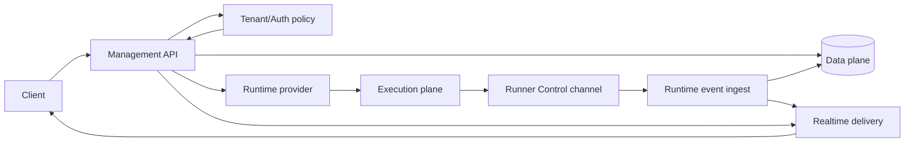

# Management Plane Architecture

Code-verified overview of the tenant-aware control surface that accepts user,
system, and runner-facing commands, authorizes them, and routes them to data or
execution-plane collaborators.

## Purpose

The management plane owns decision-making and orchestration. It answers:

- Who is the actor?
- Which tenant context is active?
- Which task, engagement, runner, or report is in scope?
- Is the requested action allowed?
- Should the operation mutate durable state, dispatch runtime work, or stream a
  response?

It does not execute pentest tools directly and does not make runtime-local file
paths globally visible.

## Responsibility Boundary

Owned by the management plane:

- HTTP request routing and response shaping.
- Credentialed cross-origin browser requests from the explicit
  `ALLOWED_ORIGINS` allowlist; local development defaults to the frontend on
  `localhost:5000` and `127.0.0.1:5000`, while product deployments normally use
  the same-origin frontend proxy.
- WebSocket authentication, tenant context, and task-channel authorization.
- Tenant membership and role-derived permissions.
- Task creation, lifecycle state transitions, admission control, product
  runtime policy resolution, and runtime provider dispatch.
- Task-scoped artifact provenance read APIs for execution, timeline, artifact
  metadata/catalog, bounded artifact reads, and raw-output lookup; Management
  authorizes the task boundary and delegates provenance lookup to artifact
  services.
- Engagement lifecycle writes and engagement-scoped knowledge reads; Management
  enforces tenant action policy, user-owned engagement scope, response shaping,
  and storage-path redaction before returning knowledge projections.
- Runner-control registry, credentials, runtime jobs, channel presence, and
  durable control messages.
- Setup, settings, LLM provider selection, reporting jobs, usage reads, CVE
  sync, and retention orchestration.
- Authenticated system-settings metrics for management-host memory, workspace
  filesystem storage, and uptime; tenant task counts continue to use the
  tenant-scoped tasks API.
- Read-only network observability for the canonical Management endpoint, local
  interfaces/default route/DNS, and tenant-scoped Runner peer addresses
  observed on control-channel connections.

Not owned by the management plane:

- Raw runtime command execution inside task environments.
- Direct cross-task workspace reads.
- Durable knowledge/evidence interpretation rules owned by data-plane services.
- Provider-specific LLM payload construction inside graph nodes.

## Wired Entrypoints

- `backend/main.py`
  - FastAPI application, router mounts, lifespan startup/shutdown, and `/ws`
    multiplexer.
- `backend/routers/auth.py`, `backend/auth.py`
  - JWT session lifecycle and current-user resolution.
- `backend/routers/tenants.py`
  - Tenant context, membership summaries, and tenant switching.
- `backend/routers/tasks/*`
  - Task CRUD, runtime control, interrupts, files, logs, metrics, VPN, and
    container/runtime surfaces.
- `backend/routers/chat/submit.py`
  - Chat submission, provider/model validation, chat row reservation, and
    background LangGraph dispatch.
- `backend/routers/artifact_provenance.py`
  - Read-only `/api/artifact-provenance/tasks/{task_id}/...` endpoints for
    executions, timelines, conversation executions, artifact metadata/catalog,
    bounded artifact reads, and raw-output batches. Every path enforces
    `ACTION_ARTIFACT_READ` and `get_tenant_task_or_404` before delegating to
    `ArtifactProvenanceQueryService` or `ArtifactMemoryService`.
- `backend/routers/engagements_crud.py`
  - Authenticated engagement create, archive, and restore write endpoints.
    Writes require `ACTION_KNOWLEDGE_WRITE`; archive/restore delegate lifecycle
    rules to `EngagementManagementService`.
- `backend/routers/engagement_knowledge.py`
  - Engagement list/detail and engagement-scoped knowledge read endpoints for
    summary, findings, assets, services, web surface, evidence reads, and
    relationship graph. Reads require `ACTION_KNOWLEDGE_READ`, use
    owned-engagement checks, delegate to knowledge query/evidence services, and
    sanitize storage-path fields from responses.
- `backend/routers/runner_control.py`
  - Execution sites, install tokens, runner registration, runtime jobs, and
    runner channel, including post-commit scheduling of VPN materialization
    after accepted runtime-start events.
- `backend/routers/system_metrics.py`
  - Tenant-settings-authorized host resource snapshots for the System settings
    panel, delegated to `backend/services/platform/system_metrics_service.py`.
- `backend/routers/network_overview.py`
  - Tenant-settings-authorized deployment network projection delegated to
    `backend/services/platform/network_overview_service.py`; Runner peer IPs are
    recorded per `runner_connections` lease when the control channel opens.
- `backend/services/websocket/gateway.py`
  - Shared WebSocket auth, tenant context, and task ownership policy.
- `backend/services/runtime_provider/operations.py`
  - Converts authorized task context into provider operation envelopes.

## Main Collaborators

- **Tenant context:** `backend/services/tenant/context.py`
- **Tenant permissions:** `backend/services/tenant/authorization.py`
- **Task lifecycle:** `backend/services/task/lifecycle_service.py`
- **Task runtime:** `backend/services/task/runtime_service.py`
- **Artifact provenance reads:** `backend/services/artifact/provenance_query_service.py`
  and `backend/services/artifact/memory_service.py`
- **Engagement access and lifecycle:** `backend/services/engagement/access_service.py`
  and `backend/services/engagement/management_service.py`
- **Engagement knowledge reads:** `backend/services/knowledge/query_service.py`
  and `backend/services/knowledge/evidence_read_service.py`
- **Product runtime policy:** `backend/services/runtime_provider/product_policy.py`
- **Runtime provider registry:** `backend/services/runtime_provider/registry.py`
- **Runner control:** `backend/services/runner_control/*`
- **Streaming fanout:** `backend/services/streaming/in_memory_hub.py` and
  `backend/services/websocket/channel_handlers.py`
- **Frontend shell:** `client/src/App.tsx`, `client/src/hooks/use-auth.tsx`,
  `client/src/hooks/use-tenant-context.tsx`

## Cross-Plane Flow

Management ingress is not uniform:

- Public bootstrap/account endpoints do not require a user JWT. Setup completion
  is rate-limited, requires the wizard to be enabled, and treats an already-
  complete installation idempotently.
  User registration validates account inputs, then creates an active default-
  tenant membership with the `owner` role; this default-owner self-registration
  is the current code-verified posture.
- User management APIs use JWT identity, active-tenant resolution, and
  role/action policy. Product WebSockets use the same user and tenant boundary.
- Runner registration exchanges a one-time install token for a tenant-bound
  Runner credential.
- The Runner control channel authenticates tenant, Runner, and credential
  headers without a user bearer token.

Authenticated user request flow:

1. Client sends HTTP or WebSocket request with JWT and active tenant hint.
2. Backend resolves user, tenant context, and permission.
3. HTTP-facing routers generally delegate orchestration to services.
4. Service mutates data-plane state or resolves product Runner placement before
   issuing a runtime provider operation.
5. Runtime and LangGraph events return through stream services and are persisted
   for replay when appropriate.
6. On accepted Runner `runtime.started` events, the runtime-event service
   transitions the task to running. After that transition is committed, the
   runner-channel router projects configured VPN work and schedules a
   task-scoped worker that delegates materialization to `TaskLifecycleService`.

## Security And Isolation Notes

- Tenant context is required before tenant-scoped work.
- Task, chat, file, and product WebSocket actions whose handlers resolve a
  specific task through ownership-aware helpers require a user-owned task
  inside the active tenant.
- Artifact provenance read endpoints are task-scoped management APIs: actors
  need `artifact.read`, and the router resolves the task through
  `get_tenant_task_or_404` before any provenance service query.
- Engagement knowledge reads need `knowledge.read` and an owned engagement in
  the active tenant. Engagement create/archive/restore writes need
  `knowledge.write`; archive/restore also require owned engagement scope.
- Engagement knowledge responses redact internal path/object-reference fields
  such as workspace, container, source, fallback, host, local, and object-key
  values before leaving Management.
- `GET /api/tasks/containers/list` is a tenant-wide task runtime-status
  inventory exception: actors with `task.read` can inspect runtime status for
  every task in the active tenant without a `task.user_id` ownership match.
- Runner Control task operations are tenant-administrative exceptions: owners
  and admins must hold `runner.manage`, but assignment and runtime-job reads use
  tenant-wide task lookup and do not require `task.user_id` to match the actor.
- WebSocket channel handlers reuse shared gateway policy instead of separate
  per-channel auth rules.
- Runtime provider requests carry tenant, task, actor, placement, workspace,
  runner, and execution-site identity.
- Product task execution must not call Docker directly from Management. Local
  Docker provider access is limited to explicit dev/test/diagnostic paths.
- Plaintext secrets should be resolved only inside backend credential services
  immediately before provider use.

## Operational Notes

- Startup validates deployment profile state, runner-control schema readiness,
  tenant baseline schema readiness, and reporting lifecycle schema readiness;
  bootstraps the default tenant; then awaits LangGraph checkpointer schema
  initialization before installation-state reconciliation, background-service
  startup, and request handling.
- Startup config is resolved through generated config/secrets with process env
  and dev `.env` as overrides. The setup wizard updates generated config and
  DB-backed installation state instead of writing product `.env` files.
- Setup database validation and completion require the submitted database name
  and user to match the active PostgreSQL or generated deployment identity;
  the wizard may rotate the configured user's password but cannot provision a
  different database or role.
- Setup wizard state can defer background services until installation is
  complete. Setup completion, including repeated requests after durable setup
  is complete, reconciles the process-local background services through the
  shared idempotent lifecycle manager.
- Product profiles require Runner placement for task creation and fail closed
  when no eligible connected Runner is available.
- Runner placement goes through `RuntimeProviderRegistry (runner mode)`,
  which wires the managed implementation with `build_runner_runtime_provider`
  and resolves to `CloudRunnerRuntimeProvider (current managed-runner implementation class)`.
- Standalone product deployment is `deploy/compose/standalone.yml`; distributed
  Management is `deploy/cloud/control-plane.yml`; Runner hosts use
  `deploy/cloud/execution-site-package/compose.yml`.
- Frontend tenant switches clear tenant-scoped React Query caches and update HTTP
  and WebSocket tenant hints.

## Runner Site Removal

Runner Site removal is a tenant-scoped, guarded hard delete of execution-plane
registration state. Management rejects removal while a connected target Runner
reports active execution or owns a nonterminal runtime job, and rejects removal
unless another connected, credential-valid Runner with a fresh heartbeat remains
outside the target site. An offline target may be removed despite stale heartbeat
metadata; the operator must stop any unreachable host processes directly.

Successful removal deletes Runner credentials, install tokens, connections,
control messages, runtime jobs, Runner rows, and the site atomically. It does not
read or mutate task lifecycle state, migrate work, or retry execution. Durable
data-plane records survive through nullable execution-reference constraints.
