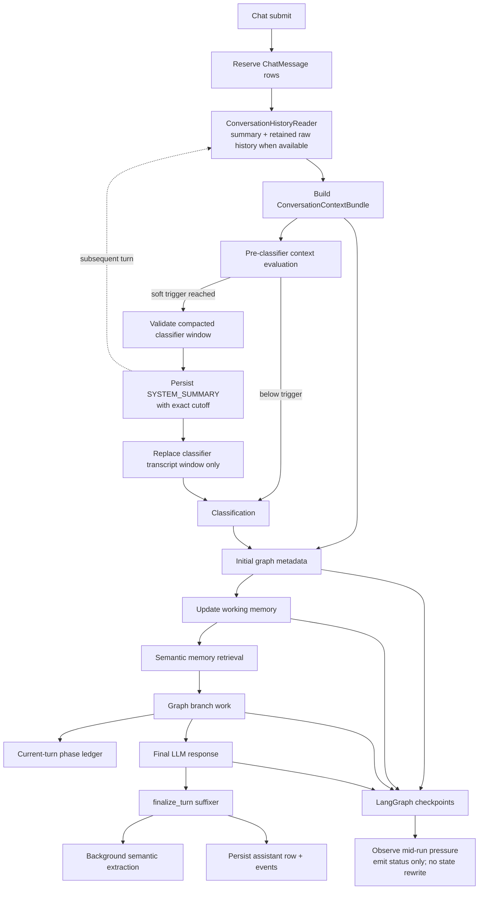

# Memory Architecture

Code-verified overview of memory surfaces used by DrowAI chat and LangGraph
execution. This document separates durable conversation memory, hot-path prompt
memory, graph-local runtime memory, current-turn phase memory, long-term
semantic memory, checkpoint memory, and operational compression.

## Purpose

Memory in DrowAI is not one store. Each graph turn uses several memory surfaces
with different ownership, lifetime, and prompt authority:

- **Chat transcript:** durable user/assistant continuity stored in
  `chat_messages`.
- **Conversation context bundle:** the prompt-authoritative hot-path envelope
  assembled once per turn.
- **Working memory:** bounded graph-local runtime state under
  `facts.metadata["working_memory"]`.
- **Current-turn phase memory:** ordered intra-turn phase ledger stored inside
  working memory.
- **Semantic memory:** durable extracted facts in `semantic_memories`, split by
  user-profile and task-engagement scope.
- **Checkpoints:** LangGraph state snapshots used for interrupt, resume, retry,
  and final-state recovery.
- **Compression snapshots:** durable `SYSTEM_SUMMARY` rows with exact raw-message
  cutoffs. A newly compacted summary replaces only the current turn's classifier
  transcript window; on later turns the canonical history reader replays the
  summary plus retained raw history into the prompt-authoritative context bundle.

The main architectural rule is that prompt continuity flows through the
`ConversationContextBundle`; graph nodes may update working memory, but prompt
builders should consume bundle projections or explicitly wired prompt context,
not rebuild ad hoc history.

## Responsibility Boundary

Owned by memory architecture:

- Durable chat continuity and provider-neutral transcript projection.
- One-per-turn context bundle assembly and role-specific projections.
- Graph-local working-memory schema, reducers, caps, and runtime-state bundle
  refreshes.
- Current-turn phase-memory append/render helpers for tool, PTR, think-more,
  and reflect phases.
- Semantic-memory extraction, retrieval, scope validation, deduplication, and
  embedding identity filtering.
- Checkpointed graph state and resume-safe runtime identity.
- Context-window evaluation, compression events, and compression snapshot
  persistence.

Not owned by memory architecture:

- HTTP/WebSocket authorization policy.
- Runtime provider selection or workspace materialization.
- Tool execution side effects.
- Provider credential storage or decrypted secret lifetime.
- Frontend transcript rendering, except through persisted chat/stream contracts.

## Memory Surfaces

| Surface | Storage | Lifetime | Prompt authority | Primary owners |
| --- | --- | --- | --- | --- |
| Chat transcript | `ChatMessage`, `ToolCall`, `ChatTurnEvent` | durable | yes, through `ConversationHistoryReader` and context bundle | `backend/services/chat/*`, `backend/models/chat.py` |
| Context bundle | `metadata["context_bundle"]` | one graph turn, checkpointed as graph metadata | yes | `agent/graph/context/*`, `backend/services/langgraph_chat/context_builder.py` |
| Working memory | `facts.metadata["working_memory"]` | graph state/checkpoint lifetime | indirectly via bundle runtime-state projection and explicit planner summaries | `agent/graph/memory/*`, `agent/graph/nodes/working_memory.py` |
| Current-turn phase memory | `working_memory.current_turn_phases` | active turn only; prior turns pruned | yes for PTR/reasoning prompts that render it explicitly | `agent/graph/utils/iteration_memory.py` |
| Semantic memory | `semantic_memories` | durable until retention/delete | no in current hot path; retrieval summary is written separately | `backend/services/memory/*`, `agent/graph/nodes/memory_retrieval.py` |
| Checkpoints | Postgres or SQLite; per-acquisition memory saver fallback | persistent task/thread lifetime for Postgres/SQLite; current acquisition only for memory saver | not directly; persistent backends store graph state used for later resume | `backend/services/langgraph_chat/checkpoint/*`, `agent/graph/persistence.py` |
| Compression | context-window metadata and durable `SYSTEM_SUMMARY` rows | durable snapshot plus per-turn metadata | yes for the current classifier window and subsequent summary-plus-retained-history bundles | `backend/services/langgraph_chat/compression/*`, `backend/services/chat/conversation_history_reader.py` |

## Wired Entrypoints

- `backend/services/chat/message_service.py`
  - Reserves and updates durable `ChatMessage` rows.
- `backend/services/chat/conversation_history_reader.py`
  - Loads persisted chat rows and converts them into provider-neutral
    role/content history.
- `backend/services/langgraph_chat/context_builder.py`
  - Builds `metadata["context_bundle"]` once per turn from chat history and
    current user message.
- `backend/services/langgraph_chat/facade_helpers.py`
  - Copies the prebuilt bundle into initial graph state and fails closed if the
    bundle is missing.
- `agent/graph/context/builder.py`
  - Defines `build_conversation_context_bundle`.
- `agent/graph/context/projections.py`
  - Defines role-specific projections for classifier, category selector,
    planner, and articulation.
- `agent/graph/context/serialization.py`
  - Renders bundle projections into ordered prompt sections.
- `agent/graph/nodes/working_memory.py`
  - Computes turn-start working memory and refreshes bundle runtime-state.
- `agent/graph/memory/memory_manager.py`
  - Owns deterministic reducers for turn start, tool result, PTR findings,
    active decision, phase ledger, and turn end.
- `agent/graph/utils/iteration_memory.py`
  - Owns current-turn phase sequence allocation, append, and rendering.
- `agent/graph/nodes/memory_retrieval.py`
  - Retrieves semantic-memory summaries and writes
    `metadata["long_term_memory_summary"]`.
- `agent/graph/nodes/finalizer.py`
  - Queues best-effort semantic-memory extraction after final text is produced.
- `backend/services/memory/runtime_service.py`
  - Resolves memory LLM and embedding dependencies without leaking decrypted
    secrets into graph state.
- `backend/services/memory/memory_store.py`
  - Persists and retrieves semantic memories with scope and embedding identity
    constraints.
- `backend/services/langgraph_chat/execution/graph_executor.py`
  - Streams graphs with `stream_mode=["custom", "values"]`, captures values
    state, and observes mid-run context-window pressure without rewriting state.
- `backend/services/langgraph_chat/compression/turn_service.py`
  - Owns the only compression-authority path: pre-classifier compaction,
    candidate validation, and durable snapshot persistence.
- `backend/services/langgraph_chat/compression/snapshot_repository.py`
  - Persists hidden `SYSTEM_SUMMARY` rows with an exact summarized-through
    message id.
- `backend/services/langgraph_chat/checkpoint/checkpointer_service.py`
  - Provides per-task checkpointer lifecycle and fallback.

## End-To-End Turn Flow

## Graph Lifecycle Usage

### Normal Chat

Active builder: `agent/graph/graph_builder.py`.

Lifecycle:

1. `LangGraphContextBuilder.build_runtime_config` builds the context bundle from
   persisted history and the current user message.
2. `facade_helpers.build_metadata` copies that bundle into graph metadata.
3. `classification` routes the turn.
4. `update_working_memory` reduces runtime state and refreshes the bundle's
   `runtime_state` / `evidence_refs`.
5. `memory_retrieval` attempts semantic retrieval and writes
   `long_term_memory_summary`, or clears the key on no-op/failure.
6. `simple_chat` builds messages from the context bundle. It intentionally does
   not read `long_term_memory_summary`.
7. `post_process` and `finalize` finish graph state.
8. `finalize_turn` appends final text to trace history and queues background
   semantic extraction.

Normal chat prompt continuity is transcript/bundle-driven. Working memory is
available as runtime-state projection, but long-term semantic retrieval is not a
hot-path prompt input.

### Simple Tool Execution

Active builder: `agent/graph/builders/simple_tool_builder.py`.

Lifecycle:

1. Classification gates the branch on `simple_tool_execution`.
2. `update_working_memory` sets route stage, objective, active target, typed
   handles, intent brief, simple-tool seed todos, and bundle runtime-state.
3. `memory_retrieval` writes a bounded semantic summary but current prompt
   paths do not treat it as prompt authority.
4. `select_tool_categories` consumes the category-selector projection from the
   context bundle.
5. Tool planning uses `project_for_planner` from the bundle for transcript and
   runtime-state, then combines runtime-state summary with current-turn phase
   memory for planner prompt context.
6. Tool execution result projection updates:
   - `last_tool_result` and compact result metadata
   - working-memory tool state, coverage, tool runs, collections, target
     referents, and available findings
   - current-turn phase memory via a `source="tool"` record
7. `post_tool_reasoning` reads latest tool context and phase memory, emits a
   decision, applies active decision / findings back into working memory, and
   appends a `source="ptr"` phase record.
8. `think_more` and `reflect`, when routed, render existing phase memory and
   append `source="think_more"` or `source="reflect"` records.
9. `synthesis` or `format_results` prepares the final response.
10. `finalize_turn` queues background semantic extraction.

Simple-tool memory is therefore a mix of prompt-authoritative bundle context,
runtime working-memory state, and a current-turn phase ledger that keeps the
tool/PTR/reasoning loop coherent without inventing a second turn transcript.

### Deep Reasoning

Active builder: `agent/graph/builders/deep_reasoning_builder.py`.

Lifecycle:

1. Classification gates the branch on `deep_reasoning`.
2. `update_working_memory` follows the same reducer path as simple tool, but
   preserves planner-owned goals once a plan is pending/approved.
3. `memory_retrieval` runs after working-memory update and before
   `clarify_gate`.
4. `clarify_gate`, `planner`, and `plan_review` use graph facts plus planner
   context. Tool planning still derives recent transcript and runtime-state
   from the context bundle.
5. Tool execution follows the shared tool execution subgraph:
   `select_categories -> prepare_tool_plan -> approval_gate -> dispatch_tool ->
   tool_synthesizer -> post_tool_reasoning`.
6. `post_tool_reasoning` appends PTR phase memory and routes through
   `observation_adapter` back to `decision_router`.
7. `think_more`, `reflect`, and `synthesis` consume and extend current-turn
   phase memory as needed.
8. `finalize` builds the final answer from articulation projection, plan/todos,
   observations, executed tools, and targets.
9. `fallback_finalize` runs `finalize_turn`, which queues background semantic
   extraction.

Deep reasoning uses the same memory contracts as simple tool, but it also
persists plan, todo, decision, observation, and executed-tool state in the graph
state that checkpoints capture for resume/retry.

## Semantic Memory Lifecycle

Semantic memory is durable long-term fact storage, not the active transcript.

### Tiers

- `user_profile`
  - User-private facts.
  - Requires `user_id`.
  - Must not carry `tenant_id` or `engagement_id`.
- `task_engagement`
  - Tenant-owned engagement/task facts.
  - Requires `tenant_id` and either `engagement_id` or `task_id`.
  - Task and engagement ownership is validated against canonical DB rows.

### Retrieval

1. `memory_retrieval_node` derives a query from working memory:
   active target plus non-unknown objective.
2. It resolves `MemoryRuntimeService` from run config runtime services.
3. Runtime user id, metadata user id, and context user id must agree.
4. `MemoryRuntimeService.retrieve_summary` resolves the active embedding
   dependency and task tenant/engagement scope.
5. `MemoryStore` checks candidate tier presence and retrieves user-profile plus
   task/engagement results with active embedding identity filters.
6. `core/memory/retrieval_summary.py` renders a bounded summary.
7. The node writes `metadata["long_term_memory_summary"]` or clears it.

Current gap: this summary is parked groundwork. Tests and node comments confirm
that simple chat and planner hot paths deliberately drop
`long_term_memory_summary`; the prompt-authoritative path remains the context
bundle plus explicitly rendered working/phase memory.

### Extraction

1. Final graph branches route through `finalize_turn`.
2. `finalize_turn` calls `enqueue_memory_extraction` with user message, final
   assistant response, task/conversation identifiers, and a non-secret runtime
   selection snapshot.
3. The trigger runs in a background executor when semantic memory runtime is
   enabled.
4. `MemoryRuntimeService.run_extraction` resolves:
   - embedding provider for durable vectors
   - memory gate LLM
   - memory extraction LLM
5. `MemoryExtractionService` performs:
   - structural precheck
   - LLM gate
   - bounded fact extraction
   - durable secret masking
   - tiered `MemoryCreateRequest` writes
6. `MemoryStore.store` masks again, computes exact `scope_key` dedupe, embeds
   content, runs semantic dedupe on Postgres, then persists the final vector.

Extraction is best-effort: enqueue and worker errors are logged/metriced but do
not fail the graph turn.

## Working Memory Contract

Working memory is the canonical graph-local runtime state under
`metadata["working_memory"]`. It is deterministic, bounded, and pointer-first.

Important fields:

- `ids`: task, conversation, turn id, and turn sequence.
- `input`: current user message reference and bounded excerpt.
- `stage`: chat, tool selection, parameterization, execution, or approval.
- `objective`: current operational goal with provenance.
- `active`: typed target/subject/collection handles.
- `constraints`, `preferences`, `referents`, `entities`, `facts`,
  `coverage`, `tool_state`, `tool_runs`, `collections`, `open_questions`.
- `available_findings`: bounded candidate findings for later planner/PTR use.
- `current_turn_phases`, `current_turn_phase_counter`,
  `current_turn_phase_turn`: current-turn phase ledger.
- `active_decision`: latest advisory decision.
- `intent_brief`: classifier-derived brief folded into runtime state.

Caps and normalization live in `agent/graph/memory/working_memory.py`. Reducers
live in `agent/graph/memory/memory_manager.py`. The scratchpad renderer is
diagnostic only and must not become prompt authority.

## Current-Turn Phase Memory

Current-turn phase memory is an ordered ledger inside working memory. It exists
to keep a single user turn coherent while tools, PTR, think-more, reflect, and
synthesis loop.

Properties:

- Runtime stamps `turn_sequence` and `phase_sequence`; LLM output does not own
  identity fields.
- Each record stores ordered prompt-section snapshots, not free-form semantic
  summaries.
- Records from prior turns are pruned at the turn boundary.
- The ledger is rendered by `render_phase_memory_section` and
  `render_latest_phase_memory_section`.
- Tool result projection writes `source="tool"`.
- PTR writes `source="ptr"`.
- Think-more writes `source="think_more"`.
- Reflect writes `source="reflect"`.

This ledger lives in working memory rather than `TraceState.observations`, so
existing prose-observation consumers remain unchanged.

## Checkpoint And Resume Memory

LangGraph performs checkpoint writes while executing graphs compiled with the
acquired checkpointer. The executor consumes `values` stream events to capture
the latest full state, observe context pressure, and detect interrupts; it does
not persist those chunks itself. Checkpoints carry serializable graph state such
as facts, metadata, trace, plan/todo state, working memory, and phase ledger.

Checkpointing behavior:

- `CheckpointerService` prefers Postgres, falls back to SQLite, then memory.
- Postgres and SQLite checkpointers are isolated per task and can be pooled with
  LRU cleanup.
- The `MemorySaver` fallback is created for each acquisition and is not pooled,
  so its checkpoints cannot support a later resume or retry request.
- Resume/retry config is built by `build_checkpoint_execution_config`.
- Runtime services and live clients are attached through config, not serialized
  as checkpoint state.
- `strip_runtime_services` is used before checkpoint state updates where live
  services would otherwise leak into state-facing config.
- Final-state recovery queries latest thread state first; a supplied
  `checkpoint_id` is treated as a resume anchor, not the identity of the final
  post-run state.

## Compression And Context Window Memory

Context compression has one prompt-facing authority point before classification.
It also creates durable continuity for later turns through the canonical history
reader.

Current behavior:

- Before classifier invocation, `TurnCompressionService` is the only component
  allowed to compact the turn. It evaluates the real classifier request against
  a usable prompt budget that reserves output tokens. Compaction begins when
  prompt tokens reach a soft trigger: by default 80% of that usable budget, or a
  valid configured token override. It then builds and validates a summary plus
  retained whole-turn candidate.
- The validated candidate is persisted as a hidden `SYSTEM_SUMMARY` row with an
  exact `through_message_id` cutoff before the facade installs it.
- For that current turn, the facade replaces only
  `context_bundle.classifier_transcript_window`; the bundle projections used by
  non-classifier graph prompts keep their original current-turn history.
- On subsequent turns, `ConversationHistoryReader` selects the latest valid
  summary cutoff and prepends the summary as a system message to retained raw
  history. The context builder then uses that canonical history to assemble the
  prompt-authoritative bundle.
- During graph execution, `LangGraphExecutor` only evaluates checkpoint chunks
  for context-window pressure and emits status metadata. It does not compress or
  rewrite checkpoint state.

## Security And Isolation Notes

- Semantic-memory retrieval verifies runtime user id against selection,
  metadata, and context user ids before reading.
- Task-engagement memory validates tenant/task/engagement ownership before
  writes.
- User-profile memory is user-private and cannot carry tenant/engagement scope.
- Semantic memory applies exact dedupe with scoped keys and semantic dedupe only
  inside the same ownership scope and embedding identity.
- Durable memory content and metadata are masked through
  `runtime_shared.durable_secret_masking`.
- Memory runtime services resolve decrypted API keys inside backend runtime
  methods and do not place them in graph metadata/checkpoints.
- Tool request metadata strips raw LLM secret keys before constructing runtime
  tool requests.
- Runtime side effects remain behind runtime-provider/tool-execution services;
  memory docs should not imply host-path access from graph nodes.

## Operational Notes

- `MEMORY_RETRIEVAL_MAX_RESULTS` controls total retrieval count.
- `MEMORY_RETRIEVAL_SUMMARY_MAX_CHARS` bounds semantic retrieval summary text.
- `MEMORY_EXTRACTION_MIN_MESSAGE_LENGTH` skips low-signal turns.
- `MEMORY_EXTRACTION_MAX_FACTS_PER_TURN` bounds extracted facts per completed
  turn.
- Semantic memory depends on configured embedding and memory LLM selections; if
  selection or credential resolution fails, retrieval/extraction no-ops.
- SQLite retrieval falls back to newest rows instead of vector distance because
  pgvector distance is Postgres-specific.
- The context bundle is required for hot-path prompt consumers after the
  authority cutover; missing bundle errors indicate upstream wiring bugs.

## Known Gaps Or Drift

- `memory_retrieval_node` writes `long_term_memory_summary`, but current
  hot-path prompt consumers intentionally do not read it.
- `ConversationContextBundle.retrieved_prior_context` is reserved and currently
  empty.
- `metadata["memory_snapshot"]` is seeded in runtime config but is not the
  prompt-authoritative memory contract.
- Compression snapshot metadata temporarily overloads
  `ChatMessage.citations["context_compression"]`; the repository notes that a
  dedicated column or table remains follow-up work.
- The architecture documentation state file is still at broad discovery state;
  this page documents the memory component directly from wired code paths.
