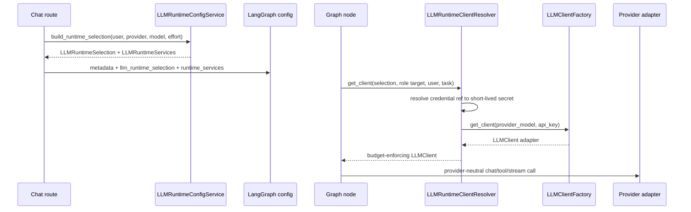

# Model Architecture

Code-verified overview of how LLM providers, model profiles, credentials,
runtime selection, multi-model role routing, and provider adapters are wired
through the system.

## Purpose

The model layer lets the app use multiple LLM providers without graph nodes,
routers, or tool planners constructing provider SDK clients directly.

The backend owns user-facing model catalog, credential storage, saved
selection, and runtime-safe selection payloads. The agent provider layer owns
provider/model metadata, provider-neutral LLM contracts, factory registration,
and provider-specific adapters for OpenAI and Anthropic.

GPT-5.6 is represented by exact OpenAI profiles for `gpt-5.6-sol`,
`gpt-5.6-terra`, and `gpt-5.6-luna`; the non-listable `gpt-5.6` API alias uses
the Sol profile. Each profile has a 1,050,000-token context window, a
128,000-token output limit, a `medium` default reasoning effort, and accepts
only `none`, `low`, `medium`, `high`, `xhigh`, or `max`. Usage pricing is
model-specific and accounts for cached input, cache writes, and the documented
long-context multiplier above 272,000 input tokens.

## Responsibility Boundary

Owned by the model layer:

- Provider and model identity contracts.
- Provider/model capability profiles.
- Public catalog metadata and selectable-model validation.
- Encrypted per-user provider credentials.
- Saved per-user conversation and reporting LLM selections.
- Runtime-safe provider/model/credential-ref payloads.
- Role-aware call target resolution for multi-model execution.
- Provider-neutral `LLMClient` interface.
- Adapter construction through `LLMClientFactory`.
- OpenAI Responses, OpenAI Chat Completions, and Anthropic Messages adapters.
- Output budget and context-window enforcement before provider calls.

Not owned by the model layer:

- Prompt template content.
- LangGraph branch selection.
- Task authorization.
- Tool execution authorization.
- Frontend rendering.
- Durable decrypted provider secrets in graph state or checkpoints.

## Plane Placement

- Management plane:
  - Exposes catalog, selection, credential, credential-test, and task model
    switch routes.
  - Validates model selectability and credential presence before runtime use.
- Data plane:
  - Stores encrypted provider credentials, saved selections, conversation
    metadata, and usage records.
  - Stores only non-secret credential references in runtime/checkpoint-facing
    metadata.
- Execution plane:
  - Consumes `LLMRuntimeSelection` and `LLMRuntimeServices`.
  - Resolves role-specific call targets and constructs provider clients at
    invocation time.

## Wired Entrypoints

Backend management and runtime wiring:

- `backend/routers/llm.py`
  - Public model catalog, conversation/reporting selection, credential,
    runtime switch, and conversation lifecycle routes.
- `backend/routers/chat/submit.py`
  - Builds the runtime LLM selection for chat turns.
- `backend/services/llm_provider/catalog_service.py`
  - Lists provider/model profiles and validates selectable models.
- `backend/services/llm_provider/credential_service.py`
  - Stores encrypted credentials and resolves short-lived provider secrets.
- `backend/services/llm_provider/selection_service.py`
  - Persists the user's default provider/model selection.
- `backend/services/llm_provider/reporting_selection_service.py`
  - Persists and validates the independent reporting provider/model selection.
- `backend/services/llm_provider/runtime_config_service.py`
  - Builds `LLMRuntimeSelection` and live `LLMRuntimeServices`.
- `backend/services/llm_provider/runtime_client_resolver.py`
  - Converts runtime selections into concrete provider clients.
- `backend/services/llm_provider/environment_service.py`
  - Builds the selected provider's local-container compatibility environment.
- `backend/services/llm_provider/runtime_services.py`
  - Attaches non-checkpointed live runtime services to graph config.
- `backend/services/langgraph_chat/facade_helpers.py`
  - Projects non-secret runtime model metadata into graph config.
- `backend/services/reporting/memo_generator.py` and
  `backend/services/reporting/report_section_generator.py`
  - Resolve the reporting selection through the shared runtime client resolver.
- `backend/services/docker/container_config.py`
  - Adds the provider compatibility environment during local task-container
    provisioning.

Agent provider and graph wiring:

- `agent/providers/llm/core/identity.py`
  - Provider/model ids and `ProviderModelRef`.
- `agent/providers/llm/core/base.py`
  - Provider-neutral `LLMClient`, response, streaming, tool-call, and
    structured-output contracts.
- `agent/providers/llm/profiles/registry.py`
  - Immutable provider/model profile registry.
- `agent/providers/llm/profiles/openai.py`
  - OpenAI model profiles, API surfaces, limits, and internal role defaults.
- `agent/providers/llm/profiles/anthropic.py`
  - Anthropic model profiles, limits, and internal role defaults.
- `agent/providers/llm/factory/client_factory.py`
  - Provider/model-aware adapter factory.
- `agent/providers/llm/adapters/openai/*`
  - OpenAI Chat Completions and Responses adapters.
- `agent/providers/llm/adapters/anthropic/*`
  - Anthropic Messages adapter and provider-local translation helpers.
- `agent/graph/utils/llm_resolver.py`
  - Central graph-node resolver for role-owned LLM clients.
- `core/llm/role_policy.py`
  - Shared role-based provider/model/reasoning-effort policy.

## Model Catalog And Profiles

Model metadata lives in the provider profile registry, not in routers.

```mermaid
flowchart LR
    Profiles[Provider model profiles]
    Catalog[LLMProviderCatalogService]
    Router[/api/llm/models]
    UI[Client model picker]

    Profiles --> Catalog
    Catalog --> Router
    Router --> UI
```

Profiles declare:

- provider id and display name
- model id and display name
- API surface
- capability set
- context-window limit
- max-output limit
- listable/catalog visibility
- reasoning-effort values
- tool-choice modes
- structured-output strategies
- provider-owned internal role defaults

`LLMProviderCatalogService` reads listable profiles and adapter availability
from `LLMClientFactory`. A model is selectable only when its profile is valid,
the provider adapter is registered, and the model supports chat. OpenAI
selection is additionally constrained to the Responses API public model family.

## Credential And Selection State

Durable state is split deliberately:

- `UserLLMProviderCredential`
  - Encrypted provider credential row.
- `LLMCredentialRef`
  - Non-secret `{user_id, provider}` pointer used in runtime payloads.
- `UserLLMSelection`
  - User's default conversation provider/model.
- `UserReportingLLMSelection`
  - Independent provider/model/reasoning-effort selection for task memos and
    engagement report sections.
- `LLMRuntimeSelection`
  - Non-secret runtime payload: provider, model, credential ref, and optional
    reasoning effort.
- `LLMRuntimeServices`
  - Live invocation-only service bag containing the runtime client resolver.

Decrypted provider API keys are not stored in graph metadata, checkpoint state,
stream packets, or task workspace files. Provider calls resolve them through
`LLMRuntimeClientResolver` when constructing a concrete client. A separate
OpenAI-only local-Docker compatibility path resolves the selected credential
through `LLMProviderEnvironmentService` and injects `OPENAI_API_KEY` into the
task container environment during provisioning. The credential service always
checks that the credential-ref user matches the runtime user and additionally
checks task ownership when a task ID is supplied. Task-scoped provider calls
and local-container provisioning supply that task context. Engagement report
sections instead enter through tenant permission and owned-engagement checks,
then resolve the requesting user's credential without a task ID. Container
injection does not add the secret to graph metadata or checkpoints.

## Runtime Flow



Graph nodes call `agent/graph/utils/llm_resolver.py`. That resolver requires
`runtime_services.client_resolver` and `llm_runtime_selection` in graph config.
Raw API keys in metadata are not supported.

`runtime_services` is a live object, so it is attached only to local invocation
config and stripped before checkpoint/state inspection. The serializable state
keeps provider/model and credential references only.

Reporting generation follows a separate saved-selection lifecycle from the
default conversation selection. Authenticated `GET` and `PUT`
`/api/llm/reporting-selection` routes read and persist it through
`ReportingLLMSelectionService`. That service requires structured-output support
and an enabled credential before building its own `LLMRuntimeSelection`; task
memo and engagement report-section generators then construct the client through
the shared `LLMRuntimeClientResolver`.

## Multi-Model Support

The user's selected provider/model is the default conversation target, but it
is not the only model a turn can use.

`core/llm/role_policy.py` resolves a provider/model/reasoning-effort tuple for
each role-owned call. User-selected roles can use the conversation model or an
explicit reasoning model. Internal roles use provider-owned defaults declared in
provider profiles, with environment variable overrides for specific internal
roles.

Current role families:

- User-selected roles:
  - `conversation_main`
  - `reasoning_main`
  - `post_tool_observation`
  - `intent_classifier`
- Internal fixed roles:
  - `tool_output_compressor`
  - `tool_category_selector`
  - `post_tool_articulator`

Conversation-context compression also uses the task-selected provider/model,
but resolves that target directly from the compaction request. It has no
internal lightweight-model profile default or role-policy environment override.

When a role resolves to a provider different from the conversation selection,
`LLMRuntimeClientResolver` fetches an enabled credential ref for the target
provider. This means multi-provider execution is supported, but every target
provider still requires a valid credential for the runtime user.

Capability checks stay profile-driven. Reasoning effort is passed only to
models that declare `REASONING_EFFORT`; unsupported efforts fail before the
provider call.

## OpenAI Implementation

OpenAI is registered under provider id `openai`.

OpenAI profiles define two API surfaces:

- `responses`
  - Public selectable GPT-5-family models.
  - Used by `OpenAIResponsesClient`.
  - Supports reasoning effort, streaming, tools, native structured output,
    usage reporting, context-window limits, and max-output limits.
- `chat_completions`
  - Non-listable compatibility profiles for older GPT-4/GPT-3.5 style models.
  - Used by `OpenAIChatClient`.

`LLMClientFactory` resolves OpenAI adapters by the selected profile's API
surface. Provider-aware calls use `ProviderModelRef`; legacy model-only prefix
fallbacks remain for compatibility callers and tests.

OpenAI-specific translation is isolated in adapter helpers:

- Responses request shaping:
  - `agent/providers/llm/adapters/openai/responses/request_builder.py`
- Responses output and usage parsing:
  - `agent/providers/llm/adapters/openai/responses/response_parser.py`
- Responses streaming parsing:
  - `agent/providers/llm/adapters/openai/responses/stream_parser.py`
- OpenAI tool payload conversion:
  - `agent/providers/llm/adapters/openai/tool_contracts.py`
- OpenAI native JSON schema output:
  - `agent/providers/llm/adapters/openai/structured_output.py`

## Anthropic Implementation

Anthropic is registered under provider id `anthropic`.

Anthropic profiles use the `messages` API surface and are handled by
`AnthropicMessagesClient`.

Anthropic model profiles declare provider-published context and max-output
limits, streaming, tool use, usage reporting, and prompt-parse structured
output. Claude Sonnet 5 and Claude Fable 5 are public catalog models;
Claude Mythos 5 has an exact non-listable Anthropic Messages profile and is
excluded from normal user selection. Active 4.x profiles remain available, and
Haiku 4.5 remains the provider-owned model for all internal lightweight roles.

Effort-capable Anthropic profiles expose only the levels accepted by each
model. The adapter sends the resolved value through `output_config.effort` and
uses the model profile default (`high`) when no explicit value is selected.
Fable 5, Mythos 5, Opus 4.7, Opus 4.8, and Sonnet 5 support `xhigh`; Sonnet
4.6 does not. Newer models omit unsupported sampling parameters during request
translation.

Anthropic-specific translation is isolated in adapter helpers:

- Messages request construction and usage normalization:
  - `agent/providers/llm/adapters/anthropic/client.py`
- Tool schema and tool-choice conversion:
  - `agent/providers/llm/adapters/anthropic/tool_contracts.py`
- Prompt-parse structured output:
  - `agent/providers/llm/adapters/anthropic/structured_output.py`
- Text and tool-call response parsing:
  - `agent/providers/llm/adapters/anthropic/response_parser.py`

Adaptive and redacted thinking blocks are accepted as provider metadata while
visible text remains the provider-neutral response content. Anthropic thinking
token counts are normalized into usage `reasoning_tokens`. Documented
structured refusal signals from Anthropic Messages, OpenAI Responses, and
OpenAI Chat Completions raise `LLMRefusalError` with one
`LLMRefusalOutcome`. The outcome carries provider/model identity, optional
category, explanation, response id, normalized usage, and partial streamed
or non-streamed visible content; ordinary refusal-like assistant prose remains
a successful response.

Anthropic pricing includes base input, 5-minute cache writes, 1-hour cache
writes, cache reads, and output tokens. Sonnet 5 switches automatically from
its launch pricing to standard pricing on September 1, 2026 (UTC).

Anthropic structured output is intentionally prompt-and-parse based. The
adapter appends JSON-output instructions and validates the returned content
through the shared provider-neutral structured-output parser.

## Adding Provider Or Model Support

Use the provider/profile/factory path. Do not branch graph nodes or routers on
provider SDK details.

Recommended steps:

1. Add provider/model identity constants only if a new stable provider id is
   needed.
2. Add provider and model profiles under `agent/providers/llm/profiles/`.
3. Declare exact capabilities, API surface, context window, max output,
   reasoning-effort support, tool-choice modes, structured-output strategies,
   and listable/selectable intent.
4. Add provider-owned internal role model defaults when internal graph roles can
   use that provider.
5. Register the provider profiles in `agent/providers/llm/profiles/registry.py`.
6. Implement a provider adapter that satisfies `LLMClient`.
7. Keep provider SDK payload shaping inside provider-local adapter helpers.
8. Normalize every documented non-streaming and streaming refusal signal into
   `LLMRefusalOutcome`, and re-raise `LLMRefusalError` unchanged through parse,
   recovery, tool, and retry layers. Application and UI code must not inspect
   provider-native refusal payloads.
9. Register the adapter resolver in `LLMClientFactory.register_provider`.
10. Extend catalog validation only when the new provider needs provider-specific
   selectability rules.
11. Add tests for catalog listing, selection validation, credential resolution,
    factory construction, role targeting, tool calls, structured output,
    streaming usage, refusals, and budget enforcement.
12. Update UI/schema code only if the public catalog or selection response shape
    changes.

For a new model under an existing provider, prefer adding a profile first. If
the model uses an already-supported API surface and capabilities, no graph code
or router code should change.

## Security And Isolation Notes

- Provider API keys are encrypted at rest.
- Graph metadata carries only provider/model and credential references.
- Decrypted secrets are resolved at the runtime client boundary for provider
  calls; local-Docker provisioning also resolves the selected OpenAI secret for
  the task container's `OPENAI_API_KEY` compatibility environment.
- Credential resolution always validates the credential-ref user against the
  runtime user. It additionally validates task ownership when a task ID is
  supplied, including task-scoped provider calls and local-container
  provisioning. Engagement report sections rely on upstream tenant permission
  and owned-engagement checks, then resolve the requesting user's credential
  without a task ID.
- The local-container secret is distinct from graph metadata and checkpoint
  persistence, which remain non-secret.
- Live runtime services are not checkpointed.
- Output budget and context-window checks run before provider API calls.
- Provider adapters normalize errors into provider-neutral exceptions.

## Operational Notes

- Adapter availability affects catalog availability and selectability.
- The default provider/model comes from the profile registry and selection
  service defaults.
- OpenAI legacy settings mirrors still exist for compatibility paths.
- Runtime model switching writes a task-scoped control message carrying the new
  non-secret runtime selection.
- Multi-provider role routing requires credentials for every target provider.
- Model profile limits should be updated before increasing runtime defaults.

## Known Gaps Or Drift Risks

- OpenAI has both Responses and Chat Completions adapters; the public selectable
  path is Responses-focused.
- Some OpenAI model-only compatibility paths remain for older callers.
- Anthropic historical assistant tool-call replay is not fully supported by the
  adapter.
- Provider SDK feature support should be represented as profile capabilities
  before graph nodes depend on it.
