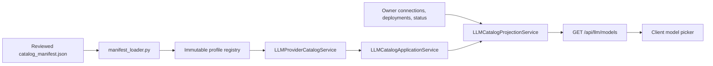
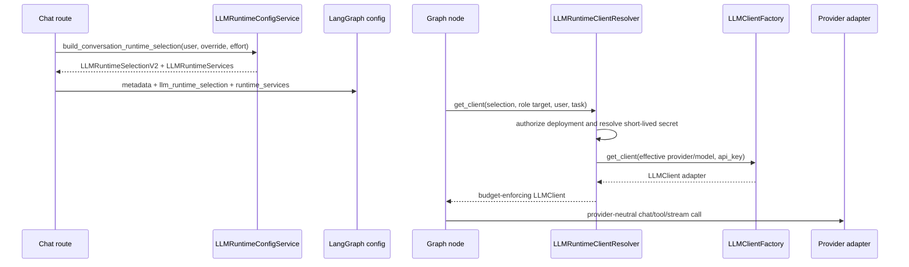

# Model Architecture

Code-verified overview of how LLM providers, model profiles, credentials,
runtime selection, role execution policy, and provider adapters are wired
through the system.

## Purpose

The model layer lets the app use multiple LLM providers without graph nodes,
routers, or tool planners constructing provider SDK clients directly.

The backend owns user-facing model catalog, credential storage, saved
selection, and runtime-safe selection payloads. The reviewed catalog manifest
owns exact model metadata that is loaded into immutable provider profiles. The
provider profile modules own provider defaults and compatibility helpers, while
the agent provider layer owns provider-neutral LLM contracts, factory
registration, and provider-specific adapters for OpenAI and Anthropic.

The deployment-aware text-LLM implementation follows the
[Deployment-aware LLM HLD](../devdocs/hldd/deployment-aware-llm-architecture-hld.md)
as design context. This document describes the verified wired state.
Deployment references are authoritative for active text-LLM selections;
provider/model values remain compatibility snapshots and historical
attribution fields.

GPT-5.6 is represented by exact OpenAI profiles for `gpt-5.6-sol`,
`gpt-5.6-terra`, and `gpt-5.6-luna`; the non-listable `gpt-5.6` API alias uses
the Sol profile. Each profile has a 1,050,000-token context window, a
128,000-token output limit, a `medium` default reasoning effort, and accepts
only `none`, `low`, `medium`, `high`, `xhigh`, or `max`. Usage pricing is
model-specific and accounts for cached input, cache writes, and the documented
long-context multiplier above 272,000 input tokens.

## Responsibility Boundary

Owned by the model layer:

- Provider and model identity contracts.
- Provider/model capability profiles.
- Public catalog metadata and selectable-model validation.
- Encrypted per-user provider credentials and per-connection managed endpoint
  credentials.
- Saved per-user conversation and reporting LLM selections.
- User-owned inference connections, deployments, routes, and capability
  observations for text-LLM resolution.
- Runtime-safe provider/model/credential-ref payloads.
- Role-aware call target resolution for multi-model execution.
- Provider-neutral `LLMClient` interface.
- Adapter construction through `LLMClientFactory`.
- OpenAI Responses, OpenAI Chat Completions, and Anthropic Messages adapters.
- Output budget and context-window enforcement before provider calls.

Not owned by the model layer:

- Prompt template content.
- LangGraph branch selection.
- Task authorization.
- Tool execution authorization.
- Frontend rendering.
- Durable decrypted provider secrets in graph state or checkpoints.

## Plane Placement

- Management plane:
  - Exposes catalog, global selection, reporting and memory selection,
    credential, credential-test, reviewed connection lifecycle, GPT-OSS
    proving lifecycle, inventory, deployment, guarded operation, and
    conversation lifecycle routes.
  - Validates model selectability and credential presence before runtime use.
- Data plane:
  - Stores encrypted direct-provider and connection-owned credentials, saved
    selections, conversation metadata, and usage records.
  - Stores only non-secret credential references in runtime/checkpoint-facing
    metadata.
- Execution plane:
  - Consumes `LLMRuntimeSelection` and `LLMRuntimeServices`.
  - Resolves role-specific call targets and constructs provider clients at
    invocation time.

## Wired Entrypoints

Backend management and runtime wiring:

- `backend/routers/llm.py`
  - Public model catalog, conversation/reporting/memory selection, credential,
    reviewed managed connection, GPT-OSS proving, and conversation lifecycle
    routes. Selection routes update user-global defaults for later workload
    invocations; the legacy task model-switch route is removed.
- `backend/routers/chat/submit.py`
  - Builds the runtime LLM selection for chat turns.
- `backend/services/llm_provider/catalog_application_service.py`
  - Owns catalog request transaction boundaries, deployment backfill, static
    provider loading, credential status loading, projection, commit, and
    rollback.
- `backend/services/llm_provider/catalog_projection_service.py`
  - Composes owner-scoped catalog outcomes from static providers plus reviewed
    connections, deployments, runnability, credential status, and GPT-OSS
    proving metadata.
- `backend/services/llm_provider/catalog_service.py`
  - Lists static provider/model summaries from immutable profiles and validates
    selectable models.
- `backend/services/llm_provider/credential_service.py`
  - Stores encrypted direct-provider or connection-owned credentials and
    resolves short-lived provider secrets only after live authorization.
- `backend/services/llm_provider/managed_connection_lifecycle_service.py`
  - Owns reviewed non-proving connection create, health or capability test,
    inventory refresh, enablement, and transaction boundaries.
- `backend/services/llm_provider/proving_connection_lifecycle_service.py`
  - Owns the GPT-OSS proving create, bounded test, evidence rebinding,
    enablement, and transaction boundaries.
- `backend/services/llm_provider/connection_service.py`,
  `deployment_service.py`, `inventory_service.py`, and
  `connection_status_service.py`
  - Own connection rows, deployments/routes, inventory observations, status,
    runnability, and public references used by catalog projection and lifecycle
    responses.
- `backend/services/llm_provider/operation_registry.py`,
  `guarded_transport.py`, and `connection_presets_manifest.json`
  - Own the reviewed preset manifest, fixed operation vocabulary, endpoint
    target resolution, and guarded backend egress for managed/proving
    connection operations.
- `backend/services/llm_provider/selection_service.py`
  - Persists the user's default conversation deployment reference and
    provider/model compatibility snapshot.
- `backend/services/llm_provider/reporting_selection_service.py`
  - Persists and validates the independent reporting deployment reference and
    provider/model/reasoning compatibility snapshot.
- `backend/services/llm_provider/runtime_config_service.py`
  - Builds `LLMRuntimeSelection` and live `LLMRuntimeServices`.
- `backend/services/llm_provider/runtime_client_resolver.py`
  - Converts runtime selections into concrete provider clients.
- `backend/services/llm_provider/environment_service.py`
  - Builds the selected provider's local-container compatibility environment.
- `backend/services/llm_provider/runtime_services.py`
  - Attaches non-checkpointed live runtime services to graph config.
- `backend/services/langgraph_chat/facade_helpers.py`
  - Projects non-secret runtime model metadata into graph config.
- `backend/services/reporting/memo_generator.py` and
  `backend/services/reporting/report_section_generator.py`
  - Resolve the reporting selection through the shared runtime client resolver.
- `backend/services/docker/container_config.py`
  - Adds the provider compatibility environment during local task-container
    provisioning.

Agent provider and graph wiring:

- `agent/providers/llm/core/identity.py`
  - Provider/model ids and `ProviderModelRef`.
- `agent/providers/llm/core/base.py`
  - Provider-neutral `LLMClient`, response, streaming, tool-call, and
    structured-output contracts.
- `agent/providers/llm/profiles/registry.py`
  - Immutable provider/model profile registry built from the reviewed catalog
    manifest plus provider defaults and compatibility rules.
- `agent/providers/llm/catalog/catalog_manifest.json` and
  `agent/providers/llm/catalog/manifest_loader.py`
  - Reviewed exact model metadata source and loader for immutable profile
    inputs.
- `agent/providers/llm/profiles/openai.py`
  - OpenAI provider defaults and legacy compatibility helpers.
- `agent/providers/llm/profiles/anthropic.py`
  - Anthropic provider defaults.
- `agent/providers/llm/factory/client_factory.py`
  - Provider/model-aware adapter factory.
- `agent/providers/llm/adapters/openai/*`
  - OpenAI Chat Completions and Responses adapters.
- `agent/providers/llm/adapters/anthropic/*`
  - Anthropic Messages adapter and provider-local translation helpers.
- `agent/graph/utils/llm_resolver.py`
  - Central graph-node resolver for role-owned LLM clients.
- `core/llm/role_policy.py`
  - Shared role-based provider/model/reasoning-effort policy.

## Model Catalog And Profiles

Exact model metadata lives in the reviewed catalog manifest, not in routers or
provider-specific profile modules. The manifest loader validates the active
revision, falls back to the last-known-good revision when possible, and builds
immutable `ModelProfile` inputs for the profile registry. Provider profile
modules supply provider defaults and compatibility rules that do not replace
the manifest as the review boundary for exact catalog facts.

Profiles declare:

- provider id and display name
- model id and display name
- API surface
- capability set
- context-window limit
- max-output limit
- listable/catalog visibility
- reasoning-effort values
- tool-choice modes
- structured-output strategies

`LLMProviderCatalogService` reads listable immutable profiles and adapter
availability from `LLMClientFactory`. `LLMCatalogApplicationService` owns the
request transaction: it backfills deployment identity, loads static providers,
loads masked credential status, invokes projection, commits, and rolls back on
provider errors. `LLMCatalogProjectionService` then composes the owner-scoped
transport-neutral response from static providers plus reviewed connections,
deployments, runnability, credential status, and GPT-OSS proving metadata.

A static model is selectable only when its profile is valid, the provider
adapter is registered, and the model supports chat. OpenAI selection is
additionally constrained to the Responses API public model family. Reviewed
connection providers are projected from code-owned presets and owner-owned
connection/deployment state rather than from the static model manifest.

## Credential And Selection State

Durable state is split deliberately:

- `UserLLMProviderCredential`
  - Encrypted direct-provider credential row keyed by user and provider.
- `LLMConnectionCredential`
  - Encrypted managed-endpoint credential keyed one-to-one by inference
    connection. The connection remains the authority for owner and preset.
- `LLMCredentialRef`
  - Non-secret `{user_id, provider}` pointer used in runtime payloads.
- `LLMInferenceConnection`, `LLMModelDeployment`, `LLMDeploymentRoute`, and
  `LLMCapabilityObservation`
  - User-owned text-LLM endpoint identity, exact wire model, route metadata,
    and capability evidence.
- `UserLLMSelection`
  - User's default conversation deployment reference plus provider/model
    compatibility snapshot.
- `UserReportingLLMSelection`
  - Independent reporting deployment reference plus provider/model/reasoning
    compatibility snapshot for task memos and engagement report sections.
- `UserMemoryLLMSelection`
  - Memory gate/extraction deployment references plus provider/model
    compatibility snapshots.
- `UserEmbeddingSelection`
  - Semantic-memory embedding provider/model, dimensions, and vector-family
    identity. Embedding provider/model, dimensions, and vector-family fields
    remain unchanged and are not deployment-aware in Phases 1-6.
- `LLMRuntimeSelection`
  - Legacy non-secret runtime payload: provider, model, credential ref, and
    optional reasoning effort. New text-LLM turns use the V2 deployment form
    outside deterministic tests.
- `LLMRuntimeSelectionV2`
  - Checkpoint-safe deployment reference, expected revision, optional route,
    reasoning effort, and compatibility provider/model snapshot.
- `LLMRuntimeServices`
  - Live invocation-only service bag containing the runtime client resolver.

Decrypted provider API keys are not stored in graph metadata, checkpoint state,
stream packets, task workspace files, or task-container environments. Managed
text-LLM calls resolve the credential owned by the authorized connection;
direct provider calls resolve the user/provider row. Both paths enter through
`LLMRuntimeClientResolver` when constructing a concrete client. Local-Docker
provisioning uses `LLMProviderEnvironmentService` only to expose non-secret
compatibility metadata for the selected provider and model. The container
configuration path sanitizes provider metadata before applying it, so task
containers receive diagnostic provider/model fields such as `LLM_PROVIDER` and
`LLM_MODEL`, not `OPENAI_API_KEY` or other decrypted provider credentials. The
credential service always checks that the credential-ref user matches the
runtime user and additionally checks task ownership when a task ID is supplied
for task-scoped provider calls. Engagement report sections instead enter
through tenant permission and owned-engagement checks, then resolve the
requesting user's credential without a task ID.

## Runtime Flow

Graph nodes call `agent/graph/utils/llm_resolver.py`. That resolver requires
`runtime_services.client_resolver` and `llm_runtime_selection` in graph config.
Raw API keys in metadata are not supported.

`runtime_services` is a live object, so it is attached only to local invocation
config and stripped before checkpoint/state inspection. The serializable state
keeps V2 deployment references plus compatibility provider/model snapshots
only. Legacy provider/model checkpoints are no longer written for new
non-deterministic turns.

`core/llm/runtime_selection.py` is the shared contract and safe-projection
authority for deployment runtime identity. New graph state has one durable
selection at `facts.metadata.llm_runtime_selection`; the current invocation has
one executable copy at `configurable.llm_runtime_selection`. Runtime projections
and `graph_runtime_context` do not mirror the selection. The surrounding
`provider` and `model` fields remain display and compatibility metadata, not
resume routing authority.

Checkpoint continuation reads only explicit current and historical selection
locations. If any location claims a versioned deployment selection, V2 is
authoritative: identical historical mirrors are accepted, conflicting mirrors
fail closed, and malformed or unsupported V2 payloads cannot downgrade to
legacy provider/model resolution. Legacy checkpoints are considered only when
no versioned marker exists; their provider/model identity must map to exactly
one owned deployment using its effective compatibility profile and canonical or
wire-model aliases. Zero matches are unmapped and multiple matches are
ambiguous. In every case, the resulting deployment reference still passes
through live owner, revision, route, connection, credential, capability, and
guarded-egress validation before a provider call.

Reporting generation follows a separate saved-selection lifecycle from the
default conversation selection. Authenticated `GET` and `PUT`
`/api/llm/reporting-selection` routes read and persist it through
`ReportingLLMSelectionService`. That service requires structured-output support
and an enabled credential before building its own `LLMRuntimeSelection`; task
memo and engagement report-section generators then construct the client through
the shared `LLMRuntimeClientResolver`.

## Multi-Model Support

The user's selected deployment is the model target for every call in the
agent turn. Hidden graph roles do not select another model or provider.

`core/llm/role_policy.py` resolves a provider/model/reasoning-effort tuple for
each role-owned call. Conversation, reasoning, classification, compression,
tool selection, post-tool observation, and articulation all resolve to the
selected deployment and its exact serving route for OpenAI, Anthropic, and
reviewed compatible models.

Current role families:

- User-selected roles:
  - `conversation_main`
  - `reasoning_main`
  - `post_tool_observation`
  - `intent_classifier`
- Lightweight internal roles:
  - `tool_output_compressor`
  - `tool_category_selector`
  - `post_tool_articulator`

Conversation-context compression also uses the task-selected provider/model,
but resolves that target directly from the compaction request.

Capability checks stay profile-driven. Reasoning effort is passed only to
models that declare `REASONING_EFFORT`. User-facing reasoning roles preserve
the submitted effort. Lightweight internal roles request `low`; the shared
policy chooses the closest supported effort without escalating into a hidden
high-effort call when a lower level exists. Non-reasoning models omit the
setting.

## OpenAI Implementation

OpenAI is registered under provider id `openai`.

OpenAI profiles define two API surfaces:

- `responses`
  - Public selectable GPT-5-family models.
  - Used by `OpenAIResponsesClient`.
  - Supports reasoning effort, streaming, tools, native structured output,
    usage reporting, context-window limits, and max-output limits.
- `chat_completions`
  - Non-listable compatibility profiles for older GPT-4/GPT-3.5 style models.
  - Used by `OpenAIChatClient`.

`LLMClientFactory` resolves OpenAI adapters by the selected profile's API
surface. Provider-aware calls use `ProviderModelRef`; legacy model-only prefix
fallbacks remain for compatibility callers and tests.

OpenAI-specific translation is isolated in adapter helpers:

- Responses request shaping:
  - `agent/providers/llm/adapters/openai/responses/request_builder.py`
- Responses output and usage parsing:
  - `agent/providers/llm/adapters/openai/responses/response_parser.py`
- Responses streaming parsing:
  - `agent/providers/llm/adapters/openai/responses/stream_parser.py`
- OpenAI tool payload conversion:
  - `agent/providers/llm/adapters/openai/tool_contracts.py`
- OpenAI native JSON schema output:
  - `agent/providers/llm/adapters/openai/structured_output.py`

## OpenAI-Compatible Implementation

Reviewed GPT-OSS routes use `OpenAICompatibleChatClient` with the code-owned
`openai_compatible_chat.agent_v1` dialect and the same deployment-aware resolver
and factory boundary as native providers. The dialect admits only the agent
contracts DrowAI exercises: chat, usage-aware streaming, native JSON-schema
output, function tools, and `auto` or `required` tool choice. It does not claim
reasoning-effort or parallel-tool controls. Connection presets supply the normal
provider endpoint and exact wire model identifier; graph nodes do not construct
endpoints or clients.

Mistral Small 4 uses the same compatible-client, deployment resolver, guarded
transport, and local validation path. Its reviewed route preserves
`mistral-small-latest` on the wire while resolving capabilities and pricing
through the canonical `mistral/mistral-small-2603` profile. The code-owned
request policy maps DrowAI's neutral `required` tool choice to Mistral's
equivalent `any` value and forwards validated reasoning effort. Thinking chunks
are excluded from user-visible answer text.

Arbitrary custom compatible endpoints retain the conservative dialect. They do
not become agent-capable merely because they implement an endpoint named
`/v1/chat/completions`; unsupported calls fail before outbound inference.

Reporting and semantic-memory generation retain their independent user
selections. When either selection points at a reviewed compatible deployment,
the shared effective-profile and runtime-client path supplies the same
structured-output dialect instead of a reporting- or memory-specific adapter.

Deployment selections snapshot the deterministic enabled route when one is
available. Turn finalization forwards that authoritative selection into usage
persistence, preserving connection, deployment, and route attribution for all
role-owned calls in the turn.

Endpoint resolution is connection-scoped and declarative. Native OpenAI and
Anthropic routes use `OPENAI_BASE_URL` and `ANTHROPIC_BASE_URL`; hosted NVIDIA
and Hugging Face routes use `DROWAI_NVIDIA_NIM_BASE_URL` and
`DROWAI_HUGGINGFACE_BASE_URL`; Mistral uses `DROWAI_MISTRAL_BASE_URL`. An
override changes only its named provider.
User-configured custom, Ollama, and vLLM connections retain their saved base
URL. The registry resolves one SDK client base URL and one guarded operation
URL, and the runtime passes the client base URL explicitly through the shared
factory contract. A configured base URL may already include the declared
client path such as `/v1`; paths are composed exactly once.

The runtime client builder injects a provider-neutral asynchronous inference
transport into compatible adapters. The backend implementation binds one
authorized operation target and short-lived credential, returns bounded JSON
for non-streaming calls, and decodes SSE incrementally so graph events and the
first provider chunk remain observable before response completion. Other
code-owned connection operations retain the bounded synchronous transport.

Both guarded transports disable ambient HTTP proxy inheritance, keep
credentials connection-owned, and reject redirects. Public destinations
require HTTPS and globally routable DNS. Local development permits HTTP only
for a hostname or literal address that resolves entirely to loopback.

## Anthropic Implementation

Anthropic is registered under provider id `anthropic`.

Anthropic profiles use the `messages` API surface and are handled by
`AnthropicMessagesClient`.

Anthropic model profiles declare provider-published context and max-output
limits, streaming, tool use, usage reporting, and prompt-parse structured
output. Claude Sonnet 5 and Claude Fable 5 are public catalog models;
Claude Mythos 5 has an exact non-listable Anthropic Messages profile and is
excluded from normal user selection. Active 4.x profiles remain available.
Every agent-turn role uses the selected Anthropic deployment; lightweight
roles use the shared low-effort policy.

Effort-capable Anthropic profiles expose only the levels accepted by each
model. The adapter sends the resolved value through `output_config.effort` and
uses the model profile default (`high`) when no explicit value is selected.
Fable 5, Mythos 5, Opus 4.7, Opus 4.8, and Sonnet 5 support `xhigh`; Sonnet
4.6 does not. Newer models omit unsupported sampling parameters during request
translation.

Anthropic-specific translation is isolated in adapter helpers:

- Messages request construction and usage normalization:
  - `agent/providers/llm/adapters/anthropic/client.py`
- Tool schema and tool-choice conversion:
  - `agent/providers/llm/adapters/anthropic/tool_contracts.py`
- Prompt-parse structured output:
  - `agent/providers/llm/adapters/anthropic/structured_output.py`
- Text and tool-call response parsing:
  - `agent/providers/llm/adapters/anthropic/response_parser.py`

Adaptive and redacted thinking blocks are accepted as provider metadata while
visible text remains the provider-neutral response content. Anthropic thinking
token counts are normalized into usage `reasoning_tokens`. Documented
structured refusal signals from Anthropic Messages, OpenAI Responses, and
OpenAI Chat Completions raise `LLMRefusalError` with one
`LLMRefusalOutcome`. The outcome carries provider/model identity, optional
category, explanation, response id, normalized usage, and partial streamed
or non-streamed visible content; ordinary refusal-like assistant prose remains
a successful response.

Anthropic pricing includes base input, 5-minute cache writes, 1-hour cache
writes, cache reads, and output tokens. Sonnet 5 switches automatically from
its launch pricing to standard pricing on September 1, 2026 (UTC).

Anthropic structured output is intentionally prompt-and-parse based. The
adapter appends JSON-output instructions and validates the returned content
through the shared provider-neutral structured-output parser.

## Adding Provider Or Model Support

Use the provider/profile/factory path. Do not branch graph nodes or routers on
provider SDK details.

Recommended steps:

1. Add provider/model identity constants only if a new stable provider id is
   needed.
2. Add reviewed exact model metadata to
   `agent/providers/llm/catalog/catalog_manifest.json`, or add provider
   defaults/compatibility helpers under `agent/providers/llm/profiles/` when
   the model uses an approved compatibility family.
3. Declare exact capabilities, API surface, context window, max output,
   lifecycle, support tier, aliases, pricing provenance, reasoning-effort
   support, tool-choice modes, structured-output strategies, and
   listable/selectable intent in the manifest.
4. Ensure `agent/providers/llm/catalog/manifest_loader.py` validates the new
   manifest fields and `agent/providers/llm/profiles/registry.py` builds the
   resulting immutable profiles.
5. Implement a provider adapter that satisfies `LLMClient`.
6. Keep provider SDK payload shaping inside provider-local adapter helpers.
7. Normalize every documented non-streaming and streaming refusal signal into
   `LLMRefusalOutcome`, and re-raise `LLMRefusalError` unchanged through parse,
   recovery, tool, and retry layers. Application and UI code must not inspect
   provider-native refusal payloads.
8. Register the adapter resolver in `LLMClientFactory.register_provider`.
9. Extend catalog validation only when the new provider needs provider-specific
   selectability rules.
10. Add tests for catalog listing, selection validation, credential resolution,
    factory construction, role targeting, tool calls, structured output,
    streaming usage, refusals, and budget enforcement.
11. Update UI/schema code only if the public catalog or selection response shape
    changes.

For a new model under an existing provider, prefer adding a profile first. If
the model uses an already-supported API surface and capabilities, no graph code
or router code should change.

## Security And Isolation Notes

- Provider API keys are encrypted at rest.
- Graph metadata carries only provider/model and credential references.
- Decrypted secrets are resolved at the runtime client boundary for provider
  calls. Local-Docker provisioning does not resolve or inject provider secrets;
  task containers receive only sanitized, non-secret provider/model
  compatibility metadata.
- Credential resolution always validates the credential-ref user against the
  runtime user. It additionally validates task ownership when a task ID is
  supplied for task-scoped provider calls. Engagement report sections rely on
  upstream tenant permission and owned-engagement checks, then resolve the
  requesting user's credential without a task ID.
- Local-container provider metadata, graph metadata, and checkpoint persistence
  remain non-secret.
- Live runtime services are not checkpointed.
- Output budget and context-window checks run before provider API calls.
- Provider adapters normalize errors into provider-neutral exceptions.

## Deployment-Aware Implementation Notes

- Active text-LLM execution resolves through deployment references. Provider
  and model fields on text selections remain compatibility snapshots and are
  not sufficient runtime authority.
- `/api/settings` no longer exposes or accepts OpenAI text-LLM mirrors; OpenAI
  credentials and selections are owned by provider/deployment services.
- The legacy task-switch route is removed. Selection changes are user-global
  and affect later workload invocations, not running or paused work.
- Tenant-admin connection sharing, relay egress, and dynamic policy routing are
  deferred. The current implementation is user-owned and fails closed instead
  of falling back to another deployment.
- Embedding provider/model, dimensions, and vector-family fields remain
  unchanged. The provider-based embedding credential resolver remains available
  for the unchanged embedding path.

## Operational Notes

- Adapter availability affects catalog availability and selectability.
- The default compatibility provider/model comes from the profile registry and
  selection service defaults when a user has no saved text selection.
- Text-LLM selections must map to a user-owned deployment to be runnable.
- Multi-provider role routing requires credentials for every target provider.
- Model profile limits should be updated before increasing runtime defaults.

## Known Gaps Or Drift Risks

- OpenAI has both Responses and Chat Completions adapters; the public selectable
  path is Responses-focused.
- Some OpenAI model-only compatibility paths remain for older callers.
- Anthropic historical assistant tool-call replay is not fully supported by the
  adapter.
- Provider SDK feature support should be represented as profile capabilities
  before graph nodes depend on it.
