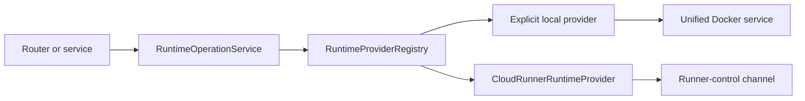
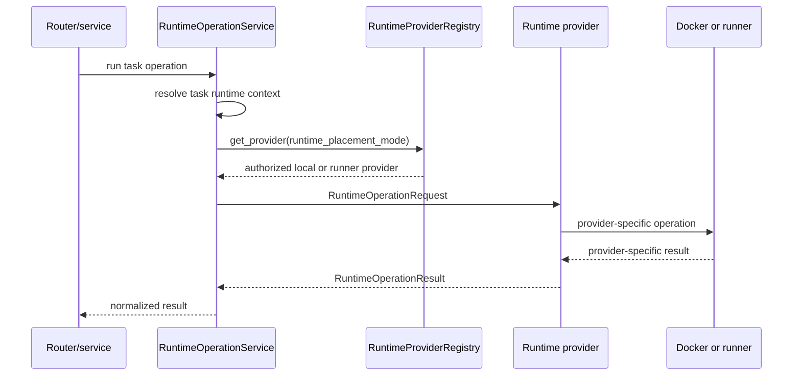

# Runtime Provider Architecture

Code-verified overview of how task runtime operations are routed to product
Runner execution or explicit dev/test local Docker execution without leaking
runtime implementation details into management-plane callers.

## Purpose

The runtime-provider layer is the execution boundary between backend control
flows and task runtimes.

Management-plane services build task-scoped operation envelopes. Product
callers resolve Runner placement before provider dispatch; the registry then
selects a provider from authorized `runtime_placement_mode` metadata. The
selected provider performs the operation against either the Runner control
channel or an explicit dev/test/diagnostic local Docker stack and returns a
normalized result.

## Responsibility Boundary

Owned by the runtime-provider layer:

- Runtime placement dispatch after product policy has authorized the placement.
- Provider-neutral operation request/result contracts.
- Explicit local Docker provider delegation for dev/test/diagnostic callers.
- Runner provider delegation for product task execution.
- Runtime lifecycle, workspace, VPN, logs, metrics, terminal, tool-command, and
  artifact operation surfaces.
- Provider result normalization.

Not owned by the runtime-provider layer:

- HTTP route authorization.
- Tenant membership decisions.
- LangGraph graph logic.
- Tool planning.
- Durable artifact provenance policy.
- Provider SDK or LLM client construction.

## Wired Entrypoints

- `backend/services/runtime_provider/contracts.py`
  - `RuntimeOperationRequest`, `RuntimeOperationResult`, placement modes, actor
    types, and status normalization.
- `backend/services/runtime_provider/provider.py`
  - Abstract `TaskExecutionRuntimeProvider` operation contract.
- `backend/services/runtime_provider/registry.py`
  - Placement-mode to provider selection.
- `backend/services/runtime_provider/product_policy.py`
  - Product placement policy that rejects Management-owned local Docker for
    product task paths.
- `backend/services/runtime_provider/context.py`
  - Task-to-runtime context resolution.
- `backend/services/runtime_provider/operations.py`
  - Management-plane helper for building requests and dispatching operations.
- `backend/services/runtime_provider/local_docker_provider.py`
  - Explicit dev/test/diagnostic local Docker-backed provider.
- `backend/services/runtime_provider/cloud_runner_provider.py`
  - Managed runner provider facade.
- `backend/services/runtime_provider/cloud_runner/*`
  - Runner lifecycle, terminal, artifact, environment metadata, dispatch, and
    tool-command collaborators.
- `agent/graph/adapters/executor_adapter.py`
  - LangGraph-side bridge from tool execution into provider operations.
- `backend/services/runner_control/*`
  - Runner registration, assignment, channel, runtime jobs, and inbound result
    processing used by the runner provider.

## Main Collaborators

`RuntimeOperationService` is the usual boundary for management-plane callers.
It resolves an authorized task context, builds a `RuntimeOperationRequest`, and
dispatches the call to the provider selected by `RuntimeProviderRegistry`.

## State / Data Flow

Each provider request carries:

- `tenant_id`
- `task_id`
- `actor_type`
- `actor_id`
- `user_id`
- `runtime_placement_mode`
- `workspace_id`
- `runner_id`
- `execution_site_id`
- operation name
- operation payload
- operation metadata

This identity envelope is the core isolation contract. Providers should not
reconstruct tenant/task/runtime identity from ambient state when the envelope
already carries it.

## Runtime Flow

## Explicit Local Docker Provider

`LocalDockerRuntimeProvider` adapts provider operations to existing local
services:

- container lifecycle through `unified_docker_service`
- workspace creation/cleanup through `WorkspaceManager`
- workspace file reads/writes through workspace-safe path validation
- terminal/runtime command compatibility operations
- VPN config/status and runtime metrics/logs

Local and runner providers share the same workspace layout `2.0` container
contract: one writable `/workspace` data bind and one read-only
`/run/drowai/control` bind. VPN materialization and runtime-input persistence
target the host-owned control root; public operation names and result envelopes
are unchanged.

Runtime startup probes the packaged image manifest before the executor daemon
starts. A workspace-layout mismatch fails closed instead of reusing an image
with the old mount contract.

Local artifact promotion and tool-command finalization are no-op success
operations because local execution already writes into the task workspace and
local provenance finalization handles durable rows separately.

This provider is not a standalone or distributed product fallback. Product task
creation, startup, terminal, tool, workspace, and artifact paths must resolve to
Runner placement unless an explicit dev/test/diagnostic caller has opted into
local placement.

## Product Runner Provider

`CloudRunnerRuntimeProvider` is a facade that wires focused collaborators:

- lifecycle operations
- terminal operations
- runtime artifact read/write/query/promote operations
- environment metadata operations
- remote operation dispatch/waiting
- tool-command dispatch/result waiting/finalization

Runner operations use the runner-control data model and channel. Some
operations return immediately as accepted/running, while read-like operations
can request bounded waiting through metadata such as `wait_for_result` and
`wait_timeout_seconds`.

## Runner Control Channel Contract

Runner registration and the durable command channel are exposed through the
runner-control router:

- `POST /api/runner-control/register`
- `WS   /api/runner-control/channel`

Managed runner processes start the control-plane client with `drowai_runner run`.
The channel carries `task.start`, `runtime.started`, `terminal.result`,
`tool.command`, `artifact.manifest`, `artifact.upload.request`, and
`artifact.upload.complete` messages.

Product Runner configuration is read from the generated Runner config file:

- `DROWAI_RUNNER_CONFIG=/var/lib/drowai/config/enrollment.toml`
- `DROWAI_RUNNER_ROOT=/var/lib/drowai`
- `DROWAI_RUNNER_HOST_BIND_ROOT=/var/lib/drowai`
- `DROWAI_RUNNER_HEARTBEAT_INTERVAL_SECONDS`
- `DROWAI_RUNNER_TLS_VERIFY`

The Runner exchanges enrollment material for durable credentials and then owns
its credential secret path under the Runner data root. Raw registration token
environment variables are not the primary product deployment contract.

## Security / Isolation Notes

- Unknown placement modes fail closed.
- Runtime operations are task-bound through the request envelope.
- Runner operations require runner/workspace/runtime-job binding checks before
  accepting tool and artifact results.
- Workspace reads and writes must stay inside the task workspace.
- Provider results should not expose backend-local paths or secret material to
  frontend callers.

## Operational Notes

- Product task paths use `runtime_placement_mode=runner`, which resolves to
  `CloudRunnerRuntimeProvider`.
- `runtime_placement_mode=local` resolves to `LocalDockerRuntimeProvider` only
  for explicit dev/test/diagnostic callers.
- Provider result shape is stable even when provider internals differ.
- Runner operations may be asynchronous; callers must distinguish accepted,
  running, succeeded, failed, and rejected states.
- Runtime-provider code should be extended before adding direct Docker or
  runner-control calls to routers.

## Known Gaps Or Drift Risks

- Some local provider operations remain compatibility adapters around existing
  Docker/workspace services.
- Runner and local providers do not have identical timing behavior; runner
  operations often need explicit wait policy.
- Local artifact promotion is a no-op, while runner artifact promotion is an
  active runtime/data-plane operation.
