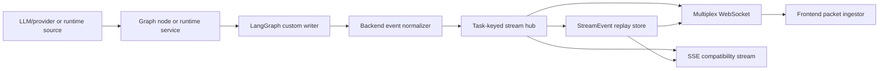

# Streaming Architecture

Code-verified overview of how DrowAI produces, transports, persists, replays,
and renders real-time updates.

## Purpose

Streaming gives users incremental visibility into model responses, reasoning
phases, observations, tool execution, subagents, and runtime channels. The word
`delta` describes delivery to the UI; it does not prove that the content came
directly from a live model-token stream.

Every update belongs to one of four production methods:

| Method | How content is produced | Current uses |
| --- | --- | --- |
| Live model-text streaming | Provider text chunks are forwarded as they arrive | Chat answers, final answers, `think_more`, tool articulation |
| Mixed text and structured call | Assistant text streams while function arguments remain hidden until complete | PTR Observation text plus the `ptr_commit` graph decision |
| Completed structured projection | A complete native call is parsed, then one safe field is emitted as an event | Subagent tool-selection intent |
| Application event projection | Code emits lifecycle, status, or already-complete text events | Intent status, tool start/end, retries, plans, observation adaptation |

The last two methods may use a `*_delta` event, but they do not parse or expose
partially generated JSON.

## Main Flow

`LangGraphExecutor.stream_graph` consumes LangGraph with
`stream_mode=["custom", "values"]`:

- `custom` carries node-authored UI events.
- `values` carries graph-state snapshots for final-state capture, checkpoints,
  context-window observation, and interrupt detection. It is not forwarded as
  model-token content.

## Model-Generated Streams

### Answers and reasoning

Simple chat and finalization call
`stream_chat_messages_with_usage`. Provider text chunks become
`message_delta` events between `message_start` and `section_end`.
`think_more` uses the same provider text stream but projects chunks as
`reasoning_delta` events.

The pre-tool `articulation` graph node is a separate LLM call. On the first
tool attempt it streams a short tool-intent explanation as reasoning text. It
is distinct from post-tool Observations and from subagent selection intent.

### PTR Observations

Post-tool reasoning makes one provider-neutral
`stream_chat_with_tools_with_usage` call with one internal `ptr_commit`
function:

1. Ordinary assistant-text chunks stream directly into the Observation card.
2. Provider adapters buffer native function-argument chunks privately.
3. After the response completes, the backend parses and validates the complete
   `ptr_commit` call.
4. The validated `next_action` drives graph routing.

Observation text is therefore genuine model-text streaming. It is not
extracted from the function JSON, and control flow never depends on parsing the
visible text.

### Subagent tool intent

The generic subagent runtime uses a non-streaming native tool-selection call.
Each tool call contains a reserved `_builder_intent` field. After the complete
tool call is returned and validated, the runtime removes that field from the
tool parameters and emits it as one `reasoning_delta`.

For example, one UI reasoning section may contain:

- deterministic label: `Running the subagent model turn.`
- LLM-authored, post-parse intent: `Discover which hosts are alive...`

This requires no articulation call and never streams partial JSON. The UI may
still display both strings as one reasoning section because both are ordinary
stream events with the same section identity.

## Application-Generated Streams

The unified emitter defines bounded lifecycle families:

| Family | Principal events | Meaning |
| --- | --- | --- |
| Answer | `message_start`, `message_delta`, `section_end` | User-facing assistant response |
| Reasoning | `reasoning_start`, `reasoning_delta`, `reasoning_section_end` | Model text, projected intent, or lifecycle status |
| Observation | `observation_start`, `observation_delta`, `observation_section_end` | Post-tool evidence interpretation |
| Tool | `tool_start`, `tool_end`, `tool_batch_start`, `tool_batch_end` | Execution lifecycle and result status |
| Control | `retry_start`, `retry_attempt`, `graph_interrupt`, `agent_pause_request`, `stream_error`, `status` | Workflow and failure state |
| Planning | `plan_created`, `todo_progress`, `intent_summary` | Plan and goal progress |

Some events contain already-complete data. For example,
`observation_adapter` chunks a completed compact observation for consistent UI
rendering; this is event chunking, not model-token streaming. Intent
classification similarly emits a deterministic reasoning placeholder around
the classifier call.

`tool_delta` remains part of the shared event contract, but active runtime
execution does not incrementally forward command stdout through it. Graph
execution emits start/end and batch lifecycle events; adapter code can also
construct a synchronous start/delta/end display sequence after a tool has
already completed.

The normalized schema also accepts the compatibility event names
`assistant_delta`, `assistant_message`, and `assistant_final`. Current graph
text streams primarily use the section-oriented `message_*` events;
`assistant_final` remains a persisted turn-boundary sentinel.

## Provider Normalization

`LLMClient` is the provider boundary. OpenAI Chat, OpenAI Responses, Anthropic,
and OpenAI-compatible adapters normalize:

- text chunks into a common async content iterator;
- completed native calls into common `ToolCall` records;
- final token usage into one usage contract;
- refusals and stream failures into provider-neutral exceptions.

Usage-aware streams must return final usage data. Setup and idle timeouts bound
stalled providers. Mixed PTR streaming depends on a provider/model supporting
assistant text and a native function call in the same response; function
arguments are never forwarded as visible deltas.

## Fanout, Persistence, and Replay

Processed graph events are normalized at the backend boundary and published to
`InMemoryStreamHub` under a `task_id`. The hub assigns task-local sequence
numbers, fans out to live subscribers, masks durable secrets, and persists
replayable packets through `StreamEventStore`.

The primary frontend path is the multiplex `/ws?type=agent-multi` WebSocket.
Each subscription is authorized for its task, replays packets after the
client's last sequence, and then follows the live hub. The frontend
`RuntimeStreamClient` reconnects and resubscribes with per-task cursors;
`StreamPacketIngestor` projects ordered packets into chat and agent-run state.

Reasoning SSE endpoints remain compatibility/fallback delivery surfaces. They
use the same persisted replay and live hub sources rather than a second event
model.

## Other Real-Time Channels

These channels share WebSocket authentication and task-ownership enforcement
but do not use the agent event-card protocol:

| Channel | Data |
| --- | --- |
| `terminal` | Bidirectional PTY input, resize control, and raw output frames |
| `docker` | Task runtime logs and associated runtime updates |
| `metrics` | Runtime metrics and status snapshots |
| `vpn_status` | Task VPN status notifications |

Managed-runner terminal streaming additionally uses the
`terminal_stream_v1` capability. Validated terminal frames are routed by
tenant, task, runtime job, and session identity; a bounded compatibility path
is used when live stream mode is unavailable.

## Ordering and Safety Rules

- Streams remain task-keyed after tenant/user authorization.
- Turn events carry conversation, turn, sequence, phase/sub-turn, and section
  identity; subagent events also carry agent-run attribution.
- A new reasoning or Observation phase receives a new section identity.
  Reusing an identity can overwrite or reorder an existing UI card.
- Section-end events must be emitted on success and failure so cards stop
  displaying a streaming state.
- Structured control data remains hidden until the provider response is
  complete and application validation succeeds.
- Reconnect recovery uses persisted sequence order, not frontend timestamps.
- Durable replay packets are secret-masked before persistence.

## Wired Entrypoints

- `agent/providers/llm/core/base.py`
- `agent/graph/emission/unified_emitter.py`
- `agent/graph/nodes/post_tool_reasoning/streaming/base.py`
- `agent/subagents/runtime/model.py`
- `backend/services/langgraph_chat/execution/graph_executor.py`
- `backend/services/streaming/in_memory_hub.py`
- `backend/services/streaming/event_store.py`
- `backend/services/websocket/reasoning_subscription.py`
- `client/src/services/runtime_stream/RuntimeStreamClient.ts`
- `client/src/services/runtime_stream/StreamPacketIngestor.ts`
