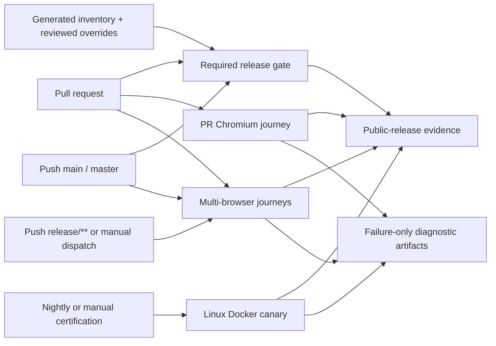

# Testing Architecture

This document describes how DrowAI turns tests into developer feedback and
release evidence. It defines the testing boundaries, execution tiers, CI
ownership, isolation model, and evidence flow; detailed inventories, measured
results, and release sign-off remain in the testing documentation.

## Purpose And Principles

DrowAI uses layered evidence rather than treating one large test command as
proof of the whole product. Each risk should be tested at the lowest reliable
layer, then connected to a small number of higher-level product journeys.

- **Unit tests** prove local behavior and edge cases.
- **Component tests** prove frontend rendering and interaction contracts.
- **Contract tests** prove schemas, protocols, authorization boundaries, and
  stable interfaces between subsystems.
- **Integration tests** prove collaboration between real components.
- **Deterministic browser tests** prove complete user journeys through the real
  frontend, backend, WebSocket, and database boundaries.
- **System canaries** prove host-dependent behavior such as real Docker
  lifecycle, terminal access, workspace isolation, and cleanup.

Browser tests are not expected to exercise every branch in every module. They
provide end-to-end confidence while focused tests retain depth for failure
handling, security, state transitions, and protocol behavior.



## Test Surfaces

Subsystem-owned tests generally live with the production responsibility they
prove. The top-level `tests/` tree is the cross-system and compatibility
surface:

| Location | Primary responsibility |
|---|---|
| `backend/tests/` | Authentication, tenancy, task lifecycle, persistence, services, routers, streaming, runtime-provider, and reporting behavior |
| `agent/**/tests/` | LangGraph graphs, prompts, tool policy, memory, and agent runtime behavior |
| `client/src/**/__tests__/` | React components, stores, hooks, API/session handling, and stream ingestion |
| `core/**/tests/` | Shared prompt, LLM, runbook, and cross-layer contracts |
| `tests/` | Cross-system and compatibility coverage for context, tools, scripts, runtime images, E2E contracts, and runner/runtime protocols |
| `kali_executor/tests/` | In-runtime command execution behavior |
| `e2e/fixtures/` | Typed browser fixtures plus fixture, isolation, prerequisite, and artifact-security contracts |
| `e2e/tests/` | Complete Playwright journeys and the real local-runtime canary |
| `e2e/probes/` | Intentionally failing, contract-owned Playwright probes excluded from normal journey discovery |

Place a new test at the lowest layer that can reliably prove the intended
behavior. Add browser coverage when a user-visible workflow crosses multiple
boundaries or when navigation, streaming, persistence, or authorization is the
risk being protected.

## Release And Browser Tiers

The package scripts are the developer entrypoints; the workflow files are the
authority for CI triggers and environments.

| Tier | Command | What it proves | CI owner and trigger |
|---|---|---|---|
| Required release contracts | `npm run test:release:quick` | Curated backend, LangGraph, frontend, environment-independent E2E fixture/security contracts, TypeScript, and production build | `.github/workflows/release-gate.yml`; every pull request and pushes to `main` or `master` |
| Manual main contracts | `npm run test:release:main` | Quick gate plus selected runner-control, runtime-provider context, and runner protocol contracts | Developer/manual; not a separate required workflow |
| PR browser core | `npm run test:e2e:pr` | Four `@pr-core` Chromium cases through the real app stack with deterministic graph behavior | Required `.github/workflows/e2e-smoke.yml` check on every pull request |
| Deterministic Chromium journeys | `npm run test:e2e:journeys:chromium` | All `@journey` cases in Chromium | `.github/workflows/e2e-journeys.yml`; pushes to `main` or `master` |
| Deterministic release matrix | `npm run test:e2e:journeys:all` | All `@journey` cases in Chromium, Firefox, and WebKit | `.github/workflows/e2e-journeys.yml`; pushes to `release/**` and manual dispatch |
| Local-runtime canary | `npm run test:e2e:runtime:local` | Real Linux Docker, terminal, task workspace, lifecycle, isolation, and leak-free teardown | `.github/workflows/e2e-runtime-local.yml`; nightly at `02:30 UTC` and manual dispatch, including an explicit release-certification job |

The browser configuration uses one worker and zero retries. CI forbids focused
tests. Screenshots are captured only on failure, videos are retained only on
failure, and network traces are disabled because trace archives can retain
authorization and cookie headers.

`test:release:e2e` is a manual aggregate: it runs the `main` release contracts
and then the same isolated Chromium PR core selected by `test:e2e:pr`. It is
convenient local evidence, not a replacement for the multi-browser journey or
Linux Docker certification tiers.

Specialized maintained commands remain useful for focused diagnosis:

- `npm run test:e2e:fixture-contracts:quick` runs the four fixture and
  artifact-security contracts that need neither a browser nor a live stack;
  the required release gate includes this command.
- `npm run test:e2e:fixture-contracts` runs all fixture contracts, including
  integration contracts that need Chromium and loopback; the PR browser
  workflow runs it after browser installation.
- `npm run test:langgraph:quick`, `test:langgraph:main`, and
  `test:langgraph:nightly` select the corresponding regression markers.
- `npm run test:langgraph:mock-prompts` is a credentialed live-LLM prompt-flow
  runner that requires `--api-key` or `OPENAI_API_KEY`, uses the real provider
  client, and mocks only tool-execution outcomes. It is focused diagnostic
  evidence, not deterministic offline or release-certification evidence.

## Deterministic Journey Boundary

The PR and multi-browser suites exercise the real React application, FastAPI
backend, HTTP/WebSocket contracts, and SQLite persistence. They do not intercept
browser requests and do not require an external LLM, internet service, Docker
daemon, or shared developer database.

Determinism is process-scoped and explicitly enabled by
`E2E_DETERMINISTIC_MODE=true`. The test stack supplies deterministic graph and
reporting outcomes behind existing application boundaries. Prerequisite states
for knowledge, reports, usage, and permissions are created by the guarded
offline seed utility, not by a publicly reachable seed endpoint.

The deterministic scenario graph does not execute a real LLM or real agent
tool. It therefore does not certify agent tool selection, runtime dispatch,
local file communication, or Kali-executor command handling.

The browser journeys cover the product lifecycle across setup and
authentication, engagement/task lifecycle, chat and interrupts, dashboard
workspaces, persisted knowledge, reporting, usage/settings/profile, viewer
authorization, and cross-tenant isolation. The exact scenario-to-risk mapping
is maintained in [Test Matrix](../testing/TEST_MATRIX.md).

The local-runtime canary deliberately has a different boundary:

- deterministic graph mode is disabled;
- the host must be supported Linux with a working Docker daemon and runtime
  image;
- the canary launches a real task container and terminal, writes a task-local
  workspace file, verifies UI visibility and cross-task non-disclosure, then
  exercises lifecycle and cleanup;
- the safe command is sent directly through the UI terminal, so this canary
  proves container/terminal/workspace behavior rather than the agent-to-tool
  execution path;
- missing prerequisites fail explicitly rather than converting the check into
  a skip or simulated pass;
- managed Runner execution and credentialed live-LLM quality remain separate
  certification concerns.

## Isolation And Secret Safety

The `@pr-core`, `@journey`, and `@runtime-local` certification suites own
temporary resources rather than reusing developer or CI state:

- a temporary SQLite database;
- distinct frontend and backend loopback ports;
- task workspace, durable-evidence, and object-storage roots;
- generated configuration and secret roots;
- log and scenario-metadata directories;
- actors, tenants, memberships, engagements, and tasks created for that suite.

Cleanup is marker-guarded. The fixture refuses to remove a directory when its
ownership marker is missing or does not match the suite identifier.

Failure artifacts may include screenshots, video, an HTML report, service logs,
and scenario metadata. They are uploaded only when a browser workflow fails and
retained for seven days. Text diagnostics are copied to the artifact tree and
then sanitized in place; this is not currently an atomic, fail-closed staging
operation. Screenshots and video are not mechanically sanitized. Network traces
are disabled because they can persist authorization headers. Developers must
inspect every retained bundle before sharing it, and tests and fixtures must
never log passwords, JWTs, cookies, bearer tokens, API keys, or report secrets.

## Developer Workflow

Start with the smallest test that proves the change:

```bash
# Focused backend or cross-system behavior
pytest backend/tests -k <pattern>
pytest tests -k <pattern>

# Frontend type and production-build contracts
npm run check
npm run build

# Required pull-request contract gate
npm run test:release:quick

# Browser tiers (require loopback ports and installed Playwright browsers)
npm run test:e2e:pr
npm run test:e2e:journeys:chromium
npm run test:e2e:journeys:all

# Real runtime certification (supported Linux + Docker only)
npm run test:e2e:runtime:local
```

For a backend/service change, run focused pytest first. For UI state or stream
translation, run the relevant Vitest file and TypeScript check. For a workflow
crossing the UI, backend, persistence, or WebSocket boundary, run the scoped
Playwright spec before its owning tier. Runtime-provider or workspace changes
also require the relevant contract tests and, when behavior reaches Docker, the
real-runtime canary.

Do not use retries to hide nondeterminism, weaken an assertion merely to make CI
green, or interpret an unavailable host capability as passing evidence. A
failure in a restricted sandbox may require reproduction on its owning CI
runner, but it should remain visible until the actual tier completes.

## Inventory, Audit, And Retirement

The repository maintains an evidence-based inventory rather than assuming every
historical test is current or trustworthy:

```bash
.venv/bin/python scripts/generate_test_inventory.py
.venv/bin/python scripts/generate_test_inventory.py --check
```

The generated CSV records one test file per row, while the generated summary
reports the current classification. Reviewed classifications and timing
evidence live in `docs/testing/test-audit-overrides.json`; generated files must
not be hand-edited.

`untriaged` means that release ownership has not been established, not that the
test is useless. Tests should be retired only after code-path inspection and
evidence establish that they are duplicate or target disconnected legacy code.
Keep useful slow or environment-dependent tests and assign them to an
appropriate main, nightly, or manual tier instead of forcing them into every
pull request.

See the [Test Strategy](../testing/TEST_STRATEGY.md) for classification rules and
the [generated inventory summary](../testing/generated/test-inventory-summary.md)
for current counts.

## Certification And Known Gaps

Implementation of a test tier and successful release certification are
different states. A tier is implemented when its fixtures, selectors, commands,
and workflow are wired. It is certified only after the required consecutive
runs succeed in the intended environment and their evidence is recorded.

Current tier ownership and recorded evidence are maintained in the
[Test Strategy](../testing/TEST_STRATEGY.md) and
[Test Coverage Matrix](../testing/TEST_MATRIX.md). Do not copy transient status
into this architecture page because it changes independently of the testing
design.

Architectural gaps that require separate evidence remain:

- fail-closed artifact publication that sanitizes text before it becomes
  upload-visible and removes the destination when sanitization fails;
- real local agent-to-tool dispatch through file communication and the Kali
  executor;
- managed Runner execution;
- credentialed live-LLM behavior and output quality;
- production-scale load and concurrency;
- accessibility and visual-regression certification;
- mobile and physical Safari/device coverage;
- clean installation, upgrade, and deployment-matrix certification;
- exhaustive security assurance beyond the tested authorization and isolation
  boundaries.

Passing the full testing architecture establishes strong evidence for the
supported workflows and environments. It does not prove the absence of every
bug, vulnerability, provider failure, or deployment-specific issue.
