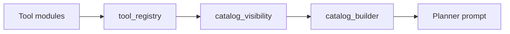
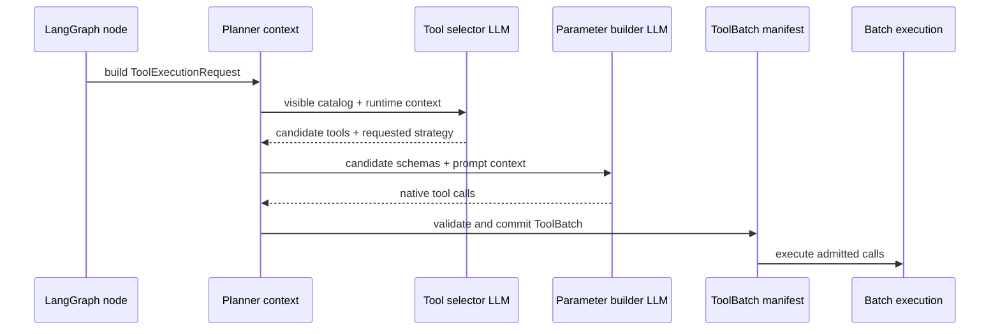
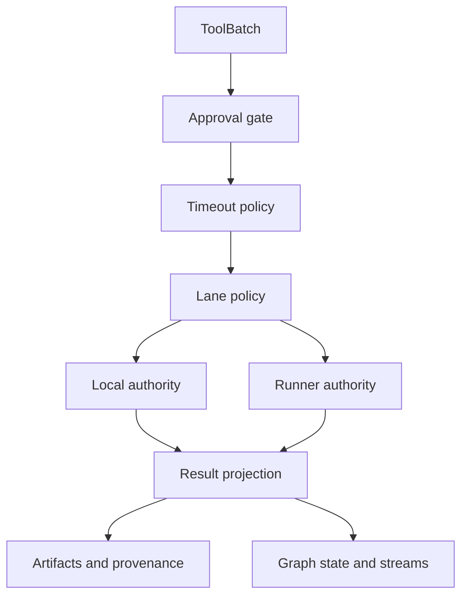
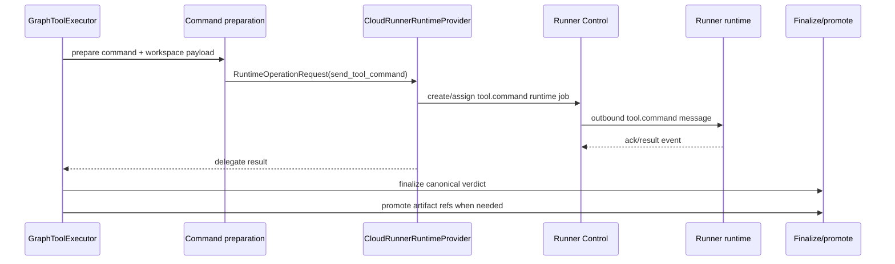

# Tool Architecture

Code-verified overview of tool discovery, prompt exposure, tool planning,
approval, execution routing, product Runner transport, explicit dev/test local
container transport, and result projection.

## Purpose

The tooling layer lets LangGraph turns choose and execute task-scoped
capabilities without letting model output become direct execution authority.

Tools are discovered from code, selectively exposed to prompts, planned through
LLM selection and parameter-building calls, validated into a canonical batch
manifest, optionally approved by the user, routed through explicit execution
lanes, and projected back into graph state, stream events, artifacts, and
provenance records.

## Responsibility Boundary

Owned by the tooling layer:

- Tool schema and implementation contracts.
- LLM-facing tool catalog visibility.
- Planner prompts for tool selection and parameter generation.
- Native function specs for parameter-building calls.
- Canonical `ToolBatch` admission and per-call lifecycle.
- HITL approval, partial approval, edit, denial, and idempotent resume handling.
- Execution-lane and transport policy.
- Runner tool-command dispatch for product tasks, plus local file-comm, local
  PTY, backend-direct, and artifact-direct lanes only where explicitly allowed
  by runtime/tool policy.
- Result normalization, compact prompt-safe summaries, artifacts, and provenance
  links.

Not owned by the tooling layer:

- HTTP request authentication.
- Tenant membership and task authorization.
- Runtime provider selection for the task.
- Durable LLM credential storage.
- Frontend rendering of tool events.

## Wired Entrypoints

- `agent/tools/tool_registry.py`
  - Discovers concrete `BaseTool` subclasses and exposes registry metadata.
- `agent/tools/catalog_visibility.py`
  - Controls which tool ids are visible in model-facing catalogs.
- `agent/tools/catalog_builder.py`
  - Builds the bounded visible catalog for planner prompts.
- `core/prompts/builders/tool_planning.py`
  - Builds selection and parameter prompts from versioned templates.
- `agent/reasoning/enhanced_planner_impl.py`
  - Runs tool selection and native parameter-building LLM calls.
- `agent/tools/tool_call_specs.py`
  - Converts tool planner schemas into provider-neutral function specs.
- `agent/graph/subgraphs/tool_execution.py`
  - Public LangGraph facade for tool execution nodes.
- `agent/graph/subgraphs/tool_execution_runtime/*`
  - Planner context, approval, batch admission, lane dispatch, runner command
    orchestration, result projection, and provenance helpers.
- `agent/tool_runtime/*`
  - Coordinator, timeout policy, command preparation, transport routing, PTY,
    batch execution, and runtime context binding.
- `agent/graph/adapters/executor_adapter.py`
  - Bridges LangGraph tool calls into local or runner execution authorities.
- `agent/executor.py`
  - Compatibility execution facade that delegates routing to `agent/tool_runtime`.
- `agent/communication/file_comm.py`
  - Agent-side JSONL command/result transport for local containers.
- `kali_executor/executor_daemon.py`
  - In-container daemon that executes prepared file-comm commands.
- `backend/services/runtime_provider/cloud_runner_provider.py`
  - Runner provider facade for runner tool-command dispatch, finalization, and
    artifact promotion.

## Tool Definition And Registry

Tool implementations subclass `agent.tools.base_tool.BaseTool`.

Core tool contract:

- `args_model`
  - Execution-facing Pydantic schema.
- `planner_args_model`
  - Optional planner-facing schema when planning input should differ from
    execution input.
- `planner_guidance`
  - Compact guidance appended to native function spec descriptions.
- `compile_planner_parameters`
  - Optional compiler from planner args to execution args.
- `build_command`
  - Shell command builder for container transports.
- `prepare_workspace_files` / `prepare_workspace_directories`
  - Pre-execution runtime workspace materialization.
- `parse_output`, semantic evidence hooks, artifact creation, and
  post-processing hooks.

`agent/tools/tool_registry.py` scans `agent/tools/**/*.py` with AST parsing and
indexes only concrete `BaseTool` subclasses. Helper modules, private modules,
schema files, policies, parsers, and deprecated modules are excluded. Tool
modules are imported lazily when metadata or execution requires the concrete
class.

## Catalog Exposure

The registry is not the same as the prompt catalog.

Catalog rules:

- `available_tools()` returns implemented tool ids.
- `visible_available_tools()` returns only ids allowed by
  `catalog_visibility.py`.
- Hidden tools can remain implemented and internally callable.
- Artifact DB tools are intentionally hidden from LLM-facing planning prompts.
- `build_full_tool_catalog()` caps prompt exposure with
  `AgentConfig.max_tools_exposed`.
- `render_capability_surface()` derives broad prompt-facing capability families
  from the visible tool list, not from every implemented tool.

## Prompt Injection

Tool prompts are assembled through versioned templates under
`core/prompts/versions/tool_planning/`.

Selection prompt inputs:

- visible resolved tool ids and catalog descriptions
- intent brief
- target and phase
- constraints
- selected categories
- next-tool hint
- current-turn phase memory
- working-memory summary from the shared context bundle
- referenced prior turns
- relevant findings
- capability surface
- scoped runbooks
- policy text for special visible tools such as CVE lookup

Parameter prompt inputs:

- selected candidate tool ids
- native function schemas for those tools
- selector scheduling hint
- target / targets
- plan and todo progress
- current goal
- next-tool directive
- previous tool and compact previous-output summary
- working memory and referenced prior turns
- bounded artifact file metadata for filesystem planning
- scoped tool runbooks

Prompt builders consume already-projected context. `request_context.py` requires
the hot-path `ConversationContextBundle`, projects it with `project_for_planner`,
and passes the planner the same prompt-authoritative recent-turn window used by
other graph roles.

## Planning Lifecycle

Planning steps:

1. Tool execution node builds `ToolExecutionRequest` and `AgentConfig`.
2. Runtime identity is required: tenant id, runtime placement mode, workspace
   id, actor type, and actor id.
3. Planner context selects category-filtered or full visible catalog.
4. `EnhancedActionPlanner` asks the LLM to propose candidate tools.
5. Candidate ids are validated against the visible catalog.
6. Function specs are built only for selected candidates.
7. The parameter builder commits concrete native tool calls.
8. Calls are validated and projected into a canonical `ToolBatch`.
9. The graph stores `planner_plan.tool_batch`; old single-tool-shaped state is
   rejected as execution input.

## Approval And Batch Admission

Tool execution is batch-backed, even when the batch has one call.

Batch admission owns:

- max committed calls per batch
- requested vs effective strategy
- parallel compatibility checks
- shell command size limits
- tool-call budget checks
- strategy downgrade metadata
- rejected reason metadata

Approval flow owns:

- deciding whether HITL approval is required
- emitting approval requests with tool call ids and batch id
- accepting full approval
- accepting partial approval
- applying edited parameters
- denying individual calls
- rejecting the whole batch when all calls are denied
- downgrading parallel execution when partial approval requires it
- preserving idempotent resume through dispatch cache metadata

## Runtime Execution Flow

Execution steps:

1. `orchestrator.py` reconstructs the canonical `ToolBatch`.
2. `BatchValidator` admits, downgrades, or rejects the batch.
3. Each call gets detached per-call state so parallel calls do not mutate shared
   facts directly.
4. `ToolTimeoutPolicy` normalizes parameters and deadlines per call.
5. `GraphToolExecutor` resolves lane authority.
6. The selected authority executes the call.
7. Output is truncated for UI/prompt safety but raw stdout/stderr can still be
   persisted as artifacts.
8. Result projection builds compact metadata, trace observations, stream
   events, action history, memory updates, artifacts, and provenance rows.
9. Per-call results are applied back to graph state in manifest order.

## Execution Lanes

Lane policy lives in `agent/tool_runtime/backend_tool_policy.py`.

| Lane | Tool examples | Allowed authority |
| --- | --- | --- |
| `container_scoped` | most CLI/runtime tools | local PTY/file-comm or runner tool-command |
| `backend_scoped` | `knowledge.cve_lookup` | backend direct |
| `artifact_scoped` | `artifact.*` | artifact direct |

Important rules:

- Unknown tools are treated as `container_scoped`.
- Container-scoped tools cannot fall back to direct backend execution.
- Backend-scoped and artifact-scoped tools do not use file-comm or PTY.
- Runner placement supports runtime-container tools in runner image v1.
- Runner placement rejects management artifact and knowledge tools before
  dispatch.

## Local Container Transport

Local placement uses `EnhancedCommandExecutor`, `GraphToolExecutor`, and
`agent/tool_runtime/transport_router.py`.

Local transport order:

1. Validate and normalize parameters.
2. Try PTY when enabled, supported, and requested/allowed by policy.
3. Fall back to file-comm when the lane allows file-comm.
4. Use direct execution only for explicit backend/artifact lanes.
5. Return route-policy violation if a container-scoped tool has no allowed
   transport.

File-comm flow:

1. `prepare_tool_command()` validates tool args and builds the shell command.
2. Required workspace files/directories are materialized in the host workspace.
3. `FileCommAgent` appends a command envelope to `commands.jsonl`.
4. `kali_executor/executor_daemon.py` reads the command in the container.
5. The daemon runs the prepared command under `/workspace`.
6. The daemon writes the result to `results.jsonl`.
7. Agent-side code waits for the result and enriches it into an
   `ExecutionResult`.

PTY flow:

1. `should_use_pty()` checks feature flag, tool support, and transport hints.
2. `prepare_tool_command()` builds the same canonical command payload used by
   file-comm.
3. `execute_via_pty_transport()` sends the command through the terminal session
   manager.
4. PTY output is normalized into the same command-transport result shape.

## Managed Runner Transport

Runner placement routes container-scoped calls through provider-owned
tool-command operations.

Runner dispatch requirements:

- tenant id
- task id
- workspace id
- runtime placement mode
- runner id / execution site when assigned
- lane dispatch metadata
- prepared command, not raw `args`
- command id / tool call id / batch id
- timeout policy
- pre-execution workspace file and directory payloads

`CloudRunnerRuntimeProvider.dispatch_tool_execution()` is only a compatibility
surface for runner mode. Active runner container tool execution uses per-call
lane routing and `send_tool_command`.

## Result Projection

Tool results are projected into several surfaces:

- `last_tool_result`
  - compact execution metadata for current graph logic.
- `last_tool_result_compact`
  - prompt-safe summary, findings, errors, artifact refs, and structured
    signals.
- trace observations and executed-tool records
  - graph routing and post-tool reasoning context.
- stream events
  - live frontend updates.
- output artifacts
  - saved raw/synthetic outputs for later reading and indexing.
- provenance rows
  - durable task/tool/execution/artifact linkage.
- current-turn phase memory
  - structured memory used by later planner and post-tool prompts.

Post-tool reasoning consumes the compact projection rather than raw unbounded
tool output.

Code-verified compression note: `compress_tool_output()` in
`agent/graph/compression/compressor.py` remains the public graph compression
entrypoint. The deterministic compression adapter layer is defined by
`agent/graph/compression/deterministic/contracts.py`,
`agent/graph/compression/deterministic/registry.py`,
`agent/graph/compression/deterministic/common.py`,
`agent/graph/compression/deterministic/envelope.py`,
`agent/graph/compression/deterministic/filesystem.py`,
`agent/graph/compression/deterministic/pcap.py`,
`agent/graph/compression/deterministic/http.py`,
`agent/graph/compression/deterministic/network_discovery.py`,
`agent/graph/compression/deterministic/credential_attack.py`,
`agent/graph/compression/deterministic/utility.py`, and
`agent/graph/compression/deterministic/web_discovery.py`. These adapters are
pure transformations of raw result/metadata; they do not execute tools, call
LLMs, import backend knowledge adapters, or use Docker, runner, or
runtime-provider services.

## Current Tool Completion Reference

Code-verified on July 7, 2026.

Completion means more than "the wrapper executes." A tool is treated as
finished for the current tooling architecture when it has:

- execution-facing Pydantic args and safe command construction;
- a rich parser that converts raw CLI output into bounded structured metadata;
- semantic observations/evidence when the output should update canonical task
  knowledge;
- deterministic compression wired through
  `agent/graph/compression/deterministic/*` and imported by
  `agent/graph/compression/compressor.py`;
- catalog policy that intentionally marks whether the tool is visible,
  hidden, utility, system, or internal-only.

Current inventory:

| Inventory slice | Count | Source of truth |
| --- | ---: | --- |
| Implemented `BaseTool` subclasses | 183 | `agent/tools/tool_registry.py` AST scan |
| Visible planner tools | 29 | `agent/tools/catalog_visibility.py` |
| Tools overriding `parse_output` | 144 | concrete tool classes |
| Tools with semantic observations | 7 | `emit_semantic_observations` overrides |
| Tools with semantic evidence | 5 | `emit_semantic_evidence` overrides |
| Tools with declared capture contract | 11 | `_capture_contract` on tool classes |

Finished visible domain/runtime tools:

| Tool | Why it is finished |
| --- | --- |
| `information_gathering.network_discovery.nmap` | Forces XML capture with `-oX -`, parses hosts, ports, services, OS/script enrichment, emits semantic observations/evidence, and has a network-discovery deterministic adapter. |
| `web_applications.web_crawlers.ffuf` | Uses a planner-facing schema and compiler, materializes inline wordlists, parses ffuf JSON/text into crawler metadata, emits semantic observations/evidence, and has a web-discovery deterministic adapter. |
| `sniffing_spoofing.network_sniffers.tshark` | Uses bounded analysis modes, structured JSON capture, PCAP compaction, semantic observations/evidence, sanitized process rendering, and a PCAP deterministic adapter. |
| `information_gathering.network_discovery.fping` | Parses liveness output into alive/unresponsive/diagnostic metadata, emits host-discovered observations, compacts noisy output, and has a network-discovery deterministic adapter. |
| `information_gathering.web_enumeration.http_request` | Builds argv-only curl commands, parses status/headers/body metadata, redacts sensitive output, persists artifacts when needed, and has an HTTP deterministic adapter. |
| `information_gathering.web_enumeration.http_download` | Enforces workspace-safe downloads, parses curl write-out metadata, validates runtime output files, verifies integrity fields, and has an HTTP deterministic adapter. |
| `networking_utilities.network` | Exposes a finite non-shell utility surface, validates operation-specific args, parses bounded utility output, and has a utility deterministic adapter. |
| `exploitation_tools.metasploit.search_modules` / `inspect_module` / `run_exploit` | Use the narrow msfconsole wrapper surface, parse msfconsole output into module/session/error metadata, and have Metasploit deterministic adapters. These are finished for the current narrow wrapper scope, not for full interactive session semantics. |

Visible support tools with deterministic projection:

| Tool family | Status |
| --- | --- |
| `filesystem.*` | Visible and deterministic for workspace file access. These are support tools rather than Kali CLI tools; most emit structured metadata consumed by the filesystem adapter. `read_head`, `read_tail`, and `grep` are convenience aliases without their own `parse_output` override, but deterministic coverage exists for their visible tool ids. |

Visible gaps:

| Tool | Current state | Completion gap |
| --- | --- | --- |
| `service_access.ftp_login` | Visible, has `parse_output`, no deterministic adapter. | Add service-access deterministic adapter and tests, then verify compact output/provenance behavior. |
| `service_access.ftp_list` | Visible, has `parse_output`, no deterministic adapter. | Same as above. |
| `service_access.ftp_download` | Visible, has `parse_output` and `postprocess_execution`, no deterministic adapter. | Same as above, including artifact/download metadata projection. |
| `service_access.ssh_login` | Visible, has `parse_output`, no deterministic adapter. | Same as above, with secret-safe credential reporting. |

Hidden tools with partial completion work already present:

| Tool | Current state | Promotion/completion requirement |
| --- | --- | --- |
| `password_attacks.online_attacks.hydra` | Hidden from catalog; has parser and semantic observations; deterministic credential-attack adapter is already wired. | Decide visibility policy, ensure planner schema/guidance is safe, add visible-catalog coverage tests before exposing. |
| `web_applications.web_application_fuzzers.ffuf` | Hidden; has parser, postprocess hook, semantic observations/evidence, and capture contract. | Add a deterministic adapter for the fuzzer variant or intentionally reuse/extend web-discovery with variant gating; then decide visibility. |
| `web_applications.web_vulnerability_scanners.nuclei` | Hidden; has JSONL capture, parser, semantic observations/evidence. | Add deterministic vulnerability-scanner adapter and visibility/runbook policy. |
| `information_gathering.network_discovery.masscan` | Hidden; has structured JSON capture and parser. | Add deterministic adapter or intentionally keep as hidden reference; decide whether broad/high-speed scan behavior should be planner-visible. |

Implemented backlog by top-level namespace:

| Namespace | Implemented | Visible | Parse-output overrides | Hidden backlog |
| --- | ---: | ---: | ---: | ---: |
| `artifact` | 2 | 0 | 0 | 2 |
| `database_assessment` | 3 | 0 | 3 | 3 |
| `exploitation_tools` | 13 | 3 | 5 | 10 |
| `filesystem` | 15 | 15 | 12 | 0 |
| `forensics` | 12 | 0 | 10 | 12 |
| `information_gathering` | 29 | 4 | 27 | 25 |
| `knowledge` | 1 | 0 | 0 | 1 |
| `maintaining_access` | 10 | 0 | 7 | 10 |
| `networking_utilities` | 1 | 1 | 1 | 0 |
| `password_attacks` | 14 | 0 | 13 | 14 |
| `reporting_tools` | 3 | 0 | 1 | 3 |
| `reverse_engineering` | 4 | 0 | 4 | 4 |
| `service_access` | 4 | 4 | 4 | 0 |
| `shell` | 2 | 0 | 2 | 2 |
| `sniffing_spoofing` | 10 | 1 | 10 | 9 |
| `stress_testing` | 6 | 0 | 0 | 6 |
| `system_services` | 9 | 0 | 6 | 9 |
| `vulnerability_analysis` | 21 | 0 | 20 | 21 |
| `web_applications` | 24 | 1 | 19 | 23 |

## How To Finish Another Tool

Use this sequence when graduating a tool from wrapper/backlog to finished:

1. Keep command construction inside the tool class with Pydantic validation and
   workspace/runtime-safe path handling.
2. Pick a canonical capture format. Prefer native JSON/XML/JSONL when the CLI
   supports it; otherwise declare text-native parsing explicitly.
3. Implement one parser authority in or near the tool module. `parse_output`
   should produce bounded structured metadata, not prose-only summaries.
4. Add semantic observations/evidence only for facts that should enter durable
   task memory or post-tool reasoning. Do not infer services, findings, or
   credentials beyond parser evidence.
5. Add a deterministic compression adapter under
   `agent/graph/compression/deterministic/`, register it at import time, and
   import the module from `agent/graph/compression/compressor.py`.
6. Add deterministic adapter tests and visible-catalog coverage tests when the
   tool is or becomes visible.
7. Register enhanced metadata near the tool implementation and keep the first
   capability description selector-grade.
8. Add the tool id to `catalog_visibility.py` only after parser, deterministic
   projection, metadata, security policy, and tests are complete.
9. Update `capability_surface.py` only when the visible tool changes the
   advertised capability families.
10. Verify product Runner behavior and explicit local-provider behavior through
    the shared command preparation and lane dispatch paths; do not bypass
    `agent/tool_runtime` or runtime-provider boundaries.

## Security And Isolation Notes

- Runtime identity is backend-projected and required before tool execution.
- Tool request metadata strips raw LLM secret fields before coordinator use.
- Durable command/log text is sanitized for secret-bearing arguments.
- Tool parameters are validated through Pydantic and shared validators before
  execution.
- Host workspace paths are resolved through workspace helpers.
- File-comm container `cwd` must remain inside `/workspace`.
- Container-scoped tools cannot execute as backend-direct fallback.
- Product container-scoped tools execute through Runner placement. Local
  container transport is reserved for explicit dev/test/diagnostic local
  provider contexts.
- Runner tool-command rejects secret-bearing env and runtime identity fields in
  tool params.
- Artifact and knowledge tools are not exposed in normal LLM-facing catalogs.

## Operational Notes

- `agent/executor.py` is a compatibility facade; current LangGraph tool turns
  run through batch-backed orchestrator paths.
- The first catalog metadata snapshot imports tool modules; later calls use the
  process cache.
- Planner cache entries are keyed from request, target, resolved tools, and
  small metadata snapshots.
- Parallel execution uses named PTY identities when required; if identity cannot
  be derived, PTY is disabled for that call.
- Timeouts are represented as structured timeout-policy metadata and preserved
  through local and runner result paths.

## Known Gaps Or Drift

- Some compatibility surfaces still exist for legacy action execution and
  single-tool coordinator use.
- `dispatch_tool_execution` exists on runtime providers, but active runner
  container tool execution uses `send_tool_command`.
- Artifact tools are implemented but hidden from model-facing planning prompts.
