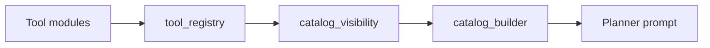
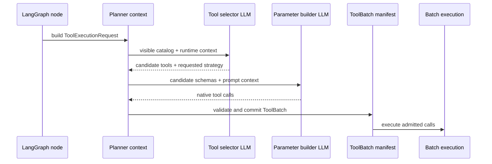
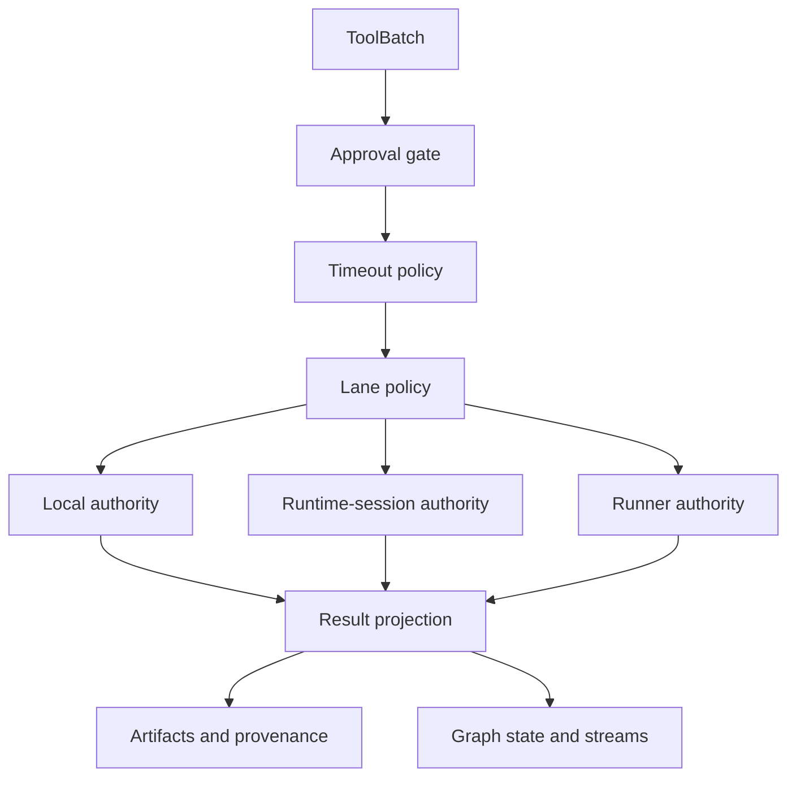
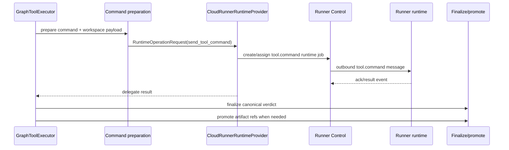

# Tool Architecture

Code-verified overview of tool discovery, prompt exposure, tool planning,
approval, execution routing, product Runner transport, explicit dev/test local
container transport, and result projection.

## Purpose

The tooling layer lets LangGraph turns choose and execute task-scoped
capabilities without letting model output become direct execution authority.

Tools are discovered from code, selectively exposed to prompts, planned through
LLM selection and parameter-building calls, validated into a canonical batch
manifest, optionally approved by the user, routed through explicit execution
lanes, and projected back into graph state, stream events, artifacts, and
provenance records.

The model-visible surface combines a curated structured-tool catalog with
universal shell controls. Structured tools carry dedicated schemas,
producer-owned parsing, compact result semantics, and optional Knowledge
integration. The shell controls provide full Kali command capability for
one-shot commands and interactive sessions, including binaries without a
dedicated tool definition; that does not automatically give those commands
tool-specific parsing or Knowledge projection.

## Responsibility Boundary

Owned by the tooling layer:

- Tool schema and implementation contracts.
- LLM-facing tool catalog visibility.
- Planner prompts for tool selection and parameter generation.
- Native function specs for parameter-building calls.
- Canonical `ToolBatch` admission and per-call lifecycle.
- HITL approval, partial approval, edit, denial, and idempotent resume handling.
- Execution-lane and transport policy.
- Runner tool-command dispatch for product tasks, provider-backed runtime
  sessions for interactive shell tools, plus local file-comm, legacy local PTY,
  backend-direct, and artifact-direct lanes only where explicitly allowed by
  runtime/tool policy.
- Result normalization, compact prompt-safe summaries, artifacts, and provenance
  links.

Not owned by the tooling layer:

- HTTP request authentication.
- Tenant membership and task authorization.
- Runtime provider selection for the task.
- Durable LLM credential storage.
- Frontend rendering of tool events.

## Wired Entrypoints

- `agent/tools/tool_registry.py`
  - Discovers concrete `BaseTool` subclasses and exposes registry metadata.
- `agent/tools/catalog_visibility.py`
  - Controls which tool ids are visible in model-facing catalogs.
- `agent/tools/catalog_builder.py`
  - Builds the complete visibility-approved catalog for full-catalog planner
    fallback.
- `agent/tools/universal_agent_tools.py`
  - Defines universal model-facing shell aliases appended to main-agent and
    subagent tool profiles when their registered metadata is visible.
- `agent/tools/shell/*`
  - Owns the hidden shell implementation schema, the utility/assessment start
    aliases, exact stdin schema, and command policy validation. Direct adapter
    execution fails closed.
- `core/prompts/builders/tool_planning.py`
  - Builds selection and parameter prompts from versioned templates.
- `agent/reasoning/enhanced_planner_impl.py`
  - Runs tool selection and native parameter-building LLM calls.
- `agent/tools/tool_call_specs.py`
  - Converts tool planner schemas into provider-neutral function specs.
- `agent/graph/subgraphs/tool_execution.py`
  - Public LangGraph facade for tool execution nodes.
- `agent/graph/subgraphs/tool_execution_runtime/*`
  - Planner context, approval, batch admission, lane dispatch, runner command
    orchestration, result projection, and provenance helpers.
- `agent/tool_runtime/*`
  - Coordinator, timeout and output-persistence policy, command preparation,
    transport routing, PTY/runtime-session control, batch execution, and runtime
    context binding.
- `backend/services/terminal/shell_session_service.py`
  - Provider-backed shell-session lifecycle, public handles, capacity/claims,
    bounded output, deadlines, and cleanup.
- `agent/graph/adapters/executor_adapter.py`
  - Bridges LangGraph tool calls into local or runner execution authorities.
- `agent/executor.py`
  - Compatibility execution facade that delegates routing to `agent/tool_runtime`.
- `agent/communication/file_comm.py`
  - Agent-side JSONL command/result transport for local containers.
- `kali_executor/executor_daemon.py`
  - In-container daemon that executes prepared file-comm commands.
- `backend/services/runtime_provider/cloud_runner_provider.py`
  - Runner provider facade for runner tool-command dispatch, finalization, and
    artifact promotion.

## Tool Definition And Registry

Tool implementations subclass `agent.tools.base_tool.BaseTool`.

Core tool contract:

- `args_model`
  - Execution-facing Pydantic schema.
- `planner_args_model`
  - Optional planner-facing schema when planning input should differ from
    execution input.
- `planner_guidance`
  - Compact guidance appended to native function spec descriptions.
- `compile_planner_parameters`
  - Optional compiler from planner args to execution args.
- `build_command`
  - Shell command builder for container transports.
- `prepare_workspace_files` / `prepare_workspace_directories`
  - Pre-execution runtime workspace materialization.
- `parse_output`, semantic evidence hooks, artifact creation, and
  post-processing hooks.

`agent/tools/tool_registry.py` scans `agent/tools/**/*.py` with AST parsing and
indexes only concrete `BaseTool` subclasses. Helper modules, private modules,
schema files, policies, parsers, and deprecated modules are excluded. Tool
modules are imported lazily when metadata or execution requires the concrete
class.

## Catalog Exposure

The registry is not the same as the prompt catalog.


```mermaid
flowchart LR
    Code[Tool modules]
    Registry[tool_registry]
    Visibility[catalog_visibility]
    Catalog[catalog_builder]
    Prompt[Planner prompt]

    Code --> Registry
    Registry --> Visibility
    Visibility --> Catalog
    Catalog --> Prompt
```

Catalog rules:

- `available_tools()` returns implemented tool ids.
- `visible_available_tools()` returns only ids allowed by
  `catalog_visibility.py`.
- Hidden tools can remain implemented and internally callable.
- Artifact DB tools are intentionally hidden from LLM-facing planning prompts.
- Full-catalog fallback planning receives every tool allowed by
  `catalog_visibility.py`; explicit action and batch limits constrain execution,
  not catalog visibility.
- `render_capability_surface()` derives broad prompt-facing capability families
  from the visible tool list, not from every implemented tool.
- `shell.utility`, `shell.assessment`, and `shell.write_stdin` are universal
  model-facing tools. They reuse registered metadata but are composed separately
  from mission-tool category filtering so both main agents and subagents retain
  the shell surface.
- `shell.exec` is the hidden implementation id behind the two start aliases.
  `shell.script` is a separate compatibility tool and is not part of the
  provider-backed shell-session contract.

## Prompt Injection

Tool prompts are assembled through versioned templates under
`core/prompts/versions/tool_planning/`.

Selection prompt inputs:

- visible resolved tool ids and catalog descriptions
- intent brief
- target and phase
- constraints
- selected categories
- next-tool hint
- current-turn phase memory
- working-memory summary from the shared context bundle
- referenced prior turns
- relevant findings
- capability surface
- tool-owned planner guidance and catalog descriptions
- policy text for special visible tools such as CVE lookup

Parameter prompt inputs:

- selected candidate tool ids
- native function schemas for those tools
- selector scheduling hint
- target / targets
- plan and todo progress
- current goal
- next-tool directive
- previous tool and compact previous-output summary
- working memory and referenced prior turns
- bounded artifact file metadata for filesystem planning

General tool planning does not load operational runbooks. Tool selection and
parameter semantics belong to the visible catalog, planner-facing schemas,
validators, and focused prompt policy owned by the relevant tool surface.

Subagent prompts have a separate built-in skill layer under `core/skills/`.
Skills provide bounded operational knowledge only: compatibility comes from
explicit agent IDs in package metadata, selected packages resolve once into
body-free checkpoint references, and their bodies are materialized into the
subagent system prompt. Startup separately verifies that every enabled
subagent's declared native tools remain model-visible. Skills never add tools,
scope, permissions, approvals, or runtime authority.

Prompt builders consume already-projected context. `request_context.py` requires
the hot-path `ConversationContextBundle`, projects it with `project_for_planner`,
and passes the planner the same prompt-authoritative recent-turn window used by
other graph roles.

## Planning Lifecycle


```mermaid
sequenceDiagram
    participant Graph as LangGraph node
    participant Context as Planner context
    participant Selector as Tool selector LLM
    participant Builder as Parameter builder LLM
    participant Batch as ToolBatch manifest
    participant Exec as Batch execution

    Graph->>Context: build ToolExecutionRequest
    Context->>Selector: visible catalog + runtime context
    Selector-->>Context: candidate tools + requested strategy
    Context->>Builder: candidate schemas + prompt context
    Builder-->>Context: native tool calls
    Context->>Batch: validate and commit ToolBatch
    Batch->>Exec: execute admitted calls
```

Planning steps:

1. Tool execution node builds `ToolExecutionRequest` and `AgentConfig`.
2. Runtime identity is required: tenant id, runtime placement mode, workspace
   id, actor type, and actor id.
3. Planner context selects category-filtered or full visible catalog.
4. `EnhancedActionPlanner` asks the LLM to propose candidate tools.
5. Candidate ids are validated against the visible catalog.
6. Function specs are built only for selected candidates.
7. The parameter builder commits concrete native tool calls.
8. Calls are validated and projected into a canonical `ToolBatch`.
9. The graph stores `planner_plan.tool_batch`; old single-tool-shaped state is
   rejected as execution input.

## Approval And Batch Admission

Tool execution is batch-backed, even when the batch has one call.

Batch admission owns:

- max committed calls per batch
- requested vs effective strategy
- parallel compatibility checks
- rejection of a batch containing more than one shell-session start
- tool-call budget checks
- strategy downgrade metadata
- rejected reason metadata

Approval flow owns:

- deciding whether HITL approval is required
- emitting approval requests with tool call ids and batch id
- accepting full approval
- accepting partial approval
- applying edited parameters
- denying individual calls
- rejecting the whole batch when all calls are denied
- downgrading parallel execution when partial approval requires it
- preserving idempotent resume through dispatch cache metadata

## Runtime Execution Flow


```mermaid
flowchart TD
    Batch[ToolBatch]
    Approval[Approval gate]
    Timeout[Timeout policy]
    Lane[Lane policy]
    Local[Local authority]
    Session[Runtime-session authority]
    Runner[Runner authority]
    Result[Result projection]
    Artifacts[Artifacts and provenance]
    State[Graph state and streams]

    Batch --> Approval
    Approval --> Timeout
    Timeout --> Lane
    Lane --> Local
    Lane --> Session
    Lane --> Runner
    Local --> Result
    Session --> Result
    Runner --> Result
    Result --> Artifacts
    Result --> State
```

Execution steps:

1. `orchestrator.py` reconstructs the canonical `ToolBatch`.
2. `BatchValidator` admits, downgrades, or rejects the batch.
3. Each call gets detached per-call state so parallel calls do not mutate shared
   facts directly.
4. `ToolTimeoutPolicy` normalizes parameters and deadlines per call.
5. `GraphToolExecutor` resolves lane authority.
6. The selected authority executes the call.
7. Output is truncated for UI/prompt safety but raw stdout/stderr can still be
   persisted as artifacts.
8. Result projection builds compact metadata, trace observations, stream
   events, action history, memory updates, artifacts, and provenance rows.
9. Per-call results are applied back to graph state in manifest order.

## Execution Lanes

Lane policy lives in `agent/tool_runtime/backend_tool_policy.py`.

| Lane | Tool examples | Allowed authority |
| --- | --- | --- |
| `container_scoped` | most CLI/runtime tools | local PTY/file-comm or runner tool-command |
| `runtime_session_scoped` | `shell.utility`, `shell.assessment`, `shell.write_stdin` | provider-backed runtime-session control |
| `backend_scoped` | `knowledge.cve_lookup` | backend direct |
| `artifact_scoped` | `artifact.*` | artifact direct |

Important rules:

- Unknown tools are treated as `container_scoped`.
- Container-scoped tools cannot fall back to direct backend execution.
- Runtime-session-scoped tools cannot fall back to file-comm, runner
  `tool.command`, legacy PTY transport, or backend direct execution.
- Backend-scoped and artifact-scoped tools do not use file-comm or PTY.
- Runner placement supports runtime-container tools in runner image v1.
- Runner placement rejects management artifact and knowledge tools before
  dispatch.

## Structured Local Container Transport

Local placement uses `EnhancedCommandExecutor`, `GraphToolExecutor`, and
`agent/tool_runtime/transport_router.py`.

Local transport order:

1. Validate and normalize parameters.
2. Try PTY when enabled, supported, and requested/allowed by policy.
3. Fall back to file-comm when the lane allows file-comm.
4. Use direct execution only for explicit backend/artifact lanes.
5. Return route-policy violation if a container-scoped tool has no allowed
   transport.

File-comm flow:

1. `prepare_tool_command()` validates tool args and builds the shell command.
2. Required workspace files/directories are materialized in the host workspace.
3. `FileCommAgent` appends a command envelope to `commands.jsonl`.
4. `kali_executor/executor_daemon.py` reads the command in the container.
5. The daemon runs the prepared command under `/workspace`.
6. The daemon writes the result to `results.jsonl`.
7. Agent-side code waits for the result and enriches it into an
   `ExecutionResult`.

PTY flow:

1. `should_use_pty()` checks feature flag, tool support, and transport hints.
2. `prepare_tool_command()` builds the same canonical command payload used by
   file-comm.
3. `execute_via_pty_transport()` sends the command through the terminal session
   manager.
4. PTY output is normalized into the same command-transport result shape.

This is the legacy one-shot PTY option for ordinary `container_scoped` tools.
It is not the transport used by the universal interactive shell aliases.

## Interactive Shell Session Transport

`runtime_session_control` is placement-neutral at the graph boundary. Lane
dispatch requires backend-projected tenant, task, execution-owner, workspace,
and placement identity, then calls the runtime-shared shell service port. The
backend implementation creates one dedicated provider terminal exec per start
and returns a bounded `ShellSessionUpdate` with independent process, logical
session, and interaction-boundary state.

The model-facing contract is:

- `shell.utility`: transient command output for navigation, inspection, and
  intermediate work; never retained as reusable assessment evidence.
- `shell.assessment`: command output eligible for a runtime-created transcript,
  artifact provenance, Knowledge ingestion, and durable raw-output reads after
  terminal provider confirmation.
- `shell.write_stdin`: exact non-empty input or `Ctrl-C` for the public session
  handle created by an explicitly interactive start. Waiting is an internal
  graph/service action rather than an empty stdin call.

Initial dispatch returns directly to normal synthesis when the process is
terminal. A genuine `process_status=running` result enters the shared
`tool_execution_session` graph, which accumulates bounded lifecycle evidence,
waits automatically for non-interactive commands, and invokes a bounded
interaction decision only when an interactive session needs model input. The
aggregate is compressed once after the runtime reports a terminal state.

## Managed Runner Transport

Runner placement routes container-scoped calls through provider-owned
tool-command operations.


```mermaid
sequenceDiagram
    participant Graph as GraphToolExecutor
    participant Prep as Command preparation
    participant Provider as CloudRunnerRuntimeProvider
    participant RC as Runner Control
    participant Runner as Runner runtime
    participant Finalize as Finalize/promote

    Graph->>Prep: prepare command + workspace payload
    Prep->>Provider: RuntimeOperationRequest(send_tool_command)
    Provider->>RC: create/assign tool.command runtime job
    RC->>Runner: outbound tool.command message
    Runner-->>RC: ack/result event
    Provider-->>Graph: delegate result
    Graph->>Finalize: finalize canonical verdict
    Graph->>Finalize: promote artifact refs when needed
```

Runner dispatch requirements:

- tenant id
- task id
- workspace id
- runtime placement mode
- runner id / execution site when assigned
- lane dispatch metadata
- prepared command, not raw `args`
- command id / tool call id / batch id
- timeout policy
- pre-execution workspace file and directory payloads

`CloudRunnerRuntimeProvider.dispatch_tool_execution()` is only a compatibility
surface for runner mode. Active runner container tool execution uses per-call
lane routing and `send_tool_command`.

## Result Projection

Tool results are projected into several surfaces:

- `last_tool_result`
  - compact execution metadata for current graph logic.
- `last_tool_result_compact`
  - prompt-safe summary, findings, errors, artifact refs, and structured
    signals.
- trace observations and executed-tool records
  - graph routing and post-tool reasoning context.
- stream events
  - live frontend updates.
- output artifacts
  - saved raw/synthetic outputs for later reading and indexing.
- provenance rows
  - durable task/tool/execution/artifact linkage.
- current-turn phase memory
  - structured memory used by later planner and post-tool prompts.

Shell projection additionally carries bounded `process_status`,
`session_status`, `interaction_boundary`, public `session_id`,
`stdin_available`, output windows, truncation, stable error code, and terminal
artifact refs. `output_persistence` distinguishes transient utility lifecycle
from durable assessment completion. Transient rows may remain visible in the
current tool card and bounded phase memory, but are excluded from reusable graph
evidence, provenance artifacts, and Knowledge ingestion.

Post-tool reasoning consumes the compact projection rather than raw unbounded
tool output.

Code-verified compression note: `compress_tool_output()` in
`agent/graph/compression/compressor.py` remains the public graph compression
entrypoint. The universal primary lane is still built by the
`UniversalToolProcessor` path in that module. For pentest catalog-role tools,
the optional secondary deterministic lane now compiles runtime semantic input
with `runtime_shared/semantic/pentest_facts.compile_facts()` and projects the
result through `agent/graph/compression/pentest_facts/project_compact_facts()`.
The projection package accepts `CompiledFactSet` plus explicit presentation
context; it does not parse raw tool output, read artifacts, dispatch by tool id,
call Knowledge services, or use Docker, runner, or runtime-provider services.

The remaining modules under `agent/graph/compression/deterministic/` are shared
metadata and envelope helpers used by the compressor. They are not a per-tool
pentest interpretation or registration surface.

### Compact Lane Authority and Consumer Inventory

Current code has two compact lanes:

- `compact_output` / `llm_compact_output`: the universal primary compact lane
  returned by `compress_tool_output()`. `ToolOutputCompressionResult` keeps
  `compact_output is llm_compact_output` when no separate LLM compact object is
  supplied, and the compressor currently returns the same object for both
  fields.
- `deterministic_compact_output`: the optional secondary lane. For pentest
  catalog-role tools it is produced from compiled canonical pentest facts and
  explicit presentation context. For non-pentest catalog roles it may be
  produced from generic bounded metadata. It is persisted for batch/cache replay
  and prompt context, but it is not the graph state's legacy
  `last_tool_result_compact` value and is not forwarded to frontend streaming
  metadata.

Production authors and readers:

| Surface | File | Lane role |
| --- | --- | --- |
| Compression result author | `agent/graph/compression/compressor.py` | Builds primary `compact_output`/`llm_compact_output` and optional secondary `deterministic_compact_output`. |
| Compression result contract | `agent/graph/compression/schema.py` | Normalizes `ToolOutputCompressionResult`; preserves the primary object invariant when `llm_compact_output` is omitted. |
| Interactive execution projection | `agent/graph/subgraphs/tool_execution_runtime/result_state_projection.py` | Calls `compress_tool_output()` and converts both lanes to dictionaries. |
| Dispatch cache author | `agent/graph/subgraphs/tool_execution_runtime/approval_and_idempotency.py` | Stores primary under `last_tool_result_compact` and secondary under `last_tool_result_deterministic_compact`. |
| Dispatch cache replay reader | `agent/graph/subgraphs/tool_execution_runtime/per_call_execution.py` | Reads both cache keys and restores per-call primary/secondary maps for idempotent replay. |
| Batch metadata writer | `agent/graph/subgraphs/tool_execution_runtime/batch_runner.py` | Writes `last_tool_result_compact_batch` and legacy `last_tool_result_compact`; passes optional secondary rows to the batch aggregator. |
| Batch row serializer | `agent/tool_runtime/batch/aggregator.py` | Serializes primary as `compact_tool_result` and optional secondary as `deterministic_compact_tool_result`. |
| Post-tool prompt reader | `core/prompts/builders/post_tool/last_tool.py` | Reads batch evidence through `read_compact_evidence()` and renders secondary summaries/details as supplemental prompt context when present. This is the product-decision-adjacent secondary reader. |
| Knowledge ingestion trigger | `agent/graph/nodes/post_tool_reasoning/node.py` | Enqueues ingestion with `last_tool_result_compact`; it does not read the secondary cache key. |
| Backend streaming adapter | `backend/services/langgraph_chat/streaming/event_processors/tool_event_processor.py` | Persists and emits normalized `compact_tool_result`; it does not read `deterministic_compact_tool_result`. |
| Runner promotion ingestion | `backend/services/runner_control/runtime_event_service.py` | Uses the runner result payload as a compact output hint; it does not consume the secondary deterministic lane. |

Consumer classification:

- Primary graph, prompt, memory, planner, stream, event, frontend, and
  Knowledge-ingestion paths consume the universal primary lane through
  `last_tool_result_compact`, `compact_tool_result`, or compact output hints.
- The only code-verified secondary semantic consumer is the post-tool prompt
  builder's supplemental deterministic rendering for batch evidence. Batch
  rows and dispatch cache entries are also transport/replay evidence, not proof
  by themselves that a specific secondary payload is product-required.

## Semantic Knowledge Boundary

Tools that produce durable deterministic Knowledge facts own the tool-specific
work up to native parsing, semantic observation emission, and semantic evidence
emission. They should emit final canonical semantic rows from parsed native
results when the fact is supported by the shared evidence and admission policy.

Backend Knowledge does not own tool-specific parsing or recovery. Runtime and
replay ingestion consume the existing semantic input envelope through
`KnowledgeIngestionService`, `runtime_shared/semantic/pentest_facts/*`,
`runtime_shared/semantic/web_common.py`, and
`backend/services/knowledge/pentest_facts/bridge.py`. New or updated tools
should not add per-tool Knowledge adapters, Knowledge-side metadata parsers,
artifact-content fallbacks, compatibility shims, or tool-id branches in the
compiler or bridge.

The semantic envelope is the shared input, and
`runtime_shared.semantic.pentest_facts.compile_facts()` is the shared
backend-free compiler authority. Backend Knowledge and pentest deterministic
compact projection are independent production consumers of that input:
`backend/services/knowledge/pentest_facts/bridge.py` compiles before emitting
Knowledge observation DTOs, while `agent/graph/compression/compressor.py`
builds its own envelope from runtime semantic inputs and compiles before compact
fact-family projection. No shared compiled instance, Knowledge DTO, compact DTO,
or consumer adapter crosses the backend/agent consumer boundary.

`runtime_shared/semantic/pentest_facts/evidence.py` owns the closed semantic
evidence vocabulary, per-type and global bounds, detail schemas, normalization,
and secret-safe rejection diagnostics. New evidence types or evidence detail
rules are added there rather than in tool emitters, Knowledge adapters, compact
adapters, or raw/artifact fallback code.

`runtime_shared/semantic/pentest_facts/policy.py` owns the exact supported
observation/subject pairs, fact families, assertion levels, canonical subject
invariants, and durable payload masking for admitted facts. New fact-family
admission rules, canonical subject invariants, assertion behavior, or durable
masking behavior are extended there before downstream consumers project the
compiled facts.

`runtime_shared/semantic/web_common.py` owns shared web URL, origin, path, and
finding identity helpers used by runtime-image tool semantics and backend
Knowledge projection/read paths without backend imports.

A tool that emits an already-supported fact family needs no Knowledge adapter,
compact adapter, registry entry, or compressor import. If a new fact family is
needed, extend the semantic contract, evidence and policy authorities, compiler,
Knowledge bridge, and compact fact-family presentation directly rather than
adding tool-specific downstream interpretation.

## Current Tool Completion Reference

Code-verified on July 31, 2026.

Completion means more than "the wrapper executes." Registration, functional
wiring, LLM visibility, mechanical validation, and broad runtime certification
are separate states:

- **Registered:** a concrete `BaseTool` with one stable tool id is discoverable
  through the active registry.
- **Functionally wired:** the tool has safe schema/command behavior, truthful
  structured result semantics, required artifact/provenance handling, and the
  applicable reusable semantic, Knowledge, compact-output, and post-tool
  reasoning paths described below.
- **LLM-visible:** a functionally wired tool is intentionally admitted by
  catalog policy and is reachable through category selection and the
  provider-neutral function-spec path.
- **Mechanically validated:** minimal/full parameters and applicable
  success/empty/partial/failure cases have been exercised through safe real
  Kali and current GUI paths.
- **Broadly certified:** supported environments, versions, scale, and
  operational edge cases have received wider validation. Functional wiring or
  visibility alone does not claim this level.

A tool is treated as functionally wired for the current architecture when it
has:

1. Execution-facing Pydantic args, safe target/path validation, and safe command
   construction inside the tool boundary.
2. An intentional native capture contract and one parser authority that turns
   stdout/stderr and declared runtime outputs into bounded structured metadata.
3. Truthful success, empty, partial/timeout, and failure semantics without
   false-positive success.
4. Workspace-safe artifact declarations and execution/artifact provenance when
   the tool produces durable outputs.
5. Producer-owned semantic observations/evidence for facts that should reach
   durable Knowledge or pentest deterministic compact projection.
6. Canonical fact admission through
   `runtime_shared.semantic.pentest_facts.compile_facts()` and the existing
   fact-family consumers; no per-tool Knowledge or compact adapter.
7. Universal primary compact output plus applicable canonical-fact secondary
   projection reaching result-state/batch and post-tool-reasoning consumers.
8. Focused schema, command, parser, result-state, security, semantic compiler,
   compact projection, Knowledge bridge/projection, and catalog tests for the
   paths the tool uses.
9. Catalog policy that intentionally marks the tool visible, hidden, utility,
   system, or internal-only. Visibility is the final enablement decision.
10. Product Runner and explicit local-provider behavior verified through
    existing `agent/tool_runtime` and runtime-provider boundaries.

### Reusable Knowledge And Compression Wiring

For a pentest tool, the reusable path is:

```text
native result
  -> tool-owned parse_output()
  -> tool-owned emit_semantic_observations()/emit_semantic_evidence()
  -> agent.tool_runtime.result_enrichment
  -> flat semantic envelope persisted with execution metadata
       |-> KnowledgeIngestionService -> Knowledge fact bridge -> observation ledger
       `-> compress_tool_output -> compile_facts -> compact fact projection
```

The flat envelope contains only `semantic_schema_version`,
`capability_family`, `semantic_observations`, and `semantic_evidence`.
`agent/semantic/enrichment.py` assembles and validates transport fields;
tool-specific parsing must not move into that module.

Knowledge wiring is automatic for supported semantic rows:

1. Emit an exact observation/subject pair admitted by
   `runtime_shared/semantic/pentest_facts/policy.py`, using the shared canonical
   host, service, web, finding, and relationship identity helpers.
2. Let `KnowledgeIngestionService` rebuild the envelope and call
   `backend/services/knowledge/pentest_facts/bridge.py`.
3. Let the bridge compile facts, attach backend-owned lineage and
   archive-scoped evidence, and emit `ObservationCreate` values for the existing
   ledger and projectors.
4. Verify the resulting assets, services, web paths, findings, relationships,
   engagement links, and evidence/provenance expected for the fact family.

Do not add a tool-id branch, Knowledge adapter, metadata parser, artifact-text
fallback, or compact-output fallback to deterministic Knowledge ingestion.
Unsupported or invalid semantic rows must produce bounded diagnostics or zero
deterministic observations rather than being reinterpreted downstream.

Pentest deterministic compact wiring is also automatic for supported facts:

1. `compress_tool_output()` rebuilds the envelope and independently calls
   `compile_facts()`; it never receives Knowledge DTOs or a Knowledge-compiled
   instance.
2. `agent/graph/compression/pentest_facts/projection.py` deterministically
   selects bounded facts/evidence and records exact omission counts and
   lossiness.
3. `presentation.py` renders existing fact families into compact summary,
   findings, structured signals, and decision evidence.
4. The universal primary compact value remains the graph/stream compatibility
   lane. The canonical-fact secondary value is persisted in batch/cache records
   and may supplement post-tool reasoning; Knowledge does not consume it.

Do not add a per-tool compression adapter, registry entry, compressor import,
or new pentest `compact_*` metadata override. A tool emitting an existing fact
family should require producer and end-to-end tests, not consumer code. When a
genuinely new fact family is required, extend the shared contract/admission
policy first, then the Knowledge and compact fact-family presentation
boundaries, with parity tests proving both consumers.

Functionally wired visible domain/runtime tools:

This is a wiring classification, not broad runtime or release certification.
Tool-specific validation maturity is documented in
`docs/tooling/llm-visible-tools.md`.

| Tool | Wired scope |
| --- | --- |
| `information_gathering.dns.amass` | Runs graph-free Amass v5 DNS enumeration through a serialized task-local collector and task-scoped Amass database, queries stored results after bounded enumeration, distinguishes parser status, enumeration status, completeness, seed/prior/new names, emits DNS/IP/`resolves_to` semantic observations and evidence, and projects supported facts through Knowledge and compact fact-family consumers. It does not import or persist the Amass Open Asset Model graph. |
| `information_gathering.network_discovery.nmap` | Forces XML capture with `-oX -`, parses hosts, ports, services, OS/script enrichment, emits semantic observations/evidence, and projects supported asset/service facts through the canonical fact pipeline. |
| `web_applications.web_crawlers.ffuf` | Uses a planner-facing schema and compiler, materializes inline wordlists, parses ffuf JSON/text into crawler metadata, emits semantic observations/evidence, and projects supported web-path facts through the canonical fact pipeline. |
| `sniffing_spoofing.network_sniffers.tshark` | Uses bounded analysis modes, structured JSON capture, PCAP compaction, semantic observations/evidence, sanitized process rendering, and projects supported packet-derived facts through the canonical fact pipeline. |
| `information_gathering.network_discovery.fping` | Parses liveness output into alive/unresponsive/diagnostic metadata, emits host-discovered observations, and projects supported asset facts through the canonical fact pipeline. |
| `information_gathering.web_enumeration.http_request` | Builds argv-only curl commands, parses status/headers/body metadata, redacts sensitive output, persists artifacts when needed, and emits a canonical web-path fact for confirmed HTTP responses plus host/service facts when the effective URL is IP-backed. |
| `information_gathering.web_enumeration.http_download` | Enforces workspace-safe downloads, parses curl write-out metadata, validates runtime output files, verifies integrity fields, and contributes bounded metadata to compact output when no supported semantic fact family applies. |
| `networking_utilities.network` | Exposes a finite non-shell utility surface, validates operation-specific args, parses bounded utility output, and uses generic metadata compact projection as a utility catalog-role tool. |
| `exploitation_tools.metasploit.search_modules` / `inspect_module` / `run_exploit` | Use the narrow msfconsole wrapper surface and parse output into module/session/error metadata. Search and inspection stay metadata-only; `run_exploit` emits `finding.exploit_succeeded` and, when a source endpoint is known, `relationship.exploits` only after explicit success. They are finished for the current narrow wrapper scope, not for full interactive session semantics. |

Visible support tools with deterministic projection:

| Tool family | Status |
| --- | --- |
| `filesystem.*` | Visible and deterministic for workspace file access. These are support tools rather than Kali CLI tools; most emit structured metadata consumed by generic compact metadata helpers. `read_head`, `read_tail`, and `grep` are convenience aliases without their own `parse_output` override, but compact coverage exists for their visible tool ids. |

Visible gaps:

| Tool | Current state | Completion gap |
| --- | --- | --- |
| `service_access.ftp_login` | Visible, has `parse_output`, and is a utility catalog-role tool. | Verify secret-safe metadata, generic compact output/provenance behavior, and whether supported credential/service facts should be emitted. |
| `service_access.ftp_list` | Visible, has `parse_output`, and is a utility catalog-role tool. | Verify metadata bounds, generic compact output/provenance behavior, and whether supported service/file-list facts should be emitted. |
| `service_access.ftp_download` | Visible, has `parse_output` and `postprocess_execution`, and is a utility catalog-role tool. | Verify artifact/download metadata projection and whether supported service/file facts should be emitted. |
| `service_access.ssh_login` | Visible, has `parse_output`, and is a utility catalog-role tool. | Verify secret-safe metadata, generic compact output/provenance behavior, and whether supported credential/service facts should be emitted. |

Hidden tools with partial completion work already present:

| Tool | Current state | Promotion/completion requirement |
| --- | --- | --- |
| `password_attacks.online_attacks.hydra` | Hidden from catalog; has parser and semantic observations. | Decide visibility policy, ensure planner schema/guidance is safe, add visible-catalog coverage tests before exposing, and verify supported credential facts compile through the canonical fact pipeline. |
| `web_applications.web_application_fuzzers.ffuf` | Hidden; has parser, postprocess hook, semantic observations/evidence, and capture contract. | Decide visibility policy and verify its emitted fact families are supported by Knowledge and compact projection. |
| `web_applications.web_crawlers.gobuster` | Hidden; has parser-owned metadata and emits canonical web-path observations from parsed Gobuster findings. | Decide visibility policy, confirm crawler scope and planner guardrails, add visible-catalog coverage tests before exposing, and verify supported web-path facts compile through the canonical fact pipeline. |
| `web_applications.web_vulnerability_scanners.nuclei` | Hidden; has JSONL capture, parser, semantic observations/evidence. | Decide visibility and planner policy, then verify supported finding facts compile through the canonical fact pipeline. |
| `web_applications.web_vulnerability_scanners.sqlmap` | Hidden; has text-native parsing, semantic metadata fields, and confirmed SQL injection semantic observations. | Decide visibility policy, confirm planner schema and guidance are safe for injection testing, add visible-catalog coverage tests before exposing, and verify supported finding facts compile through the canonical fact pipeline. |
| `information_gathering.network_discovery.masscan` | Hidden; has structured JSON capture, parser, and semantic observations. | Decide whether broad/high-speed scan behavior should be planner-visible and verify supported asset/service facts compile through the canonical fact pipeline. |

## How To Finish Another Tool

Use this sequence when graduating a tool from wrapper/backlog to finished:

1. Keep command construction inside the tool class with Pydantic validation and
   workspace/runtime-safe path handling.
2. Pick a canonical capture format. Prefer native JSON/XML/JSONL when the CLI
   supports it; otherwise declare text-native parsing explicitly.
3. Implement one parser authority in or near the tool module. `parse_output`
   should produce bounded structured metadata, not prose-only summaries.
4. Add semantic observations/evidence only for facts that should enter durable
   task memory or post-tool reasoning. Tool-specific Knowledge facts must end
   at producer-owned semantic rows; do not infer services, findings, or
   credentials beyond parser evidence, and do not add backend Knowledge
   adapters or Knowledge-side parsing for the tool.
5. If the tool emits an existing supported pentest fact family, rely on
   `compile_facts()` and compact fact projection; do not add a per-tool compact
   adapter, registry entry, or compressor import.
6. If the tool requires a new fact family, add that support at the semantic
   contract/compiler boundary and the fact-family Knowledge and compact
   presentation boundaries.
7. Verify Knowledge through ingestion, bridge, observation-ledger, and focused
   read-model projection tests. Do not use compact output as Knowledge fact
   input.
8. Verify compact behavior through compiler, fact-presentation, projection,
   omission/lossiness, result-state or batch, and post-tool prompt tests as
   applicable. Knowledge must remain unaffected by compact budgets.
9. Register enhanced metadata near the tool implementation and keep the first
   capability description selector-grade.
10. Add the tool id to `catalog_visibility.py` only after parser, supported
   semantic fact coverage or intentional utility metadata coverage, enhanced
   metadata, security policy, runtime compatibility, and tests are complete.
11. Update `capability_surface.py` only when the visible tool changes the
   advertised capability families.
12. Mechanically validate minimal/full schema transmission and applicable
    success, empty, partial/timeout, and failure cases using controlled targets.
13. Verify product Runner behavior and explicit local-provider behavior through
    the shared command preparation and lane dispatch paths; do not bypass
    `agent/tool_runtime` or runtime-provider boundaries.

## Security And Isolation Notes

- Runtime identity is backend-projected and required before tool execution.
- Tool request metadata strips raw LLM secret fields before coordinator use.
- Durable command/log text is sanitized for secret-bearing arguments.
- Tool parameters are validated through Pydantic and shared validators before
  execution.
- Host workspace paths are resolved through workspace helpers.
- File-comm container `cwd` must remain inside `/workspace`.
- Container-scoped tools cannot execute as backend-direct fallback.
- Product container-scoped tools execute through Runner placement. Local
  container transport is reserved for explicit dev/test/diagnostic local
  provider contexts.
- Runner tool-command rejects secret-bearing env and runtime identity fields in
  tool params.
- Artifact and knowledge tools are not exposed in normal LLM-facing catalogs.
- Shell command policy defaults to permissive pentesting operation with a small
  hard-block set for obvious environment destruction, shutdown/resource
  exhaustion, and container-escape patterns. The structured catalog is not a
  command allowlist, and command length alone is not an admission limit.
- Outside explicitly disabled test mode, policy validation normalizes continued
  lines, recursively checks supported shell wrappers, and rejects active
  command/process substitution. Request schemas always prevent environment
  entries from replacing runtime/transport-owned variables.
- `scope.md` and planner constraints guide the model but do not enforce command
  targets or network egress. Deployments needing technical target restriction
  must provide firewall, VPN, egress, or lab segmentation controls.

## Operational Notes

- `agent/executor.py` is a compatibility facade; current LangGraph tool turns
  run through batch-backed orchestrator paths.
- The first catalog metadata snapshot imports tool modules; later calls use the
  process cache.
- Planner cache entries are keyed from request, target, resolved tools, and
  small metadata snapshots.
- Parallel legacy PTY execution uses named identities when required; if identity
  cannot be derived, PTY is disabled for that call. A batch may contain at most
  one provider-backed shell-session start.
- Timeouts are represented as structured timeout-policy metadata and preserved
  through local and runner result paths.

## Known Gaps Or Drift

- Some compatibility surfaces still exist for legacy action execution and
  single-tool coordinator use.
- `dispatch_tool_execution` exists on runtime providers, but active runner
  container tool execution uses `send_tool_command`.
- Artifact tools are implemented but hidden from model-facing planning prompts.
