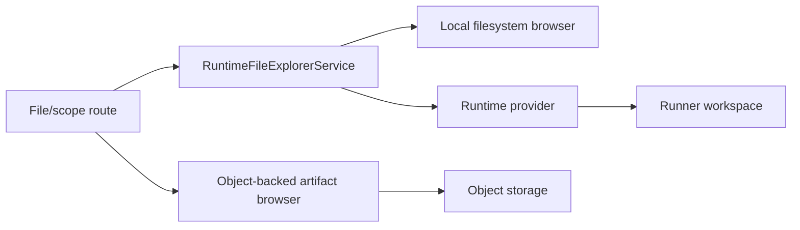

# Workspace And Artifact Architecture

Code-verified overview of task workspace layout, live runtime file browsing,
runtime artifact reads/writes, object-backed runner artifacts, and how these
surfaces stay separated.

## Purpose

Task workspaces are execution-local file systems. Artifacts are durable records
or files produced by execution. The architecture keeps live workspace access,
runtime-provider file operations, and object-backed artifact browsing distinct.

Local tasks use host task workspaces mounted into containers at `/workspace`.
Runner tasks use a runner-owned workspace and access it through runtime-provider
operations. Durable runner artifacts are promoted into the data plane through
artifact manifests and object storage.

## Responsibility Boundary

Owned by workspace/artifact architecture:

- Task workspace directory layout.
- Workspace creation, cleanup, and archive helpers.
- Workspace-safe local file browsing.
- Runtime-provider read/write/query operations for runner workspaces.
- Object-backed artifact file browsing for runner-uploaded artifacts.
- Bounded file preview/download/ZIP behavior.
- Workspace file materialization before tool execution.

Not owned by workspace/artifact architecture:

- Tool execution planning.
- Tool execution provenance row creation.
- Knowledge archive policy.
- User authorization policy.
- Object-store implementation details beyond artifact read/write contracts.

## Wired Entrypoints

- `backend/config/workspace_config.py`
  - Workspace path and directory layout authority.
- `backend/services/workspace/manager.py`
  - Task workspace creation, cleanup, archive, and helper paths.
- `runtime_shared/file_comm_contracts.py`
  - Shared `/workspace` file-comm layout.
- `runtime_shared/workspace_files.py`
  - Runtime workspace file/directory declaration validation and materialization.
- `runtime_shared/workspace_filesystem.py`
  - Descriptor-anchored host filesystem capability for task workspace reads,
    writes, traversal, ZIPs, snapshots, and cleanup.
- `runtime_shared/workspace_write_mode.py`
  - Shared write/append policy.
- `backend/services/workspace/file_browser_service.py`
  - Local workspace-safe file browsing and preview sanitization.
- `backend/services/workspace/runtime_file_explorer_service.py`
  - Runtime-aware file explorer that chooses local filesystem or runner
    provider operations.
- `backend/services/workspace/runtime_workspace_query_service.py`
  - Scope/file read boundary for authorized task workspace queries.
- `backend/services/data_plane/artifact_file_browser_service.py`
  - Object-backed virtual file browser for runner artifact rows.
- `backend/services/runtime_provider/runtime_artifact_access.py`
  - Internal read helpers for runtime artifacts through provider boundary.
- `backend/services/runtime_provider/cloud_runner/operations/artifact.py`
  - Runner workspace read/write/query/promote provider operations.
- `backend/services/runtime_provider/local_docker_provider.py`
  - Local workspace file read/write provider operations.

## Workspace Layout

Local task workspaces live under:

```text
agent/workspaces/task-<task_id>/
```

The local container sees that directory at:

```text
/workspace
```

Host-owned control material is separate from user data:

```text
agent/runtime-control/task-<task_id>/
  vpn/task.ovpn
  runtime-input/user_input.jsonl
```

Managed runners use `<runner-root>/tasks/<workspace-id>/` for data and
`<runner-root>/control/<workspace-id>/` for control. Containers receive the
data root at `/workspace` read-write and the control root at
`/run/drowai/control` read-only. This is workspace layout `2.0`.

`WorkspaceConfig.ensure_workspace_structure()` creates:

- `results/`
- `logs/`
- `scripts/`
- `data/`
- `artifacts/`
- `reports/`
- `locks/`
- `commands.jsonl`
- `results.jsonl`
- `agent_state.json`
- lock files for command/result transport

The runner workspace uses the same conceptual `workspace_id` identity, usually
`task-<task_id>`, but the physical files are owned by the runner and accessed
through provider operations.

## Runtime File Access



Live workspace browsing uses `RuntimeFileExplorerService`:

- Local placement materializes the local workspace and reads through
  `FileBrowserService`.
- Runner placement queries or reads files through `query_runtime_artifacts` and
  `read_runtime_artifact_file`.
- Downloads and ZIPs for runner placement materialize temporary files from
  provider-returned bytes.

Object-backed artifact browsing uses `ArtifactFileBrowserService`:

- reads `execution_artifacts` rows
- builds a virtual tree from artifact `relative_path`
- reads content from inline text or object storage
- never exposes object keys or backend-local paths in API payloads

## Runtime Workspace Materialization

Tools can declare pre-execution workspace files and directories. The shared
contracts in `runtime_shared/workspace_files.py` normalize these declarations,
reject unsafe paths, cap counts/sizes, and materialize them under the runtime
workspace.

Local file-comm uses the declarations before writing the command to the
workspace command queue. Runner tool commands serialize equivalent declarations
into runner-control payloads so the runner can materialize them in its own
workspace before command execution.

## Artifact Storage Modes

Workspace artifacts can exist in several forms:

- Local workspace file under `agent/workspaces/task-<id>/artifacts`.
- Inline text in `execution_artifacts.content_text`.
- Object-backed artifact with `object_key`, `storage_backend`, and
  `upload_status`.
- Runtime-only runner workspace file reachable through provider reads.
- Engagement archive copy or object reference created by knowledge archive
  policy.

Callers should choose the correct surface:

- Use runtime file explorer for live workspace inspection.
- Use artifact provenance/catalog APIs for durable execution artifacts.
- Use runtime artifact access helpers for backend services that must read a
  runtime file through the provider boundary.

## Security / Isolation Notes

- Local path validation rejects absolute paths and traversal outside the task
  workspace.
- Backend and runner host operations use `WorkspaceFilesystem`, which traverses
  from directory descriptors with no-follow opens and accepts only regular
  files/directories. Symlinks and special files fail closed.
- VPN and runtime-input files are mode `0600` beneath task control roots of
  mode `0700`; task containers cannot replace them through the read-only mount.
- Runner path errors from the provider are mapped to not-found or outside-scope
  failures.
- Object-backed artifact browser hides object keys and backend filesystem paths.
- Text previews are sanitized before browser responses.
- Runtime artifact writes validate write mode and only allow append for approved
  index-style paths.

## Operational Notes

- Live runner workspace reads may need bounded waiting.
- Object-backed artifact rows can be `upload_pending`, `ready`, or
  `upload_failed`.
- `scope.md` for runner placement is read from object-backed artifact browser
  when available.
- Temporary files are used for downloads and ZIPs from runner/object-backed
  sources.
- Legacy regular runtime input is copied into the control root during runtime
  recreation. Unsafe legacy entries are rejected, and legacy control entries
  are removed only after the recreated runtime passes its contract check.
- Workspace cleanup differs by provider: local removes host directories, runner
  delegates cleanup scope to the runner provider.

## Known Gaps Or Drift Risks

- The term "artifact" is used for both live workspace files and durable
  provenance records; callsites must pick the correct surface.
- Some compatibility routes still ask for a materialized local workspace path.
- Runner workspace browsing and object-backed artifact browsing are intentionally
  different views and may not show identical contents at the same moment.
