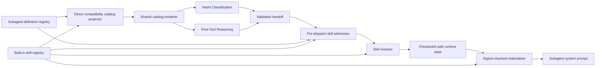

<!-- Purpose: Define the target high-level architecture for declarative internal subagent skills. -->

# Subagent Skill System - High-Level Design

## Document Status

| Field | Value |
| --- | --- |
| Status | Implemented |
| Design type | Internal subagent skill architecture |
| Code baseline verified | 2026-08-21 |
| Low-level design | [Subagent Skill System - Low-Level Design](../lldd/subagent-skill-system-lld.md) |

This document describes the implemented architecture. Wired code remains the
behavior source of truth.

## Executive Summary

The skill system provides package-owned operational guidance to subagents. A
skill is a versioned instruction package. It is not a tool, permission source,
agent definition, workflow engine, credential source, or runtime placement
mechanism.

The first implementation is intentionally simple:

- built-in packages are discovered during normal service startup;
- each skill has exactly one activation mode: `mandatory` or `selectable`;
- every skill declares compatible `agent-ids`;
- compatible mandatory skills are injected automatically;
- compatible selectable skills are injected only when the parent handoff
  includes their IDs in `skill_ids`;
- parent-selected IDs are capped at five;
- Intent Classification and Post-Tool Reasoning receive the same agent/skill
  catalog projection; and
- child runtime state stores version-and-digest-pinned references, not skill
  bodies.

There is no trigger matching, capability matching, capability-family matching,
agent-kind matching, task-text matching, priority ordering, or subagent-side
skill selection.

## Goals

- Make internal operational guidance reusable across compatible subagents.
- Keep subagent definitions as the authority for identity, mission boundaries,
  native tools, ownership, and limits.
- Make adding a future built-in skill declarative: add one valid package under
  the built-in skill root and restart or redeploy normally.
- Make adding a future subagent declarative when its native tools are already
  registered and model-visible: add one valid TOML definition and restart or
  redeploy normally.
- Use one registry authority for skill loading and one subagent registry
  authority for agent loading.
- Use one shared catalog renderer for initial delegation and follow-up
  delegation.
- Reject invalid selected skills before child launch.
- Keep skill guidance subordinate to assignment scope, ownership boundaries,
  runtime policy, native tool restrictions, approvals, and target authority.
- Preserve prompt safety through size limits, digest pinning, and body-free
  checkpoints.

## Non-Goals

The architecture does not add:

- user-authored or tenant-owned skills;
- live reload while the service is already running;
- a skill management API or UI;
- skill-provided scripts, assets, or external fetches; or
- automatic conversion of previous operational guidance.

Concrete subagent definitions, skill guidance, and runtime executables remain
declarative package content; they do not change the registry, admission,
resolution, or prompt-injection architecture described here.

## Terminology

| Term | Meaning |
| --- | --- |
| Skill package | An immediate built-in directory containing one `SKILL.md` entrypoint |
| Mandatory skill | Compatible guidance injected into a subagent without parent selection |
| Selectable skill | Compatible guidance injected only when the parent handoff requests its ID |
| Skill catalog | Per-agent projection of mandatory and selectable skill IDs and descriptions |
| Resolved skill ref | Body-free `skill_id`, `version`, `digest`, and reason persisted for a run |
| Parent-selected skill | A selectable skill requested through `skill_ids` during handoff |

## Authorities To Preserve

| Authority | Responsibility |
| --- | --- |
| Subagent definition loader and registry | Load enabled subagent TOML files and expose definition metadata |
| Skill discovery and loader | Discover built-in packages, validate one `SKILL.md`, and compute digests |
| Skill registry | Hold immutable loaded skills and materialize digest-matched references |
| Catalog projector | Project compatible mandatory/selectable skills for each enabled agent |
| Shared catalog renderer | Render identical agent/skill catalogs for initial and follow-up delegation |
| Handoff contract | Carry `{agent_handoff, subagent, objective, skill_ids}` only |
| Admission policy | Reject unknown, mandatory-only, incompatible, or over-budget selections before launch |
| Resolver | Produce deterministic body-free refs from agent ID plus parent-selected IDs |
| Runtime state | Persist resolved refs and effective runtime state without skill bodies |
| Runtime prompt builder | Render materialized skill guidance into the child system prompt |

No component should duplicate catalog construction, embed agent-specific skill
branches, or combine discovery, validation, selection, and rendering into one
orchestrator.

## Target Architecture

## Lifecycle

### Startup

1. Load enabled subagent definitions from the existing definitions directory.
2. Discover immediate built-in skill package directories.
3. Validate each `SKILL.md` safely and eagerly.
4. Fail startup before serving requests when a package is malformed, a skill
   references an unknown or disabled agent, a future agent references
   unavailable non-visible native tools, or mandatory guidance for an agent
   exceeds the prompt budget.
5. Expose immutable registries to the prompt, admission, and runtime
   composition paths.

### Handoff Authoring

1. Project each enabled agent to a catalog with `mandatory_skills` and
   `selectable_skills`.
2. Render the same catalog text for Intent Classification and Post-Tool
   Reasoning.
3. Display mandatory skills as automatically included.
4. Expose only selectable skill IDs as valid `skill_ids` choices.
5. The parent returns a subagent, objective, and zero to five selected IDs.

### Admission

1. Normalize the canonical handoff shape.
2. Validate the selected subagent through the existing ownership path.
3. Normalize and stably deduplicate selected IDs at the shared handoff boundary.
4. Reject unknown, mandatory-only, incompatible, raw over-limit, or over-budget
   selected IDs with stable reasons before dispatch.
5. Preserve normalized selected IDs in the assignment only after admission
   succeeds.

### Runtime

1. Resolve compatible mandatory skills by skill ID.
2. Resolve compatible parent-selected skills in handoff order.
3. Store only resolved references in checkpoint-safe state.
4. Materialize bodies through the registry on each prompt build and stop on
   version or digest mismatch.
5. Inject guidance into the subagent system prompt under runtime, assignment,
   ownership, approval, and native-tool policy.

## Prompt Authority

The runtime prompt includes shared guidance equivalent to:

> Prefer a provided native tool when it is applicable to the assigned task and
> can safely and fully perform the immediate action. Do not use the shell merely
> to reproduce an equivalent call that an applicable provided native tool can
> perform. When no provided native tool is applicable to an in-scope action,
> the applicable native tools cannot perform it, or selected skill guidance
> describes a shell-only workflow, use the assessment shell. Skills provide
> operational guidance; they do not add permissions, targets, tools, or
> authority.

Skill text never overrides assignment scope, ownership boundaries, runtime
policy, tool restrictions, approval requirements, credentials, or target
authorization.

## Declarative Extension Contract

After the foundation is complete, a future internal skill is activated by:

1. adding `core/skills/builtin/<skill_id>/SKILL.md`;
2. declaring `metadata.activation` as `mandatory` or `selectable`;
3. declaring one or more compatible `metadata.agent-ids`; and
4. restarting or redeploying normally.

No Python registry edit, prompt template edit, handoff schema edit, or
agent-specific branch should be required for a valid package. A future subagent
uses the same contract when its TOML references native tools that are already
registered and model-visible.

## Invariants

1. Skills provide knowledge only.
2. Skill compatibility depends only on declared agent IDs.
3. Mandatory skills sort by skill ID.
4. Parent-selected skills preserve handoff order.
5. Mandatory skills do not consume the five selected-skill slots.
6. All injected guidance shares one total prompt budget.
7. Checkpoints store references, never bodies.
8. Initial and follow-up delegation use one catalog projection and renderer.
9. Startup and admission fail closed for invalid package or selected-skill
   state.
10. The completed runtime has no active runbook dependency.
