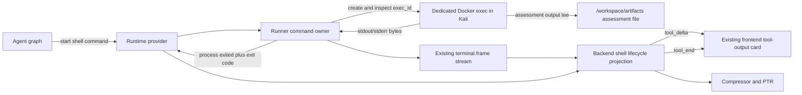

<!-- Purpose: define the approved transition from backend-inferred PTY command framing to runner-owned shell command lifecycle and live output streaming. -->

# Runner-Owned Shell Command Lifecycle Transition

**Status:** Approved design direction; implementation pending

**Decision date:** 2026-08-14

## Purpose

Define the bounded transition of `shell.utility` and `shell.assessment` from a
command lifecycle inferred by backend-side PTY output parsing to a lifecycle
owned by the task execution plane. The target must preserve live output in the
existing tool-output UI, preserve interactive shell support, and retain the
existing runtime-provider and artifact boundaries.

This is an MVP foundation change. It is not a general terminal rewrite, a new
artifact subsystem, or an enterprise process-orchestration project. The design
must reuse the existing runner terminal transport and streaming path wherever
they already satisfy the target contract.

## Decision summary

Normal, non-interactive shell executions will run as dedicated Docker exec
processes inside the selected Kali task runtime. For managed placement, the
runner owns each exec handle, output socket, input/interrupt transport, live
frame publication, and authoritative completion observation. The local runtime
provider must implement the same process contract for local placement.

The command itself continues to execute inside Kali. Assessment artifact
capture also executes inside Kali and writes only to `/workspace/artifacts`.
The backend does not infer command completion from output text and does not
create a fallback shell-output artifact.

Both non-interactive and interactive shell-tool executions use one dedicated
exec lifecycle. Interactive execution enables PTY stdin, resize, and the
existing interaction continuation; it does not type the command into a shared
bare Bash process. Non-interactive output never enters the shell
interaction-decision LLM loop: output is streamed to the frontend while the
runtime continues waiting for the real process exit.

The file-communication transport is prohibited from this design. No new shell
path, fallback, compatibility bridge, artifact capture, or status polling may
use file-comm. Its eventual repository-wide retirement is a separate change.

## Current code-verified state

The existing implementation already has a strong execution-plane foundation:

- `ShellSessionService` opens provider-backed terminal sessions and exposes
  bounded shell updates to the graph.
- Managed runners create and own Docker exec PTY sockets and continuously
  publish task-scoped `terminal.frame` messages.
- The backend buffers validated runner frames for provider reads.
- Shell lifecycle updates are translated into `tool_delta` events, and the
  frontend tool card renders running shell output.
- Assessment capture runs inside Kali and the backend exposes the artifact only
  after provider confirmation; utility output remains transient.

The ownership gap is at the individual command boundary:

1. The runner starts one persistent `/bin/bash` Docker exec session.
2. The backend sends marker-wrapped command text into that Bash process.
3. The backend parser treats the command's start and exit marker as its
   lifecycle authority.
4. Output quiescence can expose a running boundary before the exit marker is
   observed.
5. The graph can invoke an LLM to decide whether to send input, wait, or
   interrupt even when the command is ordinary and non-interactive.

The runner therefore owns the terminal transport today, but it does not own or
report the lifecycle of each command typed into the persistent shell.

## Problem statement

Output text is not a reliable process-lifecycle protocol. A Kali login banner,
partial command output, a prompt-like line, or a short quiet period can arrive
before command completion. When the backend interprets such output as an
interaction boundary, the interaction model may repeat the original command or
wait unnecessarily even though the runtime could determine the real process
state directly.

This causes four coupled problems:

- command completion depends on marker parsing rather than the Docker exec
  lifecycle;
- ordinary output can trigger unnecessary shell-interaction LLM calls;
- live output and semantic interaction decisions are incorrectly coupled;
- the persistent Bash session obscures the exit state of the individual
  command being presented as one tool execution.

Prompt changes alone cannot establish process authority. They may improve model
behavior, but they cannot make banners, silence, or partial output equivalent to
an operating-system process exit.

## Goals

- Observe non-interactive shell completion and exit code from its dedicated
  runtime process.
- Stream live command output into the existing frontend tool-output container.
- Keep `shell.utility`, `shell.assessment`, and `shell.write_stdin` as the
  model-facing tool family.
- Preserve utility versus assessment persistence semantics.
- Preserve the existing runtime-provider boundary and task isolation.
- Preserve genuinely interactive PTY behavior and exact input continuation.
- Remove marker-inferred shell-tool command lifecycle completely after cutover.
- Finish with one authoritative implementation, without a legacy fallback or
  duplicate lifecycle path.

## Scope boundaries

### In scope

- Provider and runner contracts needed to start, observe, stream, interrupt,
  and close one dedicated shell command process.
- Managed-runner Docker exec ownership and the equivalent local-provider
  implementation.
- Reuse of the existing terminal-frame channel and shell `tool_delta` frontend
  projection.
- Explicit selection between non-interactive and interactive behavior on the
  same dedicated exec lifecycle.
- Runtime-owned assessment output capture and verified artifact references.
- Graph routing that streams non-interactive progress without invoking the
  interaction-decision model.
- Tests for command lifecycle, live output, artifact behavior, local/managed
  parity, and final legacy removal.
- Final deletion of residual shell-specific framing, capture, routing, prompt,
  and compatibility code that has no remaining wired caller.

### Out of scope

- Replacing the runtime-provider architecture.
- Rewriting the runner control channel or general terminal UI.
- Replacing the existing frontend tool card.
- Designing a general-purpose distributed process supervisor.
- Migrating every registered assessment tool to the new shell lifecycle.
- Globally retiring file-comm as part of this transition.
- Changing shell command policy, approval policy, or tool visibility.
- Creating a new model-facing shell tool.
- Adding command-name heuristics, banner parsers, or prompt detection.
- Adding a backend filesystem fallback for runtime artifacts.

## Prohibited dependencies and fallbacks

The transitioned shell path must not:

- dispatch through `agent/communication/file_comm.py`;
- dispatch through `drowai_runner/file_comm_bridge.py`;
- depend on `runtime_shared/file_comm_contracts.py`;
- depend on the Kali file-comm command/result queue;
- fall back to file-comm when runner execution is unavailable;
- fall back to a backend subprocess or backend artifact writer;
- retain the old marker-framed command path as a hidden recovery mode.

An unavailable required runtime capability must produce the existing explicit
runtime-unavailable failure shape. It must not silently select a different
execution architecture.

## Target ownership model

Ownership is intentionally narrow:

| Concern | Authority |
| --- | --- |
| Command planning and capability choice | Agent graph and existing shell tool policy |
| Runtime placement | Existing runtime provider |
| Managed Docker exec handle and socket | Runner |
| Local Docker exec handle and socket | Local runtime-provider implementation |
| Command execution | Dedicated process inside Kali |
| Live output frame sequencing | Existing runner terminal-frame lifecycle |
| Process running/completed state and exit code | Docker exec lifecycle owner |
| Assessment artifact bytes | Kali command/capture process |
| Artifact existence confirmation | Existing runtime-provider artifact boundary |
| Tool progress and terminal UI events | Existing graph/backend stream projection |
| Compression and post-tool reasoning | Existing terminal downstream graph |

The backend control plane may authorize, dispatch, buffer, project, and persist
approved metadata. It must not parse output to establish exit or create shell
artifact bytes. Under local placement, Docker lifecycle ownership remains
inside the existing local runtime-provider implementation rather than graph or
shell-orchestration code.

## Execution modes

### Non-interactive utility

1. `shell.utility` selects dedicated command execution.
2. The provider asks the execution-plane owner to start the prepared command.
3. The runner or local provider creates one Docker exec and begins draining its
   output immediately.
4. Output frames are projected as transient shell `tool_delta` events.
5. The graph automatically continues runtime-owned waiting after each output
   update; it does not call the interaction-decision model.
6. The exec owner reports the actual terminal state and exit code.
7. No artifact reference, durable provenance row, or `last_artifact_path` is
   created.

### Non-interactive assessment

The lifecycle is identical to utility execution except that the prepared
runtime command tees its combined terminal output to one deterministic
assessment path under `/workspace/artifacts`.

The capture must:

- execute inside Kali;
- preserve the requested command's exit result;
- make live output and artifact output derive from the same command stream;
- expose the relative artifact reference only after process termination and
  provider confirmation;
- report capture failure without creating a backend copy.

The target must not use util-linux `script` for shell assessment capture.
Dedicated exec ownership removes the need for its nested terminal and
header/footer cleanup behavior. The runtime capture wrapper must preserve the
requested command's exit code as the command result and report capture success
or failure separately, so a `tee` failure cannot silently replace the command
verdict.

### Interactive shell

Interactive execution starts the requested command as its own stdin-enabled
Docker exec PTY. Exact user or model input, resize, interruption, and multiple
input/output exchanges continue through the existing shell continuation and
terminal-frame machinery, but the requested command is the process whose
lifecycle is observed. A persistent bare Bash process is not used as an
intermediate command owner.

Interactive mode is explicit in the shared shell start schema as
`interactive: bool = false` and is exposed consistently by both shell start
aliases. It must not be inferred from a command name, banner, prompt suffix,
quiet period, or arbitrary stdout content. Only `interactive=true` may enter
the existing interaction-decision loop and use `shell.write_stdin`
continuation. Shared main-agent and subagent prompt guidance must describe the
same rule without duplicating independently maintained prose.

The public shell tool IDs remain unchanged. Callers that omit the field receive
deterministic non-interactive execution.

## Live output contract

Live output is a required part of the transition, not a later enhancement.

- The exec owner begins draining output as soon as the process starts.
- Managed output reuses the existing sequenced `terminal.frame` channel.
- Local output uses the same provider-facing read/update semantics.
- Each delivered frame is correlated with the originating task, tool batch,
  tool call, and shell execution.
- The backend projects frames through the existing shell lifecycle
  `tool_delta` path.
- The frontend appends progress to the currently running tool card.
- Streaming a frame never causes the graph to treat the command as interactive.
- Completion is emitted only after the final output tail has been made
  available and the exec owner has observed the terminal process state.
- The final compact result and assessment artifact must not lose output that was
  delivered live.

The transition should extend the existing frame path rather than introduce a
parallel `shell.output`, `process.output`, or file-tail streaming protocol.

## Process completion contract

For dedicated execution, the lifecycle authority must provide at least:

- stable execution/session identifier;
- running or terminal process status;
- exit code when terminal;
- final-output/EOF indication;
- interruption and timeout terminal states;
- artifact reference candidates for assessment mode;
- transport failure distinct from command failure.

The exact shared DTO may extend the existing terminal/session result contract.
It must not encode completion as a magic stdout line. A runner-side Docker exec
inspection result or its local-provider equivalent is authoritative.

## Transition phases

Each phase must keep the repository buildable and must have focused tests before
the next phase begins. Temporary dual implementation is allowed only inside the
working transition and must be removed by the cleanup phase; it is not an
accepted final compatibility strategy.

### Phase 1 — Baseline and contract lock

- Record focused tests for current utility, assessment, interactive input,
  interruption, timeout, artifact, live-stream, and local/managed behavior.
- Add a regression reproducing banner/early-output followed by normal command
  completion and proving that the original command executes once.
- Inventory every wired caller of shell framing, PTY capture, output
  quiescence, shell interaction decisions, and terminal-frame projection.
- Freeze the public shell tool IDs and current frontend event identity.

No production behavior changes in this phase.

### Phase 2 — Dedicated exec lifecycle

- Extend the existing runner terminal adapter/proxy to start a supplied
  dedicated command with stdin/PTY behavior selected by the explicit
  interaction mode.
- Track the dedicated exec ID and expose real running/terminal state plus exit
  code.
- Implement the equivalent contract in the local runtime provider.
- Reuse current task/job/session ownership checks and cleanup registration.
- Add focused unit and provider contract tests.

Do not add a general process registry beyond the minimum state already required
by the terminal session owner.

### Phase 3 — Live frame and frontend integration

- Feed dedicated exec output into the existing terminal-frame publisher.
- Correlate frames to the originating shell tool call.
- Project each bounded progress update through the existing `tool_delta` path.
- Update the running tool card from those deltas without waiting for terminal
  compression or artifact reads.
- Prove ordered, non-duplicated output and final-tail delivery in local and
  managed tests.

No new frontend output component or parallel streaming event family is allowed
unless repository evidence proves the existing path cannot meet the contract.

### Phase 4 — Shell routing and assessment capture

- Route all `shell.utility` and `shell.assessment` starts to the dedicated exec
  lifecycle.
- Enable stdin/resize and interaction continuation only for explicit
  interactive starts.
- Automatically continue waiting for non-interactive processes after live
  progress; bypass the interaction-decision model.
- Replace shell assessment `script` capture with runtime-owned tee capture.
- Preserve provider confirmation and existing compact/provenance processing.
- Prove no shell execution can fall back to file-comm or backend persistence.

### Phase 5 — Full cutover verification

- Run real Kali utility, assessment, long-running output, failing-command,
  timeout, interrupt, and interactive-input scenarios.
- Run the same lifecycle contract against local Docker and managed runner
  placement.
- Verify live output in the current frontend tool card.
- Verify terminal updates proceed directly to compression and PTR without an
  interaction-decision call for non-interactive execution.
- Run existing registered-tool, runner terminal, artifact, provenance,
  compression, PTR, and frontend streaming regression suites.

### Phase 6 — Mandatory legacy cleanup

The transition is not complete when the new path works. It is complete only
after all superseded shell-specific code is removed and the residual-reference
gate passes.

Cleanup must:

- remove shell-tool command start/end-marker generation and parsing;
- remove shell-tool completion inference from output quiescence;
- remove non-interactive interaction-decision prompt construction and routing;
- remove util-linux `script` capture and `.shell-capture`
  temporary-file handling;
- remove superseded shell session record fields used only by framing or
  quiescence inference;
- remove obsolete configuration values, tests, prompt text, metrics, imports,
  comments, and documentation tied only to the retired behavior;
- remove transitional adapters, flags, shims, branches, and compatibility
  aliases introduced during migration;
- update canonical architecture documentation to describe only the final wired
  behavior;
- add the user-visible result to `[Unreleased]` only after implementation and
  validation succeed.

Shared framing or PTY code used by another verified wired caller must not be
deleted blindly. Caller tracing must either prove it remains authoritative for
that separate feature or move that feature to an explicitly owned module. The
shell transition may not leave residual code merely because another unrelated
transport has a similarly named marker helper.

The final repository must have no hidden switch that restores the retired
marker-inferred shell-tool lifecycle.

## Strict implementation quality rules

1. **One lifecycle authority.** Dedicated command state and exit code come from
   the execution-plane process owner, never from stdout parsing.
2. **One output path.** Live shell output reuses the existing terminal-frame to
   `tool_delta` path; no duplicate streaming pipeline.
3. **One artifact writer.** Assessment bytes are written inside Kali; utility
   writes none; the backend writes neither.
4. **No file-comm dependency.** File-comm is not an implementation shortcut,
   fallback, testing seam, or artifact carrier for this design.
5. **No heuristics.** Interaction mode is explicit. Command names, banners,
   prompts, silence, and output contents do not classify lifecycle state.
6. **No speculative abstraction.** Extend existing provider, terminal proxy,
   frame, and shell contracts with the minimum state required by this design.
7. **Local/managed parity.** Both placements implement the same observable
   command lifecycle, even when their internal Docker adapters differ.
8. **No graph-side runtime ownership.** Graph and control-plane orchestration
   authorize, dispatch, project, and reason; they do not own Docker handles or
   runtime filesystem side effects. The existing local runtime-provider adapter
   remains the local lifecycle authority.
9. **No final dual path.** Transitional compatibility code has an explicit
   deletion phase and cannot remain after cutover.
10. **Tests precede retirement.** Existing behavior is removed only after its
    replacement is proven through focused lifecycle and end-to-end tests.
11. **Surgical diffs.** Each phase changes only the contracts and owners needed
    for that phase; unrelated terminal, tool, or streaming refactors are out of
    scope.
12. **Code remains authoritative.** Before editing a proposed owner, trace its
    wired callers and read its module responsibility. Update documentation only
    after final behavior is verified.

## Acceptance criteria

The transition is complete only when all of the following are true:

- A normal command runs once even when Kali emits a banner or early partial
  output.
- Interactive and non-interactive completion and exit code come from the
  dedicated exec owner.
- Live output appears incrementally in the existing running tool card.
- Non-interactive output updates never invoke the shell interaction-decision
  model.
- A non-interactive terminal result proceeds directly into the existing
  compressor and PTR path.
- Interactive commands still accept exact non-empty input, waits, resize where
  currently supported, interrupt, and terminal cleanup.
- Assessment creates exactly one provider-confirmed artifact under
  `/workspace/artifacts`; utility creates none.
- No backend shell artifact copy or `_tool.txt` duplicate is created.
- Capture failure does not fall back to backend persistence.
- Local Docker and managed runner pass the same lifecycle contract suite.
- Existing terminal-frame ordering, task isolation, and frontend correlation
  remain correct.
- Shell execution contains no file-comm import, dispatch, fallback, queue, or
  result dependency.
- Residual searches and caller tracing prove the retired marker-inferred shell
  path is absent from the wired runtime.
- Transitional flags, adapters, compatibility aliases, and dead tests are
  removed.
- Canonical architecture documentation and `[Unreleased]` describe the final
  verified behavior without preserving contradictory legacy statements.

## Required verification gates

At minimum, implementation must include:

- runner adapter/proxy unit tests for dedicated start, output, status, exit,
  interrupt, close, and task/job ownership;
- local-provider equivalents of the same lifecycle tests;
- shell-service tests for utility, assessment, interactive, live progress,
  terminal completion, timeout, interruption, and capture failure;
- graph tests proving non-interactive progress bypasses interaction reasoning;
- backend streaming tests proving runner frames become correlated shell
  `tool_delta` events;
- frontend tests proving incremental output updates the existing running tool
  card and terminal state closes it correctly;
- artifact/provenance tests proving one runtime artifact for assessment and no
  artifact for utility;
- regression tests proving no duplicate execution after banner or partial
  output;
- integration coverage for both local and managed placement;
- a final residual-reference audit for every retired marker, wrapper,
  configuration, route, prompt, and compatibility symbol;
- `git diff --check` and the smallest existing curated test gates covering the
  affected runtime, graph, backend, runner, and client boundaries.

## Rejected approaches

### Keep marker parsing and improve the prompt

Rejected because a prompt cannot become authoritative process state and does
not eliminate the race between output arrival and command completion.

### Parse or suppress Kali banners

Rejected because banners are valid output and banner-specific parsing replaces
one text heuristic with another.

### Route shell commands through file-comm

Rejected because it contradicts the intended transport retirement, does not
reuse the existing live terminal-frame path, and would create a new shell
dependency on a legacy queue.

### Build a new generic process-event and streaming subsystem

Rejected for the MVP because the runner already owns Docker exec PTY sockets
and publishes task-scoped terminal frames. The existing path should be extended
before any parallel subsystem is considered.

### Rewrite all terminal handling at once

Rejected because terminal frames, input, resize, UI projection, provider
dispatch, and task-scoped cleanup are already valuable and expensive. The
transition replaces shell-tool command ownership while preserving those
working terminal foundations.

### Keep the old path as a permanent fallback

Rejected because it leaves two lifecycle authorities, prevents cleanup, and
allows the original failure mode to reappear silently.

## Definition of done

“The new runner path works” is not sufficient. Done means the new path is the
only wired shell-tool command lifecycle, live output is visible through the
existing UI stream, interactive behavior remains functional, artifacts remain
runtime-owned, file-comm is absent from shell execution, local and managed
placements pass the same contract, and all superseded shell lifecycle code has
been removed and documented as retired.
